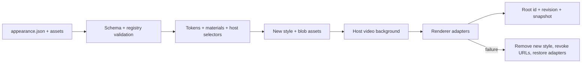

# OpenBitFun Appearance 外观包系统

本文定义 Web UI 的唯一外观运行时。原 `ThemeService + SkinService + DeepSkinComponents.scss`
双系统已经废弃；`openbitfun.skin`、`.openbitfun-skin`、旧 IndexedDB 数据和旧 manifest 均不兼容、
不迁移。

## 目标

Appearance 必须允许外观包高自由度控制所有可见宿主表面，同时保持以下边界：

- 外观包只提交强类型数据，不提交 CSS、DOM 选择器、HTML、JavaScript 或 React 代码。
- 外观包不能引用外部 URL，不能携带字体、SVG 或可执行资源；视频只允许作为宿主管理的顶层动态背景。
- 组件、场景、Portal 和独立渲染器的可定制边界由宿主注册。
- DOM 选择器与最终 CSS 只由宿主编译器生成。
- 所有可见表面最终由同一个 `AppearanceRuntime` 快照和 revision 驱动。
- 激活是事务：CSS、资源和 renderer adapter 要么一起提交，要么回滚到旧快照。

## 目录与所有权

```text
src/web-ui/src/infrastructure/appearance/
├── types/       # schema、结构化样式值、resolved snapshot
├── registry/    # component / scene / renderer 宿主契约
├── schema/      # manifest 校验和 ZIP 解析
├── compiler/    # token、materials、选择器、CSS、结构与对比度诊断
├── runtime/     # 唯一快照、revision、事务、OverlayHost、服务 API
├── storage/     # 外观包和 catalog 的 IndexedDB 命名空间
├── builtins/    # 内置外观
├── adapters/    # CSS token 与独立渲染器 adapter
└── hooks/       # React 消费入口
```

`AppearanceRuntime` 是唯一视觉 owner。内置外观和导入外观使用同一个 `AppearancePackage`
契约、同一个 compiler、同一个事务提交路径。选择值由正式配置键 `appearance.selection`
持久化；IndexedDB `openbitfun-appearance` 只保存导入包和 catalog，不保存当前选择。

包可以只声明需要覆盖的字段，但进入 runtime 前必须通过 `composeAppearancePackage` 与同模式的
完整内置基准组合。compiler 会按“内置基准普通层、导入包覆盖层”分别生成 surface 规则，避免
导入包的 `cascade: override` 将未声明的基准属性一起提升为 `!important`；renderer、token 和
materials 仍组成完整快照，因此稀疏包不会把未声明能力清空。

当前唯一 manifest 版本仍是 `schemaVersion: 1`，当前宿主 registry 是该版本的唯一权威契约。
系统不兼容已经删除或改名的 component / scene / part，也不兼容旧的单数 `material` 字段或旧
material 结构；外观包必须按本文和当前 registry 重新生成。

导入和编译失败必须保留 `AppearanceValidationIssue` 的错误码、路径与 surface 上下文，并由产品界面
按组件、场景或配置区域分组展示；禁止把全部校验问题压平成单行 toast。对于未知 part，诊断同时
提供该 surface 当前注册的 part 列表，外观包制作工具应据此重新生成 manifest。

## 包格式

文件扩展名为 `.openbitfun-appearance`，内容为 ZIP，根目录必须包含 `appearance.json`：

```text
aurora.openbitfun-appearance
├── appearance.json
└── assets/
    ├── preview.webp
    ├── background.webp
    ├── background.webm
    └── pattern.png
```

最小 manifest：

```json
{
  "schema": "openbitfun.appearance",
  "schemaVersion": 1,
  "id": "example.aurora",
  "name": "Aurora",
  "version": "1.0.0",
  "mode": "dark"
}
```

完整顶层结构：

```json
{
  "schema": "openbitfun.appearance",
  "schemaVersion": 1,
  "id": "example.aurora",
  "name": "Aurora",
  "author": "Example Studio",
  "description": "A device-local visual appearance.",
  "version": "1.0.0",
  "mode": "dark",
  "preview": { "kind": "asset", "assetId": "preview" },
  "backgroundMedia": {
    "kind": "video",
    "assetId": "background-video",
    "posterAssetId": "background-poster",
    "fit": "cover",
    "position": "center"
  },
  "requiredCapabilities": ["components.v1", "scenes.v1", "assets.v1", "background-media.v1"],
  "globals": {},
  "materials": {},
  "components": {},
  "scenes": {},
  "renderers": {},
  "assets": {},
  "integrity": { "sha256": {} }
}
```

`preview` 是设置页外观包卡片使用的图片资源。未声明时，宿主依次尝试名为 `preview`、
`background` 的资源，再回退到包内第一张图片；完全没有图片时显示占位图标。预览必须是图片，
不能引用视频。

`backgroundMedia` 是唯一的视频入口。它必须引用一个 MP4/WebM 视频资源和一个静态图片 poster，
并声明 `background-media.v1`。宿主在 `AppLayout` 的固定背景层渲染 `<video>`，强制静音、自动循环、
禁止交互；窗口隐藏时暂停，系统启用减少动态效果时只显示 poster。普通 component/scene/material 的
`backgroundImage` 和 `backgroundImages` 仍只能引用图片，不能把视频投影为 CSS URL。

## 结构化样式值

外观包不能写 CSS 文本。颜色、长度、阴影、过渡、transform 和字体栈使用 tagged object：

```json
{
  "backgroundColor": { "kind": "hex", "value": "#101318" },
  "color": { "kind": "ref", "path": "globals.colors.text-primary" },
  "paddingInline": { "kind": "px", "value": 12 },
  "opacity": { "kind": "number", "value": 0.9 },
  "boxShadow": [
    {
      "kind": "shadow",
      "x": { "kind": "zero" },
      "y": { "kind": "px", "value": 8 },
      "blur": { "kind": "px", "value": 24 },
      "color": { "kind": "rgb", "r": 0, "g": 0, "b": 0, "a": 0.3 }
    }
  ]
}
```

支持的属性是 `AppearanceStyle` 的封闭集合。新增属性必须同时修改：

1. 类型定义；
2. validator 的值域和范围校验；
3. compiler 的 CSS 映射；
4. 受影响 descriptor 的 `allowedProperties`（如果该 part 使用局部白名单）；
5. 聚焦测试和颜色审计。

正式 Style IR 覆盖 paint、typography、box、Flex/Grid、受控定位、media、transform、
transition 和 filter。`display: none`、`visibility`、`pointer-events`、任意 CSS 文本与任意
selector 不属于外观能力，外观包不能隐藏交互入口或改变事件语义。Grid track、比例、filter、
transform 等复杂值必须使用结构化对象，不能使用 CSS 字符串。

### 多背景图层

需要在同一宿主 part 上组合主背景、平铺纹理和透明装饰图时，使用成组的结构化图层字段：

```json
{
  "backgroundImages": [
    { "kind": "asset", "assetId": "corner" },
    { "kind": "asset", "assetId": "pattern" },
    { "kind": "asset", "assetId": "background" }
  ],
  "backgroundSizes": [
    {
      "kind": "backgroundSize",
      "width": { "kind": "px", "value": 96 },
      "height": { "kind": "lengthKeyword", "value": "auto" }
    },
    {
      "kind": "backgroundSize",
      "width": { "kind": "px", "value": 256 },
      "height": { "kind": "lengthKeyword", "value": "auto" }
    },
    "cover"
  ],
  "backgroundPositions": [
    {
      "kind": "backgroundPosition",
      "x": { "kind": "percent", "value": 100 },
      "y": { "kind": "percent", "value": 100 }
    },
    "top",
    "center"
  ],
  "backgroundRepeats": ["no-repeat", "repeat", "no-repeat"],
  "backgroundBlendModes": ["normal", "soft-light", "normal"]
}
```

`backgroundImages` 的第一项绘制在最上层。所有伴随数组必须与图片数组长度完全一致，且不能与
单层 `backgroundImage/backgroundSize/backgroundPosition/backgroundRepeat` 混用。图层透明度
应编码在 PNG/WebP 的 alpha 通道中；宿主不开放会改变内容树或交互堆叠的任意伪元素协议。

## Token 与 Material

`globals` 提供 colors、lengths、numbers、durations、easings 和 shadows。字体体系由
`@openbitfun/design-tokens` 独占，不属于 Appearance 包的可覆盖协议。
组件规则通过 `{ "kind": "ref", "path": "globals.colors.accent" }` 引用。

编译器将全局 token 投影为 `--openbitfun-appearance-*` 变量。`materials` 是带视觉角色的可复用样式定义：

```json
{
  "materials": {
    "soft-control": {
      "visualRole": "control",
      "style": {
        "backgroundColor": { "kind": "ref", "path": "globals.colors.control" },
        "borderRadius": { "kind": "px", "value": 6 }
      }
    },
    "accent-text": {
      "visualRole": "content",
      "style": {
        "color": { "kind": "ref", "path": "globals.colors.accent" }
      }
    }
  }
}
```

part 使用 `materials: string[]` 组合多个 material，后一个覆盖前一个，随后再由
`base/facet/state/context` 覆盖。单数 `material` 字段不存在：

```json
{
  "materials": ["soft-control", "accent-text"],
  "base": {
    "backgroundColor": { "kind": "ref", "path": "globals.colors.control-active" }
  }
}
```

## 组件契约

Appearance 契约按“可见 surface owner”而不是按 React 文件数量划分。可复用组件、跨 Portal
组件、Scene 和有独立状态/variant 语义的业务表面必须与 descriptor 共置。只负责组合、数据
装配或拆分渲染函数的内部组件归属到最近的已注册 surface scope，不能自行成为第二视觉 owner。

`workbench`、`flow-chat`、`config` 等产品级 surface 只拥有自身真实的组合结构，不得通过
`item + kind` 充当任意业务组件的永久逃生口。一个组件只要拥有两个以上需要独立定制的可见区域、
自身状态/facet、Portal 内容、重复业务卡片或独立布局语义，就必须拥有共置 descriptor。最终形态
不保留按源码路径生成 kind 的注册表；真正只有单一可见根节点、且内部没有独立视觉语义的叶子组件
才可以归属上级 surface。

组件 DOM 使用稳定属性：

```tsx
<button
  data-openbitfun-component="button"
  data-openbitfun-part="root"
  data-openbitfun-variant={variant}
  data-openbitfun-size={size}
  data-openbitfun-state={state}
/>
```

descriptor 声明：

- `parts`：可见或可交互的结构部件；
- `facets`：variant、size、placement、align 等离散维度及其宿主属性；
- `states`：hover、active、focusVisible、disabled 和业务状态的宿主选择器；
- `propertyProfile`：`paint`、`control`、`container`、`layout`、`overlay` 之一；
- `allowedProperties`：需要比 profile 更精确时使用的 part 级属性白名单；
- `forceableProperties`：当 part 使用 `cascade: "override"` 时允许升级为 `!important` 的属性；
- `visualRole`：workspace、continuous-surface、panel、toolbar、card、control、popup、dialog 等视觉角色；
- `continuityGroup`：声明多个 part 在视觉上属于同一连续区域。

未声明 profile 时使用 `container`。默认 `forceableProperties` 只包含 paint 属性；布局、定位、尺寸
等声明即使位于 override part 中也保持正常 cascade。宿主可以为确有需要的 part 显式扩大或缩小
forceable 集合，但该集合必须是该 part 允许属性的子集。

state selector 是封闭宿主契约，不是外观包输入。`self` 表示状态落在当前 part；
`ancestorPart` 表示状态由同一 surface 的另一个 part 持有，例如 checkbox 根节点的 checked
状态控制内部 box。旧的裸 `selectorSuffix` 字段不存在。

```ts
states: [
  { id: 'hover', selector: { kind: 'self', suffix: ':hover' } },
  {
    id: 'checked',
    selector: { kind: 'ancestorPart', part: 'root', suffix: ':has(input:checked)' },
  },
]
```

外观包只能引用已注册 ID。它不知道 `.btn`、`.modal__content` 等实现 class，也不能声明
自己的 selector。编译器按 descriptor 生成规则，例如：

```css
:root[data-openbitfun-appearance="example.aurora"]
  [data-openbitfun-component="button"][data-openbitfun-part="root"][data-openbitfun-variant="primary"]:hover:not(:disabled) { ... }
```

产品控件复用组件库时，可在 descriptor 中声明
`componentAttribute: 'data-openbitfun-product-component'`，由编译器匹配
`data-openbitfun-product-component` / `data-openbitfun-product-part`，避免覆盖库组件自己的标识。
模型轮次、图片导出、紧凑工具栏和消息定位控件使用这一映射；外观包仍使用
`model-round-item`、`export-image`、`toolbar-mode`、`scroll-to-latest-bar`、
`scroll-to-turn-header-button` 及原有
part/state 名称，无需修改已保存的包。迁移须验证旧包编译后的规则能命中实际产品节点。

part 规则分四层，后者覆盖前者：

1. `materials`，按数组顺序合并；
2. `base`；
3. `facets` / `states`；
4. `contexts`，用于 `variant + state`、`size + iconOnly` 等组合。

视觉连续区域默认不应被每个 part 分别加四边框、圆角或阴影。validator 会对
`visualRole: "continuous-surface"` 或带 `continuityGroup` 的 part 产生
`CONTINUOUS_SURFACE_FRAMED` warning。若皮肤确实要把该 part 设计成独立卡片，必须显式声明：

```json
{
  "decorationIntent": "framed",
  "base": {
    "borderRadius": { "kind": "px", "value": 8 }
  }
}
```

`decorationIntent` 还支持 `flat` 和 `separator`，用于向生成与审查工具表达设计意图；它不直接生成
CSS。超过 25% 的 part 使用 override 时，validator 会产生 `EXCESSIVE_OVERRIDE_USAGE` warning。

### Source ownership

目录级 source ownership 已被禁止。每个直接加载 CSS/SCSS 的生产 TSX 必须在文件内暴露可
静态证明的 DOM 契约。允许使用少量经过审计的宿主透传组件，例如 `BaseToolCard` 统一暴露共享
`tool-card` 的 root、surface、header、icon、content、status、expanded 和 error 等真实 part，
`ConfigPageLayout` 将调用方声明的专属 surface 投影到真实页面根节点。仅仅位于某个 descriptor
的祖先目录中不能通过审计，也禁止恢复目录级 ownership 规则。

descriptor 只建立源码所有权还不够：所有需要独立定制的可见部件必须同时暴露稳定
`data-openbitfun-component` / `data-openbitfun-scene` 与 `data-openbitfun-part` DOM 契约。审计同时验证 descriptor、
DOM 和 registry 三者闭合。

审计逐个 JSX 节点验证 component/scene 与 part 必须在同一真实 DOM 节点成对出现，ID 必须是
字面量，surface 类型必须与 registry 一致，part 和字面量 state 必须属于 descriptor。禁止用
同目录文本出现过某个 ID 作为覆盖证明。

## Scene 与 Portal

Scene 使用与组件相同的规则，但稳定根属性是 `data-openbitfun-scene`。每个场景必须登记自己的
canvas、navigation、toolbar、content、emptyState 等可见 part。

Portal 必须挂载到统一 `AppearanceOverlayHost`，Portal 内组件仍使用普通 component/part
契约。禁止新增直接散落到 `document.body` 的 Portal。

## 独立渲染器

Monaco、xterm、canvas、mermaid、生成式 widget 等不依赖普通 DOM CSS 的渲染器通过
`AppearanceRendererAdapter` 注册：

```ts
interface AppearanceRendererSettingsMap {
  monaco: MonacoAppearanceSettings;
  xterm: XtermAppearanceSettings;
  mermaid: MermaidAppearanceSettings;
  canvas: CanvasAppearanceSettings;
  widget: WidgetAppearanceSettings;
}

interface AppearanceRendererAdapter<K extends keyof AppearanceRendererSettingsMap> {
  id: K;
  validate(settings: AppearanceRendererSettingsMap[K]): string[];
  apply(next, previous, context): void | Promise<void>;
}
```

renderer id 和 settings DTO 是宿主拥有的封闭映射，不能扩展为 `Record<string, unknown>`。
renderer settings 必须由 adapter 自己定义和校验。普通包仍不能在 settings 中嵌入 CSS、HTML、
脚本或 URL。运行时按注册顺序 apply；任一 adapter 失败时按逆序恢复 previous。

CSS token 名称只能来自宿主常量 `APPEARANCE_CSS_TOKEN_NAMES`；Widget 跨边界变量名称只能来自
`WIDGET_APPEARANCE_VARIABLE_NAMES`。外观包不能通过自定义变量名扩张 CSS 或 Widget 协议表面。

## 编译与激活事务



每次成功提交都会增加单调 revision，并原子更新：

- `<style data-openbitfun-appearance-runtime="revision">`；
- `data-openbitfun-appearance`、`data-openbitfun-appearance-mode`、`data-openbitfun-appearance-revision`；
- `ResolvedAppearance`；
- renderer adapter 状态；
- 当前包的 blob URL 生命周期。

运行时 `<style>` 在宿主基础样式之后暂存到 `document.head`。所有生成选择器同时绑定 Appearance
ID 和 revision；只有根节点切换到新 revision 后，新规则才会生效，因此暂存阶段不会出现半应用。
part 默认使用正常 cascade，不生成 `!important`。当宿主 descriptor 对应的规则需要覆盖仍未退出的
高优先级视觉声明时，外观包可显式设置 `cascade: "override"`。compiler 只为该 part 的
`forceableProperties` 生成 `!important`；同一规则中的布局或定位属性继续使用正常 cascade，并产生
`OVERRIDE_PROPERTY_NOT_FORCEABLE` warning。该能力仍受封闭 Style IR、已注册 surface/part 和属性契约
约束，不能提交原始 CSS 或选择器。可访问性和交互不变量必须由宿主样式与组件行为保证，不能依赖
Appearance 隐藏或禁用交互入口。

compiler 还会做确定性声明标准化：声明 `borderStyle` 但没有全局 `borderWidth` 时先注入
`border-width: 0`，避免只想画底边却继承出四边框；声明 outline width/color 但没有 style 时注入
`outline-style: solid`。两种修正都会进入 diagnostics，便于皮肤制作工具在生成阶段修正源 manifest。

激活顺序固定为：创建资源 URL、暂存新 CSS、按注册顺序应用 renderer adapter、切换根节点
ID/mode/revision、发布 snapshot、删除旧 CSS 并释放旧资源。任一步失败都按逆序恢复已应用 adapter，
移除暂存 CSS，释放新资源，并保留旧根 revision 与旧 snapshot。

`AppearanceService` 将选择、导入、覆盖和删除放入同一个串行事务队列。选择事务先做无副作用的
compiler 与资源字节/MIME preflight，再提交 runtime，最后持久化 `appearance.selection`；配置写入
失败时恢复上一持久化选择并重新应用上一份已提交 package/asset source。导入包也必须在写入
IndexedDB 前完成相同 preflight；覆盖活动包时，存储、目录或后续提交失败都必须恢复旧包和旧运行时。
删除活动包时先完成存储删除与目录读取，再切换到 `system`，从而保证任一后续失败仍可恢复原包、
选择和运行时。补偿本身失败时 snapshot 进入 `degraded`，不得伪装成成功提交。

跨窗口同步只发布已经提交的 `selection-changed`、`package-upserted` 和 `package-deleted` 事件；事件
携带 source/event ID，用于阻止回环和重复消费。Web UI 使用同源 `BroadcastChannel` 传播事件，并在
窗口重新获得焦点或从隐藏状态恢复时，以正式配置和 IndexedDB 重新对账，覆盖休眠期间漏收事件的
情况。配置引用的导入包暂时不可用时，只在当前窗口回退到 `system` 并标记 `degraded`，不能把共享
配置静默改写为 `system`。

## Skin 市场边界

产品在目录、设置入口和公网 URL 中把 Appearance 包称为 **Skin**；这只是产品文案，不新增
Skin runtime、manifest 或文件格式。公网入口固定为 `market.openbitfun.com/skin/`，稳定 API 为
`/skin/api/v1`，下载物仍是 `.openbitfun-appearance`，根 manifest 仍是 `appearance.json` 和
`schema: openbitfun.appearance`。

市场稳定 DTO 和发布状态机由 `openbitfun-product-domains::appearance_market` 拥有。独立
`openbitfun-skin-market` 服务使用自己的 SQLite、content-addressed package/preview artifacts、审核日志、
retention 和备份；不与 MiniApp listing/release/submission 表共用 namespace。公开 Web 站只读。
Desktop 投稿复用 MiniApp 市场凭据存储中的 GitHub Desktop token；macOS 使用应用数据目录下的
本地加密文件，避免系统钥匙串授权提示，Windows/Linux 仍使用各自的原生凭据存储。Skin 服务只把 Bearer token
转发给受控的 MiniApp `/me` endpoint 做身份和管理员校验，不保存 OAuth secret、refresh token 或
Cookie。

安装事务固定为：读取 listing 的不可变 release 元数据，下载 package，核对 release SHA-256 和字节
大小，由 WebView 的 `AppearancePackageParser` 完成完整 schema/registry/media preflight，再调用
`AppearanceService.importPackage()` 写入 IndexedDB。Rust/Tauri adapter 只负责网络和受限临时文件，
不能直接激活 Appearance 或复制一套 Style IR validator。市场来源 sidecar 绑定 package ID、listing、
release、package SHA 和安装时间；本地文件覆盖同 ID 市场包时保留 lineage 但设置 `localOverride`，并在
UI 明确显示为本地版本，不能继续伪装成已安装的市场 release 或静默自动更新。

`appearance.selection` 随正式 GlobalConfig 跨设备同步，package 字节仍只存在当前设备。snapshot 必须
同时保留 persisted selection 和当前设备 availability：目标包缺失时本窗口回退 `system`，但不得覆写
共享 selection；以后从市场安装同 package ID 时立即 rehydrate 并应用 persisted selection。浏览和
安装是当前设备 UI 行为，与 workspace 本地/远程无关，绝不能把 package 发送到 SSH workspace。

Agent 的 outward-facing `PublishAppearance` 只接受用户明确指定的本机绝对
`.openbitfun-appearance` 路径，在上传前执行本地 package envelope 校验，并复用 Desktop 登录与投稿编排。
远程 SSH workspace 中它必须 fail closed；Agent Runtime 不得扫描目录、猜测用户许可，或假装能读取
WebView IndexedDB 中已安装的包。

编译器解析真实 RGB/HSL/hex 颜色并产生对比度诊断。诊断当前不阻止提交，但必须出现在
snapshot 和结构化日志中；未来可以按产品无障碍策略升级为 gate。

## 存储与安全

系统只使用 IndexedDB `openbitfun-appearance`，不读取旧主题或皮肤数据库。

导入限制：

- ZIP 最大 96 MiB，解压后最大 128 MiB，最多 64 个文件；市场预览还受 4 MiB、1600 万像素解码预算约束；
- `appearance.json` 最大 256 KiB，静态图片最大 16 MiB，视频最大 64 MiB，preview 图片最大 4 MiB；
- 只允许 manifest 明确声明的包内图片和背景视频；
- 图片仅 PNG、JPEG、WebP、GIF，视频仅 MP4、WebM，均按文件头识别 MIME；
- 单边最大 16384 像素，总像素最大 5000 万；
- 视频最长 60 秒、单边最大 4096 像素、总像素最大 900 万，并由当前 WebView 验证容器/codec 可解码；
- JSZip 解压和 CRC 校验前先读取 ZIP 中央目录，拒绝 ZIP64、加密条目、超大单条目和超总解压量；
- 拒绝绝对路径、父目录跳转、反斜杠路径、路径重写和未声明文件；
- 声明 SHA-256 时必须匹配；
- 对象 URL 由宿主创建，切换、失败、删除和 dispose 时释放。

## 当前实现约束

Web UI 生产代码只存在 Appearance。系统不提供 Theme/Skin 双运行时、旧包导入、旧配置读取、旧
DOM 属性或旧 CSS token 兼容层。内置外观与导入包使用同一个 parser、validator、compiler、runtime、
storage 和激活事务；Monaco、xterm、Mermaid、Canvas、Widget 与 CSS token projection 全部通过正式
renderer adapter 接入。

每个可见 owner 使用专属 surface 或明确的共享组件 surface。`data-openbitfun-kind`、按源码路径生成的 kind
数组，以及 `workbench.item` / `flow-chat.item` 聚合契约均被禁止。复杂 owner 的审计依据是样式表中
实际被 TSX 使用的视觉 class 与 TSX AST 中的 styled DOM 结构，不使用源码行数阈值。

覆盖清单由 `pnpm run appearance:contract-audit` 从源码生成。审计记录 styled production owner、
descriptor、DOM parts、Portal/renderer 边界和 registry 闭合状态；新增 CSS/SCSS owner 若没有专属
descriptor、已批准的多 part 宿主透传，或可证明为单根无内部视觉语义的叶子节点，CI 必须失败。

移动端、Installer、CLI/TUI 不复用 Web UI 的 package、surface 或 renderer schema，继续维护各自
独立的主题体系。

## 覆盖完成标准

Appearance 系统的完成标准由以下持续性证据定义：

- 每个 styled production owner 都位于唯一的共置 descriptor 边界中；
- 每个对外可复用、跨 Portal、跨 Scene 或具有独立视觉语义的组件都有 descriptor 和稳定 part；
- 产品级聚合 surface 不使用按源码路径生成的 `item + kind` 覆盖内部业务组件；
- 每个 scene canvas、导航区、工具栏、空状态和重复业务卡片都有契约；
- 所有 Portal 使用统一 OverlayHost；
- Monaco、xterm、canvas、mermaid、widget 等都有 renderer adapter；
- 生产代码不存在 `SkinService`、`DeepSkinComponents.scss`、`openbitfun.skin` 兼容逻辑；
- `ThemeService` 和旧 CSS 变量 owner 已删除，内置外观直接由 Appearance 定义；
- registry 覆盖检查、包解析测试、compiler snapshot、runtime rollback、组件 DOM contract、
  type-check、i18n audit 和 `theme:color-audit:all` 全部通过。

这些条件由审计与测试持续执行，不能通过提高 baseline、增加宽泛 allowlist 或恢复兼容层规避。
