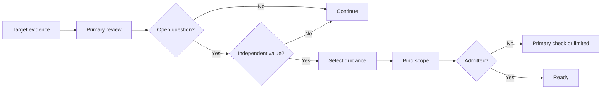
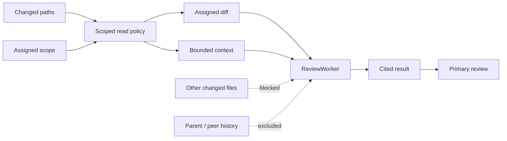

# DeepReview / Strict Review Architecture

## Scope

DeepReview is the compatibility runtime for `Review: Strict` and the internal managed-batch executor for scale-limited ordinary Review targets. It remains a read-only child session and must not be presented as a second product entry next to Review. A strict run is reviewed directly by the child; a managed large run executes a deterministic bounded packet plan and returns one aggregate Review result.

This document owns the current Review execution architecture: target evidence,
read-only roles, managed packets, adaptive focused checks, admission, queueing,
and report submission. The future user-facing record, revision, freshness, and
re-review model is defined separately in
[review-lifecycle.md](review-lifecycle.md). That lifecycle sits above the
existing child executions; it does not create another runtime or move target
evidence into the UI projection. Until the lifecycle contracts are implemented,
one Review run is still represented primarily by one child session and the
unified launch path still opens that child in the auxiliary pane.

Product-facing guardrails are summarized here:

- `Review` is the primary user-facing entry.
- `/review` is the intended long-term command entry; `/DeepReview` is only a transitional typed compatibility command for historical strict-review launches.
- `ReviewTeam` is an internal strict-review reviewer-set configuration, not a separate product concept users must learn.
- PR Review consumes Review results and future readiness projections; it must not own another reviewer executor.
- A child session is one execution revision, not the durable product identity;
  the target Review lifecycle groups revisions without merging independent
  Review requests heuristically.

Current execution and later lifecycle work must remain distinguishable:

| Area | Current implementation | Later lifecycle target |
|---|---|---|
| Bounded ordinary Review | One primary reviewer with zero to two focused checks for concrete unresolved questions | Preserve the latest result as one durable Review record |
| Strict Review | One primary reviewer with zero to three spawned calls; a conditional Judge uses the same allowance | Preserve revisions, freshness, and finding continuity |
| Large ordinary Review | Deterministic packets, at most two concurrent; questions attach to existing packets | Project the same Review record into task and pull-request surfaces |
| Capability sources | Built-in fallback, compatible Skills, and configured read-only review agents | Keep source names out of the default product presentation |
| User presentation | One Review child/result with plain-language additional-check progress | One durable card with explicit loading and historical revisions |

Product surfaces call optional worker activity an **Additional check**
(`补充检查`). It remains subordinate to one Review and is never presented as a
separate mode, fixed domain, or reviewer team. This document uses *focused
check* only as the internal execution term.

The current implementation has four layers:

- Frontend launch and UI orchestration in `src/web-ui`.
- Platform adapter commands in `src/apps/desktop/src/api/agentic_api.rs`.
- Provider-neutral policy, admission, queue, retry, diagnostics, and report transforms in `src/crates/execution/agent-runtime/src/deep_review`.
- Agent definitions, tool integration, event emission, diagnostics logging, and session-metadata IO in `src/crates/assembly/core/src/agentic`.

The launch adapter is currently desktop-only. Browser/server surfaces hide every Review launch action, including fix follow-up retry, and reject typed Review commands with a clear unsupported-state message until the server owns the same session, Git-target, and policy command contracts; existing review attempts remain viewable. Adding only one RPC method to the current ping-only server would not make the workflow functional. The Review settings route remains visible for navigation compatibility on those surfaces, but renders a read-only desktop-only state and never loads or saves desktop capacity settings.

Review strength follows explicit intent instead of a risk-score threshold table. An ordinary target of at most 80 prepared files launches one read-only `CodeReview` child. A larger or provider-truncated target remains ordinary L1 Review but uses an internal managed manifest so bounded workers can cover deterministic file batches without blocking launch. Only explicit strict intent changes review strength. L0 completion checks and Verify evidence remain outside this production contract until the separate Verify exploration defines a trustworthy evidence source.

The backend does not resolve the review target or build the launch manifest. The frontend resolves and validates bounded target evidence before launch. Strict Review builds one deep L3 manifest; managed large Review builds one bounded L1 execution manifest. Each manifest is reused unchanged for execution, and neither path requires routine consent.

## Runtime Roles

`CodeReview` and `DeepReview` are read-only adversarial review identities. `CodeReview` handles bounded ordinary Review as one isolated child. `DeepReview` handles explicit strict requests and managed large Review plans; it has no edit, command, Git-mutation, or remediation tools.

`src/crates/assembly/core/src/agentic/agents/definitions/review/review_specialists.rs` defines read-only reviewer agents:

- `ReviewWorker`
- `ReviewJudge`

`ReviewWorker` is an optional capability, not a fixed domain lane. The owning reviewer selects a concrete question from the actual change or the user's requested focus, then supplies the exact scope and evidence expectation. Bounded ordinary Review may launch at most two focused workers; Strict Review may spend at most three spawned calls shared by workers and a conditional Judge. The retired `ReviewBusinessLogic`, `ReviewPerformance`, `ReviewSecurity`, `ReviewArchitecture`, `ReviewFrontend`, and `ReviewGeneral` ids remain non-discoverable compatibility aliases for stored configuration, historical manifests, and their direct task invocations; they resolve to `ReviewWorker` under the same visibility, manifest, read-only, and budget gates, but are not registered or emitted for new runs. Review identities do not receive a generic Git tool. Prepared `GetFileDiff` is the source of truth for changed code; when the local binding is `matching_clean`, existing Read/Grep/Glob/LS tools may supplement it with repository context. `ReviewJudge` is used only for a high-severity finding, conflicting evidence, or a materially low-confidence conclusion; it does not perform a routine full review pass.

`ReviewFixer` is the separate writable remediation identity. DeepReview runtime policy rejects it during review execution. The frontend action surface invokes it only after user approval, and a new read-only Review run checks the fix when requested.

## Launch Flow

Review can be launched from session-file controls or `/review`. Targets up to 80 prepared files launch one standard read-only reviewer. Larger or provider-partial targets automatically enter the managed L1 path: at most eight module-aware packets of at most 40 files are prepared, at most two run concurrently, and every worker call is foreground-waited by the owning Review turn. Files beyond the run budget remain deferred coverage rather than causing launch rejection. `/review strict` explicitly requests the deep L3 path.

Frontend launch code lives in `src/web-ui/src/flow_chat/deep-review/launch`:

- `commandParser.ts` identifies canonical `/review strict` commands, transitional `/DeepReview` compatibility aliases, and optional file or git targets.
- `targetResolver.ts` resolves slash-command target file lists, immutable base/head revisions, change statistics, and target evidence from git status, explicit ranges, and diffs when a workspace is available. Explicit file and directory targets remain exact instead of widening to the whole worktree. File-scoped evidence reads untracked content through the registered, remote-aware workspace API.
- `launchPrompt.ts` formats the user-facing launch prompt.
- `DeepReviewService.ts` builds the review-team manifest, creates a child session, sends the launch prompt, and inserts the parent-session summary marker. The unified `ReviewService.ts` opens the child in the existing auxiliary pane.
- `src/web-ui/src/flow_chat/services/DeepReviewService.ts` is a compatibility re-export.
- `src/web-ui/src/flow_chat/services/ReviewService.ts` owns the unified prepared plan and launches either one read-only CodeReview child or the existing DeepReview child runtime.
- Fix follow-up uses the same service to re-evaluate the union of the original review files and files directly changed by `ReviewFixer`. If command, Git, or stdin tools can produce changes that cannot be attributed safely, the UI explicitly falls back to the current workspace diff instead of claiming a narrower scope. It remeasures the selected diff, preserves the original standard-or-strict intent, and opens one fresh isolated reviewer child in the existing auxiliary pane. The fixer baseline and exact selected remediation ids are persisted before remediation starts, so restart restores only unfinished items from the original selection. The follow-up reservation stores the same request id later written to the existing child relationship metadata and used to derive the backend session id. A launch acknowledgement failure preserves the stable local turn and created child, returns `uncertain`, and does not automatically or after restart resubmit the launch message. Backend creation returns an existing session only when the immutable identity (`agent_type`, relationship kind, parent session, and parent request) matches; mutable parent turn location does not break an explicit user retry. This early-return path is restricted to Review/DeepReview child relationships with a parent request, so ordinary explicit-id session restoration keeps its existing coordinator rebuild behavior. The action bar distinguishes retry, in-progress, completed, failed, cancelled, and view states instead of leaving a permanently disabled button. A metadata-only historical child is opened and hydrated before terminal state is inferred; lack of loaded turns is not treated as permission to launch a duplicate. Scope, changed-file records, and the final child id stay in session metadata so restart does not widen scope or duplicate a known run. Older sessions without recoverable scope explicitly notify the user before falling back to the current workspace diff.

`launchDeepReviewSession` creates an internal child session with:

- `sessionKind: 'deep_review'` for explicit Strict Review, or `sessionKind: 'review'` for managed L1 presentation
- `agentType: 'DeepReview'`
- tools enabled
- safe mode enabled
- auto-compaction enabled
- context compression enabled
- `deepReviewRunManifest` stored on the child session metadata

If the first launch message has an uncertain outcome after the child session is created, the frontend preserves the local turn with a request-derived stable turn id, opens the child session, records an interruption marker, and returns an explicit `uncertain` launch status. It does not automatically resubmit the message or delete a possibly running backend session.

## Target Evidence

Review target evidence is session-scoped and covers current workspace changes, an explicit local Git range, or a provider pull request. It carries:

- source kind and opaque target fingerprint
- base and head revisions
- changed file path, previous path, and add/modify/delete/rename status
- completeness and limitation facts for truncation, binary files, or unavailable content
- a deterministic workspace binding that says whether the local repository head matches the target head and whether any staged, unstaged, untracked, or conflicted worktree state could contaminate repository context
- final report evidence status (`complete`, `limited`, `stale`, or `failed`) separately from the model's risk and recommendation

An explicit, complete Git range with a matching clean workspace or a provider PR with immutable base/head and complete per-file diff availability may report `complete`. Workspace evidence remains `limited` because it is mutable, even when its prepared diff coverage is complete. Limited or stale evidence does not rewrite the model's risk or recommendation; the report and UI display reliability separately. Invalid evidence fails closed, while historical manifests with no target evidence keep legacy behavior.

The current report contract stores reliability in one `evidence_status` value,
so a stale result can replace an earlier limited-coverage value. The target
versioned Review projection in [review-lifecycle.md](review-lifecycle.md)
requires a lossless contract change: report enrichment must preserve coverage
and freshness independently, or emit independent structured reason codes. The
UI must not guess the overwritten dimension from one combined label.

Prepared Review target evidence uses bounded `GetFileDiff` pages as changed-code evidence. Local ranges read exact Git revisions; PR targets read provider diffs on demand and revalidate base/head before each file. The parent Review has a 240,000-character aggregate allowance and admits at most 128 provider diff acquisitions before provider I/O; one acquisition normally performs one file-page request and one detail request. Repeating the same page for the same reviewer returns a compact already-served result instead of the diff again. Exhaustion and stale target bindings return structured limited evidence. Git operations remain in the target-preparation owner; Review identities cannot guess refs or widen scope. Read/Grep/Glob/LS are supplemental only for a matching clean Git-range binding, never for a provider-only PR target.

Local Review `Read` calls also keep a session-scoped, metadata-only receipt of returned line ranges keyed by logical path, nanosecond mtime, byte length, and a streamed SHA-256 content digest. A fully covered repeat on the unchanged revision returns a compact already-served result; changed files, remote workspaces, tail reads, partial overlaps, and non-Review agents continue through the normal read path. Digest work is restricted to receipt-enabled Review agents. Replacing or compacting model context clears these receipts so the runtime never suppresses content that is no longer present in context.

Deleted, renamed, binary, oversized, conflicted, or unavailable files remain visible as coverage facts. The PR panel is the only built-in PR Review entry and associates progress/results by provider repository, PR id, and immutable revisions. Cached overview data is display-only until the selected PR is revalidated; revision or runtime-evidence changes make prior results stale, and failed or unavailable results remain distinct from limited coverage. The implementation does not add automatic checkout, reviewer command execution, speculative cache plans, automatic Review, inline comments, approval, merge, or automatic publishing.

## Strict Review Delegation Policy

The default strict-review contract is mirrored in Rust and TypeScript. New strict launches use the following fixed boundary:

- the `DeepReview` child performs the primary full review itself;
- concise descriptors from compatible review capabilities form a selection catalog;
- zero to three focused workers may be launched for concrete unresolved questions;
- `ReviewJudge` is available only as a conditional quality check;
- automatic file splitting, same-role fan-out, and reviewer retry are disabled;
- workers and the Judge share one three-call allowance and at most two run concurrently.

The runtime enforces the shared allowance even if a weak model ignores the prompt. This is a resource ceiling, not a keyword or risk-score workflow rule. The model decides whether another check is useful from the actual evidence and task; the manifest and backend limit which read-only capability, target scope, and question it may use. The Review capacity setting may lower focused checks and managed large-target batches to one-at-a-time execution, but it cannot raise the two-way ceiling or create additional work.

Historical configuration fields for reviewer timeouts, file-split thresholds, same-role instances, retries, concurrency, and queue behavior remain readable so stored sessions can recover honestly. New adaptive manifests override split, same-role, retry, concurrency, and call values to the bounded policy above. Configured review agents must be file-backed and read-only. `DeepReview` and `ReviewFixer` remain disallowed.

## Adaptive Review Capability

> Status: current execution behavior for newly prepared Review manifests. It
> reuses the existing Review launch, manifest, admission, task, evidence, and
> report owners; there is no second Review runtime or generic orchestration
> Harness.

The product comparison boundary is the complete Review outcome available to a
user, not the internal location of a capability. A built-in reviewer, a Skill,
and a configured read-only review agent are implementation sources for the same
product capability when the unified Review can use them. Their names and
packaging are not separate user-facing Review products.

#### 1. Decide whether a focused check is justified

#### 2. Map one admitted question to one execution shape

### Capability selection contract

The primary reviewer may launch a focused check only when its assignment states:

- one concrete unresolved question;
- why an independent capability can materially improve the conclusion;
- the changed files or packet covered by the check;
- the evidence expected from the check.

File type, a static risk label, capability availability, or the idea that an
extra reviewer might be safer is insufficient. User-requested focuses take
priority within the same allowance. Registry implementations may parse or cache
full source files during discovery, but the normal Review model context receives
only concise Skill and review-agent descriptions. Ordinary Review keeps this
catalog behind a deferred tool specification, so a direct primary review pays
no catalog input cost. Full selected guidance enters model context only after
admission.

The Skill catalog follows the runtime registry's invocation eligibility. External
discovery alone does not admit guidance: the user must import a native copy first.
Imported copies retain their source parser semantics through the import record,
including Claude skills without explicit names. Resolution rechecks the native
key and implicit-invocation policy, so undoing an import or disabling implicit
invocation also invalidates an earlier catalog selection.

The existing manifest and backend admission path gain one small typed
`focused_assignment` projection: question id, target fingerprint, allowed
changed paths or packet id, expected evidence, capability key, and capability
fingerprint. Admission resolves the capability once and derives a child-scoped
target view. `GetFileDiff` rejects changed-file access outside that view. This is
an execution constraint on the existing target owner, not another target model.
The same scoped read policy receives the prepared target's complete changed-path
inventory: `Read` rejects an unassigned changed path, while `Grep` filters matches
from unassigned changed paths. Unchanged dependencies remain available as bounded
supplemental context. All comparisons use the target owner's normalized logical
paths and local filesystem identity. Current paths take precedence over rename
aliases. Exact path spellings win; alternate casing is accepted only when it
resolves to the same local file, and linked aliases fail closed.

Adaptive focused checks are not exposed for remote workspaces in this slice.
The primary reviewer still completes the prepared review, but the product does
not spend a worker call where local path identity and the restricted Read/Grep
envelope cannot yet be guaranteed. Managed packet compatibility remains separate.

Every selected source is normalized into the existing `ReviewWorker` execution
envelope. Built-in guidance, a Skill, or a configured read-only review agent may
contribute instructions and an allowed model preference, but never its own tool,
delegation, permission, or network policy. Review policy and assignment scope
override selected guidance. The backend—not frontend `allowedTools` metadata—
enforces the exact focused-check envelope: `GetFileDiff`, `Read`, `Grep`, `Glob`,
and `LS`, plus the bounded result return. Selected content is always treated as
plain review guidance, not as a capability-effects declaration. An instruction
that cannot run inside this envelope is ignored and, when material to the
assigned question, produces limited coverage; it never grants another effect.

Call accounting is deterministic:

| Target path | Owning Review execution | Spawned calls, excluding the owner | Total review-agent executions |
|---|---|---|---|
| Bounded ordinary | Primary reviews directly | Zero to two focused `ReviewWorker` calls | One to three |
| Bounded Strict | Primary reviews directly | Zero to three calls; a conditional `ReviewJudge` consumes one remaining call | One to four |
| Managed large ordinary | Primary owns aggregation | Existing disjoint packet count, currently at most eight; zero to two admitted questions attach before launch and create no additional call | One plus packet count |

At most two spawned calls run concurrently; the owning Review execution waits
and aggregates rather than consuming one of those two worker slots. No Judge
slot is reserved: if Strict Review spends its allowance, a later conflict is
reported as uncertainty. Strict-plus-managed-packet execution is not authorized
by this direction and requires a separate design if a real target demands it.

### Evidence ownership and context isolation

Supplemental context locates exact call sites, definitions, configuration, and
unchanged dependencies; it does not replace prepared `GetFileDiff`. Review
guidance prefers one complete bounded symbol block over speculative whole-file
reads. Same-reviewer diff-page suppression and local Read receipts remain the
only content-read optimizations. The primary rereads focused evidence only for a
high-severity finding, material conflict, or materially low confidence.

### Stopping and failure behavior

No focused check is admitted without a concrete non-duplicate question, a valid
scope, remaining allowance, and plausible conclusion benefit. A previous
no-finding result for the same question and scope also stops repeat
delegation.

A failed or timed-out check is not retried automatically: the primary either
uses a bounded read or reports limited coverage. A changed target stops stale
execution. Material conflict may consume a remaining Judge call; otherwise the
result preserves the uncertainty.

### Product projection and quality evidence

The default UI shows one Review, a generic progress card only when a focused
check actually runs, and one final report. Focused progress deliberately uses a
plain-language label rather than projecting model-controlled questions, Skill
names, agent ids, packet ids, paths, fingerprints, or internal budgets. The final
report is organized by severity and root cause,
with explicit coverage and residual risk; it is never grouped by reviewer count
or presented with an invented aggregate quality score.

This implementation does not require a Review telemetry service, hit-rate database,
adaptive scoring engine, content cache, dashboard, scheduler, or retry state
machine. Deterministic contract tests and offline comparisons using existing
logs are sufficient initial evidence. Before setting numerical gates, a future
comparison must record fixtures, base commit, model/provider, sample count,
environment, and method. The architecture requires lower input tokens and wall
time on a fixed repeated-read set without losing seeded known findings; it does
not embed an environment-bound percentage target or claim an unrecorded result.

## Manifest Shape

`buildEffectiveReviewTeamManifest` in `src/web-ui/src/shared/services/review-team/index.ts` builds strict and managed manifests. `buildAdaptiveStandardReviewManifest` builds the bounded ordinary manifest without loading Review Team configuration. Every new manifest carries `adaptiveReview.version: 1`, resolved target evidence, strategy/scope metadata, execution policy, and bounded call facts.

For new strict launches:

- the backend supplies a bounded descriptor catalog from compatible Skills and configured read-only review agents; full guidance is loaded only for an admitted exact key and fingerprint;
- `qualityGateReviewer` identifies the available conditional inspector and does not require it to run;
- `workPackets` is empty;
- `executionPolicy.maxReviewerCalls` and `adaptiveReview.maxFocusedCalls` are `3`;
- file splitting and retries are disabled;
- the primary plus spawned-call ceiling is four review-agent executions; it does not claim a bound on underlying provider requests.

For managed large L1 launches:

- `workPackets` contains only deterministic `ReviewWorker` file batches;
- up to two admitted questions attach to existing packets and do not create more packets;
- packet calls are foreground-waited and may never be converted to background `Task` calls;
- `managedReviewPlan` records total, planned, and deferred file counts plus batch, concurrency, and timeout bounds;
- the final report must mark deferred, provider-omitted, timed-out, or unavailable scope as limited coverage;
- no routine launch confirmation is shown.

The evidence pack remains metadata-only. It lists changed file paths, aggregate diff stats, domain/risk tags, hunk hints, contract hints, budget counts, and workspace/Git-range target facts. It excludes embedded source text, full diff text, model output, provider raw bodies, speculative cache plans, and full file contents.

## Strategies and Scope

Small ordinary Review remains one `CodeReview` child whose primary reviewer may request zero to two focused checks. Managed large Review reuses the deep runtime profile only as an execution budget capable of bounded work packets; it remains user-facing L1 Review. A new explicit strict request selects the deep profile for evidence depth, not maximum fan-out.

`quick` and `normal` strategy values, legacy work packets, and older L2 manifests remain readable for stored-session recovery. They do not create new production Review launches. New L3 validation requires the deep strategy but no longer requires every core reviewer or a Judge call. If a quality-gate member is present, it must be `ReviewJudge`.

Review launches start directly without routine confirmation. Exceptional states that require a user decision may still request confirmation, but target size and reviewer count are not such states.

## Managed Work Packets and Historical Compatibility

New strict reviews do not generate work packets or module-aware reviewer shards. New managed large L1 reviews generate only bounded `ReviewWorker` packets. Stored manifests may also contain historical fixed reviewer ids, reviewer/judge packets, launch batches, packet ids, assigned scopes, and retry metadata. Runtime parsing, report enrichment, recovery UI, and target-evidence validation distinguish the new managed plan from historical manifests.

Packet support is not a general fan-out policy. New packets are admitted only when `managedReviewPlan` is present; focused questions attach to those packets rather than multiplying them. Packet-specific queue and retry behavior applies only when the prepared manifest actually contains those packets.

## Backend Policy and Admission

`DeepReviewExecutionPolicy` parses runtime policy and the per-turn spawned-call ceiling. `DeepReviewRunManifestGate` admits `ReviewWorker` and the optional `ReviewJudge`; managed worker packets require a prepared bounded plan, while adaptive workers require a target-bound `focused_assignment`. It rejects `ReviewFixer`, nested `DeepReview`, skipped members, stale capability fingerprints, duplicate questions on the same scope, and scope outside the prepared target.

`DeepReviewBudgetTracker` shares one allowance between focused workers and the Judge. This keeps the safety boundary deterministic without hard-coding which domain deserves delegation.

## Task Execution and Queue State

The generic `Task` tool is adapted for DeepReview across:

- `src/crates/assembly/core/src/agentic/tools/implementations/task/mod.rs`
- `src/crates/assembly/core/src/agentic/tools/implementations/task/deep_review.rs`
- `src/crates/assembly/core/src/agentic/deep_review/task_adapter.rs`
- `src/crates/execution/agent-runtime/src/deep_review/task_execution.rs`
- `src/crates/execution/agent-runtime/src/deep_review/queue.rs`
- `src/crates/execution/agent-runtime/src/deep_review/budget.rs`

DeepReview task execution uses the manifest and tool context to:

- identify an optional specialist, quality-inspector, managed packet, or historical packet id
- read historical incremental-cache metadata when present, without creating cache plans for new runs
- enforce the adaptive shared-call ceiling and historical retry coverage
- cap active optional reviewers
- enforce the global concurrency ceiling for managed and historical packet manifests; `launch_batch` remains a preferred launch grouping, not a runtime completion barrier
- wait for transient capacity when allowed
- emit queue state events
- record runtime diagnostics and capacity skips

Queueable capacity reasons are:

- `provider_rate_limit`
- `provider_concurrency_limit`
- `retry_after`
- `local_concurrency_cap`
- `launch_batch_blocked`
- `temporary_overload`

Queue states are:

- `queued_for_capacity`
- `paused_by_user`
- `running`
- `capacity_skipped`

Queue wait time is tracked separately from reviewer run time. Paused and queued time does not consume reviewer timeout.

The desktop command `control_deep_review_queue` validates `sessionId`, `dialogTurnId`, and `toolId`, then applies one of:

- `pause`
- `continue`
- `cancel`
- `skip_optional`

Pause, continue, and cancel are scoped to a specific turn and tool id. `skip_optional` is turn-scoped.

## Runtime Events

Queue state events are defined in `src/crates/contracts/events/src/agentic.rs` as `AgenticEvent::DeepReviewQueueStateChanged`.

The frontend listens through `AgentAPI.onDeepReviewQueueStateChanged` on `agentic://deep-review-queue-state-changed`. The TypeScript event shape mirrors the Rust event fields:

- tool id
- subagent type
- queue status
- optional reason
- queued reviewer count
- optional active reviewer count
- optional effective parallel instances
- optional optional-reviewer count
- optional queue/run elapsed time
- optional max queue wait
- session concurrency flag

`src/web-ui/src/flow_chat/utils/deepReviewQueueStateEvents.ts` applies queue events only to `deep_review` sessions.

## Report Submission

Review results are submitted through `submit_code_review` in `src/crates/assembly/core/src/agentic/tools/implementations/code_review_tool.rs`.

In DeepReview context, the tool requires the deep-review fields in addition to the standard summary/issues/positive-points shape:

- `review_mode`
- `review_scope`
- `reviewers`
- `remediation_plan`

Provider-neutral report transforms live in `src/crates/execution/agent-runtime/src/deep_review/report.rs`; `src/crates/assembly/core/src/agentic/deep_review/report.rs` bridges tool context, diagnostics logging, and session-metadata IO. Together they fill unambiguous historical packet metadata, add runtime diagnostics and reliability signals, and preserve read compatibility for historical incremental-cache data. Missing or invalid report summaries fail closed instead of defaulting to approval.

Report enrichment is guarded by the tool context. Standard Code Review output should not receive DeepReview-only metadata unless the active tool context proves `agent_type == 'DeepReview'`.

## Frontend Report and Action UI

DeepReview report rendering lives under `src/web-ui/src/flow_chat/deep-review/report` and is consumed by `CodeReviewToolCard`.

The action surface is shared with standard Code Review but includes DeepReview-specific phases and capacity state:

- `src/web-ui/src/flow_chat/store/deepReviewActionBarStore.ts`
- `src/web-ui/src/flow_chat/components/btw/BtwSessionPanel.tsx`
- `src/web-ui/src/flow_chat/deep-review/action-bar`

`BtwSessionPanel` projects explicit `deep_review` children as Strict Review and managed L1 children as ordinary `review`, reads the latest code-review result, restores the matching action-bar state, and renders `ReviewActionBar` without exposing the internal executor.

The action bar can show:

- capacity queue notice and inline controls
- partial results
- recovery plan preview
- remediation item selection
- needs-decision gate
- fix, independently review fixes, resume, and retry controls

The action bar dispatches queue controls through `agentAPI.controlDeepReviewQueue` when backend queue-control identifiers are available. Otherwise it falls back to local/session-stop-only behavior exposed by the store.

## Persistence

The DeepReview child session stores `deepReviewRunManifest` in frontend session state, session metadata, and history metadata. The backend also reads `deep_review_run_manifest` from tool context/session metadata when a DeepReview tool call needs manifest data.

The review action bar persists UI state separately through `ReviewActionBarPersistenceService` so historical review sessions can restore visible remediation progress without rerunning the review.

The target Review lifecycle keeps its record anchor, revision metadata, and
bounded summary query in the existing session-history persistence owner. Full
reports remain in the Review transcript, target evidence remains the scope
authority, and historical sessions without lifecycle metadata must remain
readable as single-revision legacy records. See
[review-lifecycle.md](review-lifecycle.md) for the persistence and recovery
invariants.

## Boundary Rules

- Frontend components do not call Tauri directly; they use infrastructure APIs such as `agentAPI`.
- Shared core stays platform-agnostic and uses event/config/tool abstractions instead of Tauri handles.
- The frontend owns the standard, managed, or strict launch boundary, target resolution, manifest construction, strategy wording, prompt-block construction, and action UI. Size selects only the bounded L1 executor; no risk heuristic upgrades Review strength.
- Project integration adapters own raw workspace/Git target acquisition. The artifact/evidence layer owns the fixed session target manifest and its completeness. Mutable workspace targets may have complete prepared diff coverage, but their final evidence status remains `limited`. Reviewers may not mutate or silently widen that target.
- The backend owns policy validation, runtime admission, queue/retry state, event emission, and report enrichment.
- Reviewer subagents and review orchestrators stay read-only. Remediation runs under `ReviewFixer` after user approval, not during the reviewer pass.
- Revision outcome projection is read-only presentation state above the
  executor. The record anchor may own only lineage identity and sparse explicit
  finding dispositions; remediation action state remains with the existing
  Review action owner. Neither record nor revision metadata may become a second
  target resolver, report store, content cache, or execution runtime.
- Managed/historical work packets and current evidence packs are metadata only; they must not embed file contents or full diffs.
- Review identities receive no generic Git or shell tool. Git operations stay in target preparation, prepared `GetFileDiff` remains bounded and disables external diff/text conversion, and live repository reads are supplemental only under a deterministic clean local binding.

## Change Checklist

When changing DeepReview behavior, update all affected contracts together:

- Backend constants, team definition, execution policy, manifest gate, task adapter, queue events, and report enrichment.
- Frontend strict-review defaults/types, manifest builder, prompt block, launch service, action-bar store, event mapping, report rendering, and locales.
- Desktop Tauri command DTOs when capacity controls or default review definition contracts change.
- Tests near the touched module, especially policy tests, strict-review manifest tests, queue event tests, launch tests, action-bar tests, and locale completeness tests.
- For target-evidence changes, add contract coverage for workspace changes, exact file/directory scopes, explicit ranges, provider PR identity/base/head, provider diff availability, head invalidation, clean checkout, deleted/renamed/binary/oversized files, dirty-workspace isolation, exact-diff bounds, fail-closed reports, uncertain launch preservation, and unchanged ordinary Agent behavior.
