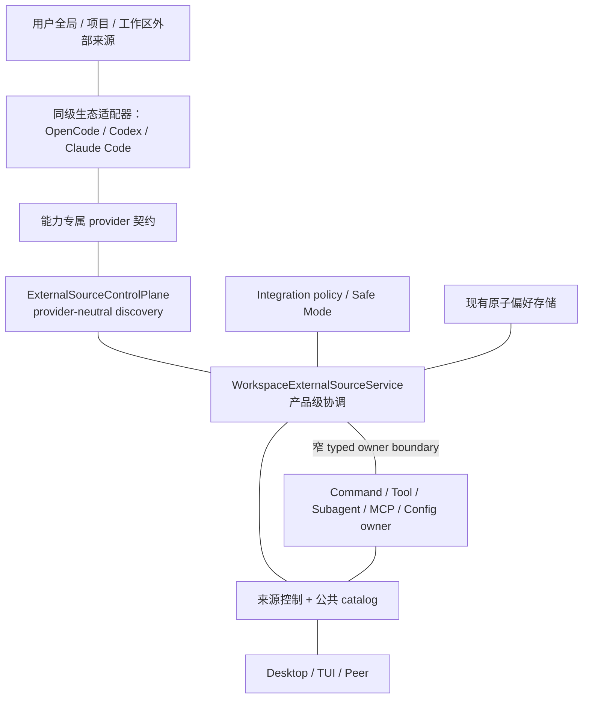
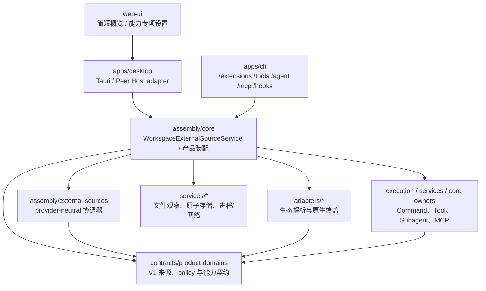
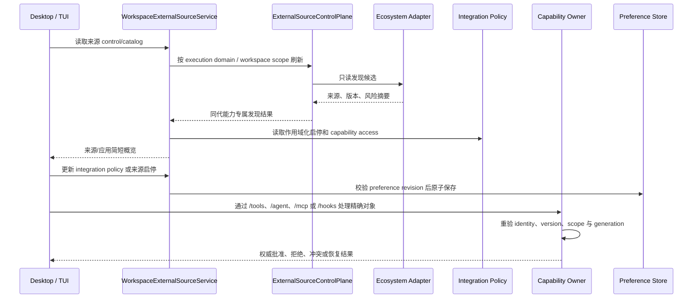

# 外部 AI 工作内容发现、导入与持续兼容设计

本文定义 OpenBitFun 如何发现、展示和消费 OpenCode、Codex、Claude Code 等外部 AI 应用留下的工作内容。OpenCode
是第一条完整兼容来源；其他生态只在有稳定格式和真实消费方时接入。各生态的解析、加载顺序和运行语义仍由对应
适配器负责，本文不建立跨生态通用配置格式或脚本 SDK。OpenBitFun 自身能力如何通过 MCP、Skill、Plugin、Hook、
SDK 或 Server 输出到外部宿主，以及内部能力组合、状态、事件和并发边界，见
[`capability-runtime-integration-design.md`](capability-runtime-integration-design.md)；两条方向共用适用的身份事实和能力归属模块，
但不共用一个大一统 adapter 或状态模型。Settings 和 TUI 只能把本文的来源与 integration policy 事实压缩为简短概览；
审批、冲突和可执行能力状态继续由 Tool、Agent、MCP、Hook 等真实 owner 负责。

本文同时记录当前可用端到端能力与目标架构。当前 OpenBitFun 已具备通用外部来源目录、四条能力专属发现通道，并由
`ExternalSourceControlPlane` 负责 provider-neutral 调度、generation fencing 和故障隔离；`assembly/core` 的
`WorkspaceExternalSourceService` 负责产品级策略、偏好、聚合和运行装配，`contracts/product-domains` 提供版本化控制事实、固定动作与错误语义，
Desktop、交互式 TUI 和 Peer Host 只显示宿主所需状态，不再各自派生另一套状态机。App Server 已注册 external-source schema 与 handler；Embedded TUI 注入 management owner 后可以调用，通用 Server `/ws` 当前没有注入绑定可信工作区的 management owner，因此请求会得到类型化 `unsupported`，不能把通用 Server 只读投影列为已交付。OpenCode Prompt Command
适配器已接入本地用户全局/项目来源；Desktop 可查看、刷新、抑制和处理跨来源冲突，交互式 TUI（ChatMode）可列出并执行
Prompt Command；静态文件和经审阅的本地 shell 输出由共享归属模块完成装配。第二条端到端能力已让受支持的单文件 OpenCode `.js` standalone Tool 经静态
预览、来源/能力确认和同名冲突选择后进入现有 Tool Runtime；Desktop 与交互式 TUI（ChatMode）使用同一决策状态。第三条纵向
切片已把 OpenCode 全局/项目 Agent 的安全子集通过独立 provider 契约接入现有 Agent 归属模块：首次启用与
同名冲突使用非阻塞决策，`primary|subagent|all` 从同一 workspace route 投影到主选择器和 Task，调用持续使用启动时选定的
版本，更新和撤下不会静默切换到同名实现。第四条端到端能力
已把 OpenCode 用户/项目 MCP 的 local stdio 与 HTTPS remote 安全子集接入现有 MCP 归属模块，沿用显式审批、冲突、
工作区隔离和失败反馈；现有 Skill 加载模块另行展示来源、用户/项目范围和固定优先级产生的覆盖结果，不并入上述
可执行来源选择规则。第五条端到端能力在不增加新的 Rust Runtime 进程的前提下接入 Claude Code 的 legacy Command、Subagent、
MCP 安全子集，以及 Codex Subagent、MCP 安全子集；三种生态使用同一个来源管理模块，并共享审批、冲突、刷新和故障隔离规则，
但各自在 sibling adapter 内保留原生来源与覆盖语义。standalone Tool 的 TypeScript/模块依赖仍未覆盖；显式配置的
OpenCode package plugin 已有共享 Bun Host 执行切片，当前接口与限制见
[Plugin Host 当前实现](plugin-runtime-design.md#7-当前实现)，不能与单文件 Tool 或只读目录合并计算支持范围。
完整 Codex/Claude Code 运行时适配和外部 Subagent 续接仍属于后续阶段；Claude Code Agent 定义可按同一静态安全子集进入主选择器，
Codex role 仍仅作为 Subagent，不能因来源被识别就宣称宿主运行时兼容。OpenCode、Claude Code 与 Codex 的本地 Hook 脱敏目录
已作为独立只读切片接入；在此之上，Claude Code 与 Codex 的同步 command 子集可经精确命令审阅复制为 OpenBitFun 管理的
原生 Hook 层，仍由唯一 `AgentHookEngine` 执行。此只读目录中的 OpenCode handler、非 command/异步 handler 和未审阅声明
不进入执行注册表；显式配置的 package plugin Hook 使用独立的 Plugin Host 执行契约。
独立的 MCP C0a 快照导入复用上述来源与现有 MCP 配置 owner：Desktop 和根 CLI 可预览 OpenCode、Claude Code、
Codex 与 DeepSeek Harness 中受支持的安全声明，并在用户显式确认后原子写入 disabled 原生条目。静态 env/header
值随私有投影复制，来源信息保存在原生配置中；GUI 可批量导入并撤销本机副本。动态凭据引用解析和 Peer/Remote
写入仍不支持；这不改变外部 MCP 持续兼容来源的运行路径。

## 当前支持声明与状态口径（2026-09-13）

本文维护跨生态的当前产品范围；各生态设计维护具体格式、字段子集与固定版本基线；用户功能说明由
`src/shared/interactive-capabilities/catalog.json` 生成。实施计划只记录当时阶段，不作为实时支持表。
“已实现”必须限定生态、内容形态、版本与环境，并同时具备生产入口、实际消费方、失败处理与验证证据。
仅有解析器、类型或演示分别记为“支持静态发现”“接口已定义”“样例验证”。不得由本地用例推断远程可用。

| 内容与生态 | 此页发现范围 | 原生副本导入 | 使用与限制 |
|---|---|---|---|
| Skill：Claude Code、Codex、OpenCode、Pi、DSH | 已接入各自受支持目录/文件子集；不代表完整包或动态配置解析 | 本地 Desktop 可复制受支持格式；按主机导入版本保留旧格式路径 | 未导入外部 Skill 不进入原生运行目录；导入后由 Skill owner 选择 |
| MCP：Claude Code、Codex、OpenCode、DSH | 已接入安全声明子集；Pi 没有 provider | 本地 Desktop、根 CLI 可规划并复制；副本默认禁用 | 原生连接状态由 MCP owner 确认；前三类另有持续兼容路径，DSH 发现不意味着 DSH 持续运行兼容 |
| Hook：五种生态 | 静态来源和事件声明 | 仅 Claude Code/Codex 的受支持同步 command，经审阅导入 | 目录本身不执行；原生 Hook 仍受开关控制；Pi/DSH/OpenCode 目录只读 |
| Command：Claude Code、OpenCode | 受支持声明 | 此页暂无副本导入 | 既有命令兼容功能负责展开、权限与冲突 |
| Tool：OpenCode | standalone 工具声明 | 此页暂无副本导入 | 受支持单文件 JS 由现有 Tool owner 启用、审批与执行；不代表 TS/依赖型工具全部可用 |
| Agent/Subagent：Claude Code、Codex、OpenCode | 安全声明子集 | 此页暂无副本导入 | 既有 Agent owner 管理启用、冲突与模型绑定；Codex role 不等于完整外部运行时 |
| 账户、完整设置、记忆、插件、宠物 | 此页尚未接入对应类别的内容发现 | 此页暂无副本导入 | 不能据此推断其他入口完全不支持；例如 instructions 加载、账户登录与显式 package plugin 已有独立实现 |

四类事实独立保存于现有 owner，页面只做展示投影，不引入另一套运行状态机：

| 维度 | 事实来源 | 页面规则 |
|---|---|---|
| 发现覆盖 | 页面显式的生态/类别清单 | 类别显示“可发现”或“暂未支持”，并通过说明限定为当前页面的内容查看；不推断导入与执行能力，不再显示笼统“已适配/未适配” |
| 当前发现 | 来源策略、pending、诊断及各 owner 扫描结果 | 区分检查中、关闭、失败、未发现；缓存条目不掩盖本次失败；有成功记录的 Skill 不因其他文件诊断丧失导入资格 |
| 副本导入 | MCP plan、Skill 协议版本和来源记录、Hook plan/import snapshot | 显示可导入、待审阅、已导入或具体限制；“已导入”只证明副本已保存，已知副本在发现失败时仍可显示 |
| 兼容使用 | 命令 availability/冲突、Tool/Agent activation、主机能力及策略 | 显示可通过兼容功能使用、待授权、未启用、冲突、受限或失败；旧主机缺少或返回未知事实时显示未确认，发现不推断可用 |

条目使用一个主状态、一句原因和已有操作。Command/Tool/Subagent 的使用状态与“不支持副本导入”同时说明；
MCP 副本的连接状态不借用外部来源 activation，页面明确“尚未确认”，由原生 MCP 管理页提供实际连接事实。
本地 Desktop 导入能力不外推至 Server/Web、Peer、远程工作区；不支持写入时显示当前环境限制，仍可查看宿主返回的目录。
远程控制与 Detached Dispatch 不因共享此展示代码而获得导入能力；任何新目标写入能力仍需独立协商和验证。

状态投影与交互回归见 Web UI 的 `ecosystemContentPresentation.test.ts`、`ExternalAgentContent.test.tsx`。
其中远程工作区和 Peer 为前端能力门禁模拟，不是 SSH、IM、Peer 或 Detached Dispatch 端到端证据；手工步骤见
[Web UI 使用说明](../../../src/web-ui/README.zh-CN.md#生态兼容状态检查)。

## 0. 当前 MCP 快照导入契约（C0a）

快照导入是显式复制，不是持续同步，也不改变现有外部 MCP 兼容来源。Desktop 与根 CLI 只负责展示脱敏预览并发送
typed intent；OpenCode、Claude Code 与 Codex sibling adapter 复用各自已合并的解析结果，DeepSeek Harness adapter 读取独立的完整声明，生成私有安全投影。外部来源
协调器固定当前 candidate 与行为版本，core 负责重新规划，最终仍由唯一 MCP 配置 service 校验并写入
`mcp_servers`。Codex 的投影与其运行准备共用同一当前 candidate/version fencing，不建立第二套解析或缓存。

公开的 versioned plan/apply DTO 只包含 schema version、plan fingerprint、candidate ID、display name、transport、建议
native ID、disposition 和稳定 reason code，不包含 command arguments、URL、原始 JSON、凭据、environment/header 值或
`MCPServerConfig`。provider 私有投影不可序列化且使用 redacted `Debug`；plan/request 最多包含 256 个 candidate，未知请求
字段与重复选择直接拒绝。

发现任务在进程共享并发预算下排队，并保留原有扫描及延迟完成期限。一次刷新中的提供方超过 worker 数量时不能被
直接丢弃为过载；导入预览也不能把待完成或调度失败的扫描当作完整目录。

当前只复制能够与原生配置保持等价语义的声明：

- local stdio command、adapter 已解析 arguments、静态 environment 和绝对 working directory；
- 无 userinfo、query、fragment 的 HTTPS streamable HTTP URL、静态 headers，保留显式 OAuth discovery 开关；
- adapter 已校验的 startup/catalog/execution 毫秒超时。原生 JSON 的读写与再次保存均保留这些可选字段，旧配置缺省语义不变。

environment/header 的静态值仅经不可序列化、Debug 脱敏的私有投影复制到原生配置，并纳入计划摘要；目录和确认界面只展示字段名。
未解析的变量或凭据引用、未知字段和其他 transport 不猜测、不复制。导入条目始终为
`enabled: false` 与 `autoStart: false`；local 条目不继承完整父进程环境，只保留 MCP runtime owner 提供的安全环境。
Codex 的 legacy `name` 是上游忽略的展示字段，不进入导入结果或行为版本；`startup_timeout_sec`（含旧
`startup_timeout_ms`）和 `tool_timeout_sec` 同时进入受审批保护的兼容运行投影和原生快照导入。
`enabled_tools`、`disabled_tools`、approval、scopes/OAuth 凭据与并行调用等运行敏感字段
仍按不支持处理，不能因静态发现成功而丢弃语义后导入。
Codex 和 OpenCode 未显式声明 cwd 时，当前 workspace 产生的 effective cwd 也会随导入保留；不能因上游未写 cwd
就改为继承 OpenBitFun 进程目录。工作目录仅通过私有投影传到配置 owner，不加入公开预览。

DeepSeek Harness 读取 `DSH_HOME`（缺省 `~/.dsh`）及其 `profiles/*`、选中 workspace 下的 `cordis.yml` 和
`cordis.patch.yml` 中显式 MCP 声明；可识别普通 group 和无目标 insert，但不合成原生 profile 或加载 bundle。
每个文件独立复用完整 `@deepseek-ai/dsh-mcp-client` 配置，目录中其他 profile 不会被视为当前启用 profile。
相对 cwd 按选中 workspace 解析；缺少该上下文时不猜测。保留默认 60 秒 tool timeout，并关闭此来源未提供的 OAuth
discovery。动态 YAML tag、需合成的 partial patch、重复声明、作用域/生命周期字段、显式 reconnect policy 和
`failOnStartupError: true` 显示不支持，不执行插件。OpenBitFun MCP owner 负责导入后的连接、重连与启停。
PI 本轮未接入 MCP provider。

native ID 优先使用外部 logical name，再使用稳定生态后缀和最小可用数字后缀；超长名称使用 bounded digest，已有条目
永不覆盖。plan fingerprint 同时绑定脱敏 plan、私有投影和当前原生 MCP 配置摘要。apply 会重新发现并重建 plan；来源或
目标内容变化时返回刷新后的脱敏 plan，且不写入；fingerprint 不绑定 coordinator refresh generation，因此内容未变的刷新
不会让 plan stale。配置 service 通过同一 JSON key 的 compare-and-set mutation lane
一次提交全部选中条目或全部不提交，并在 `_openbitfunImport` 中保留 source-qualified candidate ID、behavior version 和可选 sourceId。
普通 MCP 编辑保留这段 provenance，删除条目时随条目一并移除。旧记录缺少 sourceId 时，Desktop 从 candidate 的完整稳定 ID 与已注册 provider identity 恢复来源显示，不依赖外部文件仍在线。

根 CLI 的 `openbitfun mcp import` 默认只预览，`--apply` 导入全部 eligible 项；重复 `--candidate` 可缩小集合，单一选择可用
`--native-id` 指定目标 ID，`--format json` 输出 versioned plan/result。当前没有 TUI/Mobile/Server/Peer/Remote/ACP/SDK
写入口、导入 journal、tombstone、外部应用回写或插件安装/激活策略；Desktop 可审阅并撤销选定原生副本，仍由既有 MCP manager 完成复核、编辑、
启用和删除。

Desktop 的生态兼容页按所选 Agent 隔离外部内容。查看不会创建原生条目；用户可单项导入、导入当前类别或一键导入该 Agent 的全部可用项，审阅来源、目标 ID
和默认禁用状态后确认。MCP 选择集合一次提交；Skill/Hook 保留逐项成功、跳过和失败结果。Hook 在批量执行期间仅刷新目标 revision，源行为和精确命令必须与审阅内容相同。
其他 Agent 的 candidate 不进入此次选择。来源或目标变化导致 plan
stale 时，保留同一 candidate 的更新预览并要求重新确认；不自动加入新条目，也不隐式重试写入。切换 Agent、工作区、
Peer 主机或取消操作会清空详情与确认状态，迟到的旧请求不能更新新作用域。

### 0.1 外部内容与原生管理的界面边界

生态兼容页独立展示所选 Agent 的 Skill、MCP、Hook 和其他已发现目录项，不嵌入原生 Skill/MCP/Hook 管理页。主列表只保留分类概览；查看分类使用设计系统 Dialog，标题与操作固定在顶部，搜索和批量操作位于列表上方，内容通过有界 ScrollArea 滚动。关闭单项查看或导入确认后保留分类列表；前往原生副本管理页时关闭分类弹窗。
左侧按“已识别 / 更多应用”组织产品：成功读取的来源、实际内容或用户配置可计入已识别；内置 ACP 预置模板不作为识别证据。读取中或失败保留上次结果，成功空扫描才能撤销过期识别。具体的连接和授权状态留在运行区域，内容类别显示数量、未扫描、未发现内容或读取失败；“可发现”仅表达此页具备发现能力。“更多应用”标题使用设计系统次级文字色，悬停、聚焦和选中时恢复主文字色；“暂未支持”保持无边框、无底色文字。

左侧导航顶部在搜索框上方整合页面标题、“自动发现”开关及当前工作区、主机范围。详细说明仅在悬停或键盘聚焦时通过设计系统 Tooltip 展示，旧发现设置入口统一定位到该开关。开关更新独立的持久化字段 `automaticDiscovery`，工作区覆盖独立继承用户偏好；缺失字段沿用原有范围的 `enabled` 选择，首次显式更改后与运行策略分开。运行策略 `enabled`、各生态模式、来源抑制、授权记录和已有运行实例不因发现开关改变。

`get_external_source_discovery_snapshot` 返回版本化发现包装，声明是否允许修改、是否已有扫描和本次可扫描类别。既有严格策略与目录 DTO 不加字段，旧主机降级读取原目录、开关只读；无法识别的响应不能伪装成空目录。DiscoveryCatalog 使用独立的静态发现协调器和只读投影，扫描时仅在内存派生策略中跨过运行总开关，仍遵守各生态的禁用设置，绝不调用或撤销执行路由。开启后恢复查找，关闭后暂停该目录的新自动扫描，已有扫描可完成；手动刷新和导入预览可以显式读取。已有运行功能自身的刷新、执行校验仍由原 owner 负责。

Skill/Hook 自动读取沿用各自 owner，并随页面开关暂停；MCP 导入计划的读取也遵守开关，暂停时延后到主动导入。关闭不删除目录或副本，不自动启用发现的内容。前端保留按执行主机与工作区隔离的有限内存结果，失败保留内容并停止把旧结果当作导入资格证明。主机不支持修改或策略版本不兼容时解释只读原因；保存失败直接反馈，保存使用主机偏好版本并阻止旧快照回退已确认状态。
ACP 配置嵌入时也只展示所选产品的 clients，并隐藏包含全部产品内容的 JSON 视图。

- Skill 使用现有扫描报告按稳定 sourceId 归属筛选，展示该生态的诊断。目录包复制完整依赖，PI/DSH 支持的 Markdown 单文件转换为独立 SKILL.md 包；包内链接依赖明确拒绝。
  当前 Host 通过扫描报告的可选 importOperationsVersion 协商新导入能力；旧 Host 保留原有目录导入路径。
  版本 2 支持可选 targetName：确认页可为同名项指定独立目录及调用名称，仅修改副本的 frontmatter name；旧 Host 不接收改名请求。
  add_skill 的 sourceKey 对应已发现来源；复制先在临时目录校验、写入 `.openbitfun-import.json`，再发布到用户/项目原生目录。
  来源 ID、位置、解析方言、内容摘要和导入 ID 随副本保存；sourceId 仍为 OpenBitFun，原始来源单独用于标签和筛选。
  发现目录与原生运行时目录分离：未导入的外部 Skill 不进入对话候选、模式技能列表、提示词目录或名称/key 调用入口；旧来源 key 不会自动重定向到副本。
  本地与远程工作区执行相同过滤，撤销后重新解析即失去调用资格。已批准插件通过独立发布 owner 提供的 Skill 贡献保持原有执行契约。
  原生用户副本优先于外部用户发现，项目优先于用户的规则保持不变。PI 单文件的缺省名称来自文件名，扫描与实际加载使用相同规则。
  同源重复导入保持现有副本及用户修改；不同内容或其他来源的同名目标拒绝覆盖。明确重新导入可为内容完全相同的旧副本补齐来源。
  撤销核对导入 ID 并与发布共用跨进程锁，仅删除审阅的原生副本，外部原文件保留；来源标记损坏时保留文件并显示诊断。
- 批量操作支持当前 Agent 全部、分类以及勾选项，确认前列出目标和改名结果，完成后保留逐项成功/失败及具体错误。
  一键导入/撤销弹窗按 Skill、MCP、Hook 分组，限制窗口高度并只滚动清单；进度以实际返回结果数推进（失败也计入已处理），列表刷新期间保留进度与操作区。
  技能套件的列表、计数、分组编辑及保存后刷新均仅消费原生技能与已导入副本，外部发现项不自动进入套件。
  批量 MCP 撤销把相同配置指纹下的删除合并为一次 CAS；Hook 撤销仅沿本批成功操作返回的版本推进，其他修改仍触发冲突。
  弹窗关闭时保留最后一次完整内容直到退场结束，避免标题、正文和页脚先被清空。
- Hook 按 ecosystemId 和 source key 展示只读目录。Claude Code/Codex 支持的来源经既有 plan/apply 精确命令审阅导入；
  其他形态只展示信息。原生 Hook 页仅管理已导入来源及原生启用设置，后续更新仍需明确确认。
- 原生 Skill 页只展示 OpenBitFun 自有目录和内置内容（含导入后的副本），按导入来源提供筛选；原生 MCP 页展示来源标签。
  外部 Command/Tool/Subagent 等尚无快照导入能力的类型展示限制，不用原生管理入口冒充导入实现。
- 导入前端在不支持写入的 Server/Peer/Remote 环境明确禁用，继续通过现有宿主 API 展示可取得的目录；不回退到控制端文件。
  已保存的兼容运行策略和用户数据不因发现失败或不支持而重置。

“可发现”不表示支持快照导入或已经可执行。当前五种生态均有 Skill 发现；MCP provider 覆盖 OpenCode、Claude Code、Codex、DSH，PI 暂不支持。
五种生态的 Hook 目录与同步 command 导入范围分开呈现，后者仅覆盖 Claude Code/Codex 的受支持子集。
Command/Tool/Subagent 的持续兼容能力继续由原有归属模块控制，此页不提供其快照导入。
MCP/Hook 的“已导入”只表示已保存，界面提示到原生管理页启用与连接；实际执行仍需满足原生运行时的状态与策略。

## 1. 产品判断与竞品启示

竞品事实与 OpenBitFun 的产品判断分开记录：

| 产品 | 已验证的交互 | 对 OpenBitFun 的启示 |
|---|---|---|
| [Codex 从其他智能体导入](https://learn.chatgpt.com/docs/import.md) | 设置中同时检测用户级与所选项目级内容，支持全部导入或自定义选择；插件和连接需要后续设置时显示状态卡 | 先给用户完整资产清单和使用范围，再把需要授权的内容留在非阻塞的后续任务中。 |
| [Cursor 从 VS Code 迁移](https://docs.cursor.com/get-started/migrate-from-vs-code) | 一键迁移扩展、主题、设置和快捷键 | 对来源高度相似、风险可控的内容提供低摩擦默认路径，不要求逐项理解内部格式。 |
| [VS Code Profiles](https://code.visualstudio.com/docs/configure/profiles) | 可按类别选择、浏览内容、预览后创建，并把 Profile 与文件夹或工作区关联 | 使用范围、内容预览和工作区关联应是一等信息；用户不需要先提交变更才能理解结果。 |
| [Claude Code 导入 Claude Desktop MCP](https://docs.anthropic.com/en/docs/claude-code/mcp) | 命令启动后交互选择 MCP Server，并可在导入后通过列表验证 | 高副作用连接适合选择性启用和可验证完成状态，不能因为识别成功就宣称可用。 |
| [OpenCode 配置](https://opencode.ai/docs/config/) | 用户级、项目级、环境指定和目录资产按固定顺序实时成为运行输入 | 对已有 OpenCode 项目应保留持续关联，不把一次性复制作为可用前提。 |

因此 OpenBitFun 不照搬单一竞品。默认路径采用“持续兼容来源”，吸收 OpenCode 的实时性和 Skills 的低摩擦发现；
设置中同时提供类似 Codex 的统一来源清单、选择和完成状态；“显式导入”只作为用户希望把外部内容转成 OpenBitFun
原生配置时的可选快照操作。

## 2. 目标与非目标

目标：

1. 自动发现当前执行域中的用户全局、项目和工作区外部来源，不阻塞项目打开、TUI 输入或无关会话。
2. 当前能够安全消费且不存在同名冲突的低风险内容默认无感应用，并通过可撤销的非阻塞摘要说明来源和影响；
   Command、Tool、Subagent 等外部可执行能力与产品本地能力、或独立外部 provider 之间发生同名冲突时，不得
   静默选择胜者。现有 Skill 根继续按已发布顺序解析，但必须展示来源和默认覆盖状态；带模式的管理界面再展示
   应用模式开关后的实际采用项。
3. 插件、Hook、Command、MCP 等可执行或有外部副作用的内容先发现，首次启用或能力扩大时再由用户确认。
4. 运行中感知来源修改、升级、删除和重新出现；静态准备失败时保留仍合规的旧进程，旧进程停止后的失败只从完整旧文件重启。
5. 用户始终能解释“发现了什么、来自哪里、当前是否生效、为何降级、下一步能做什么”。
6. 产品体验可复用于未来生态，但解析、优先级、权限和运行语义不被抽象成最低公分母。
7. 冲突选择按“能力 + 逻辑名称 + 全部候选身份与内容版本”形成内容摘要；同一内容摘要只询问一次，任一候选更新后才重新询问。

非目标：

- 不要求用户先完成阻塞式迁移向导才能打开已有项目。
- 不把“已发现”“已解析”“已应用”和“可执行”合并为一个模糊的“已加载”状态。
- 不双向写回外部应用文件，也不自动删除、移动或升级外部来源。
- 不复制凭据值、私有会话数据库或未文档化的内部状态。
- 不新建一套跨领域信任数据库、通用权限语言或大一统外部资产对象。
- 不因候选更新失败继续使用已被删除、显式停用、撤销或不再满足当前安全策略的旧代码。

## 3. 用户体验

### 3.1 首次发现

发现始终在后台进行。Desktop、交互式 TUI（ChatMode）和 Peer 控制界面消费事实所在 Host 的同一来源状态，但按
宿主展示；Peer 控制界面只代理 Peer Host，不读取控制端同名来源。当前 Server `/ws` 已注册 external-source App Server 方法但未注入可信工作区 owner；未来只读 Web 入口必须先绑定 Host 持有的工作区范围，不能由浏览器提供任意路径或扫描来源：

```text
已发现 OpenCode 工作内容
2 项配置、7 个 Skills、1 个插件
已应用当前支持的低风险内容；1 个插件需要确认。

[查看详情] [撤销已应用内容] [以后先询问]
```

- 默认打开“自动应用低风险内容”；应用完成后显示一次聚合摘要，不弹阻塞式 Modal。
- 用户可以改为“低风险内容也先询问”。此时发现结果保持待选择状态，但项目和会话继续可用。
- 自动应用仍须通过已有工作区来源校验、组织上限和归属模块校验，且不能授予工具或扩大权限；未通过时只进入
  “已发现”或“需确认”。
- 可执行内容因首次启用、更新策略要求询问或 import 前摘要扩大而等待确认时，不得 import module、启动进程、
  读取凭据或主动联网；提示可以稍后处理。
- 当前阶段范围外的 TypeScript、依赖型 Tool 和 package plugin 只进入“已发现，静态预览”清单，不进入模型可调用
  集合；受支持 JS Tool 也必须在明确启用前保持同一状态。
- 外部 Subagent 即使只是声明文件，也会把 prompt、模型和工具集合带入一次独立 agent 调用，因此按当前行为与能力
  能力范围确认；列表和 IPC 只显示描述、来源、模型、工具和诊断摘要，不传输 prompt 正文。
- 全局来源首次在当前执行域识别时提示一次；项目来源按工作区提示。相同全局来源不能在每个项目重复轰炸用户。
- “撤销已应用内容”对持续兼容来源表示在用户选择的当前项目或当前执行域内抑制对应来源/资产并重新计算下一
  来源或产品默认；后续 watcher 更新不得绕过该偏好重新应用。该操作不写回外部文件，也不同于显式导入的字段级撤销。

### 3.2 外部 AI 应用设置页

设置中提供统一的“外部 AI 应用”入口，先按来源产品和使用范围分组，再展示资产：

| 信息 | 产品要求 |
|---|---|
| 来源 | 产品、规范化位置、用户全局/项目/工作区使用范围、实际执行域；Agent 普通视图只接收 `<workspace>/…`、`~/.config/…` 或 `<remote>/…` 等安全标签，不传绝对用户路径。 |
| 内容 | 配置、Rules、Agents、Skills、Commands、MCP、Hooks、插件、工具等类别与数量。 |
| 状态 | 已发现、已应用、可用、需确认、更新中、沿用上一版本、部分受限、暂时过期、已移除/已停用或不可用。 |
| 变化 | 最近成功读取时间、候选摘要、已应用摘要、权限或能力变化。 |
| 操作 | 查看详情、应用/启用、按项目或执行域抑制/恢复兼容来源、进入/退出 Safe Mode、停用插件执行、撤销显式导入、重新加载、低风险/代码更新改为先询问、显式导入为 OpenBitFun 配置。 |

默认视图只展示用户需要处理的事项和聚合结果；文件级诊断、字段来源、依赖和执行身份进入详情。来源删除或更新
失败不要求用户阅读日志才能理解结果。

Safe Mode 是执行域/工作区实例内的易失控制状态，不写入来源偏好，也不把来源伪装成 `disabled`。进入后继续发现和
展示 Command、Tool、Subagent 与 MCP，但立即撤下外部 Tool、Subagent 和 MCP 的新调用路由；Prompt Command 作为
静态模板继续可见。退出后基于当前来源版本重新协调，不能恢复已删除、已撤销或已过期审批的旧路由。
GUI 和 TUI 都通过同一个 `SetSafeMode` 动作请求该变化，Peer Host 在事实所在 Host 执行；目标只读 Server 在注入绑定可信工作区的只读 owner 后通过
`hostCapabilities` 明确拒绝变更，当前通用 Server 因没有 management owner 而返回类型化 `unsupported`。所有偏好写操作携带 `expectedPreferenceRevision`，旧视图必须得到 `stale_revision`
并重新读取，不能用界面本地状态覆盖并发进程的新决定。

### 3.3 兼容来源与显式导入

| 方式 | 适用场景 | 来源变化后 | 写入边界 |
|---|---|---|---|
| 持续兼容来源（默认） | 继续使用外部应用维护的用户/项目内容 | 重新解析候选，按风险和用户策略自动切换或等待确认 | 不写 OpenBitFun 配置，不写回外部文件。 |
| 通用配置显式导入（可选） | 用户希望把受支持的非执行配置交给 OpenBitFun 独立维护 | 只提示外部来源有变化，用户选择是否重新导入 | 只写用户选定的 OpenBitFun 配置层，支持字段级预览和撤销。 |
| 命令 Hook 审阅导入（C0） | 用户希望让受支持的 Claude Code/Codex 命令 Hook 由现有原生 Hook owner 执行 | 只标记可更新，用户重新审阅并应用后才改变执行 | 只写产品私有托管快照；按来源整体更新、启停、移除或损坏重置，不提供字段级撤销。 |

显式导入完成后，已选字段由 OpenBitFun 原生配置拥有，不再同时叠加外部值；未导入内容仍可继续作为兼容来源。
插件和 Tool 不通过配置复制获得执行资格。Claude Code/Codex command Hook 只通过下节的独立审阅快照路径进入既有
原生 Hook owner，不复用通用配置导入或插件 Runtime。

### 3.4 Hook 脱敏目录与审阅导入

Hook 首先以独立、只读的 `ExternalHookCatalogSnapshotV1` 脱敏展示。Desktop 的 **Agent Hooks** 设置页和交互式 TUI
统一 `/hooks` 同时展示 OpenBitFun 原生层、外部来源和已导入快照；旧 `/hooks_external`、`/hooks-external` 仅保留为别名，
不再形成第二套产品心智或状态 owner。Claude Code/Codex 的受支持同步 command handler 只有在用户查看精确命令、
依赖和跳过原因并确认计划指纹后，才复制到用户或工作区私有快照；导入、更新、启停和删除都不修改来源文件。
OpenCode 与不受支持的 handler 仍停留在脱敏目录。

当前目录的来源与降级边界如下：

| 生态 | 当前来源 | 当前可见与可导入事实 | 明确不做 |
|---|---|---|---|
| OpenCode | 用户、legacy、项目祖先 `.opencode` 与显式配置目录中的 `plugin/`、`plugins/`；相同层级的 JSON/JSONC `plugin` 声明 | 以稳定、确定的 adapter 顺序展示每个具名导出的静态对象属性、未知属性和动态注册提示；相同事件在不同具名导出中保留独立注册身份；软件包声明只显示“已声明、未解析”；显式配置目录保持原生的末级优先顺序 | 不安装依赖、不解析软件包导出、不 import JS/TS、不执行 handler；类型声明 `.d.ts` 不作为运行时插件源；不把项目根下任意 `plugin(s)/` 当成 OpenCode 目录。 |
| Claude Code | 用户 `~/.claude/settings.json`，以及从项目根到当前工作区的 `.claude/settings.json`、`.claude/settings.local.json` | 目录仅展示 Hook 事件、matcher 与 handler 类型；有效 `disableAllHooks` 按所选来源层级解释。受支持的同步 command、matcher、timeout、status 和安全文件依赖可在私有准备阶段进入精确审阅计划 | 不导入 managed Hook 例外、`http`/`mcp_tool`/`prompt`/`agent`、异步或未知字段；任一参与层无效或超限时不猜测激活状态。公开目录不传输 handler 正文。 |
| Codex | 用户与按持久 `project_root_markers` 有界的项目祖先 `hooks.json`、`config.toml`；linked worktree 映射到主 checkout 对应目录 | 目录展示固定 schema 的事件与 handler 类型；受支持的同步 command、Windows override、timeout、status 和安全文件依赖可进入精确审阅计划 | 不猜测插件、托管层、会话注入、state/feature 合并或 trust-gated 项目激活；依赖这些未观察语义的声明不导入。 |

只有语义完全一致的 `PreToolUse`/`PostToolUse` 和 OpenCode `tool.execute.before`/`tool.execute.after` 分别映射到
OpenBitFun 已有 `ToolBefore`/`ToolAfter` 契约。其他原生事件仍可见，但标为 `native_only`；静态分析不能安全确定的注册
标为 `opaque`，不得猜测映射。目录 DTO 只包含 provider 身份与稳定 adapter 顺序、来源、使用范围、脱敏位置、matcher 摘要、
handler 类型、原生激活状态、覆盖后的显示状态和固定诊断，不包含 handler body、命令、prompt、URL、环境变量、凭据
或任意执行 payload。`content_version` 仅内容摘要化这些已脱敏语义事实，原始文件字节和敏感正文不进入版本值。

发现按文件、目录项、软件包声明、handler 和总目录条目设置硬上限；单个文件或 provider 失败只产生 Hook 资产诊断，
健康 provider 仍然发布。刷新失败时协调器保留该 provider 的最后有效静态结果并显式标记 stale；首次失败使用独立
provider 失败事实，避免在空目录界面中伪装成“成功但没有来源”，错误正文仍只保留在共享诊断中。Desktop 和 TUI
只按需刷新，并复用已有类型化 Discovery Lane 的 provider 级合并、超时和延后结果机制，不建立第二套 watcher、
任务调度器或状态机。同一工作区有发现仍在运行时，后续 Desktop/TUI 刷新只读取共享 pending 快照，不再排队第二代
发现；超时后的最终状态在既有 refresh gate 内一次完成、发布。Desktop 轮询同一缓存快照直至 pending 结束，TUI 在单次
命令内等待该快照完成。GUI 对每个 provider 的来源、条目、诊断以及目录级诊断分别使用共享分页预算，TUI 对来源、
条目和诊断设置输出上限，避免大型目录一次挂载或打印数千项。Git/worktree 服务只提供当前 checkout 边界与主 checkout 身份；adapter
在最多 32 层的边界内解释各生态祖先规则，无法确认 Git 边界时只读取当前工作区，不向任意父目录扩散。当前只允许
本机执行域：Remote workspace 和 Peer Device Mode 显示明确不支持，绝不
回退读取控制端本地同名配置。Server、Mobile、SDK、ACP、Peer/Remote Host 不提供该管理切片；本地导入只复用既有
原生 Hook Runtime，不新增外部 Runtime。

## 4. 来源、资产与加载策略

### 4.1 来源身份与使用范围

来源身份至少包含生态、来源类型、规范化位置、使用范围和执行域。使用范围必须明确区分：

- 本地用户全局来源：可影响本地多个项目，决定只记录一次；项目可以单独停用或覆盖。
- 项目来源：随仓库共享，只影响按该生态规则命中的项目树。
- 工作区本地来源：只影响当前机器上的当前工作区实例，不随仓库同步。
- 远端用户或项目来源：在远端执行域发现和决策，不把本地同名路径或选择静默复制过去。

“全局来源只提示一次”只表示来源级加载偏好在同一执行域去重，不表示首个项目的工作目录、环境、凭据或策略
结论自动授权其他项目。全局来源可以共享原始文件解析、内容摘要和内容一致的完整文件缓存；静态准备、Host 加载和健康
必须按“有效来源图 + 项目/工作区实例 + 执行域 + 工作目录/环境”分别计算。一个项目失败不能把同一全局来源在
其他项目中的健康状态覆盖成失败。Remote 使用独立来源偏好和实例结论，不静默继承本机选择。

### 4.2 风险分级

风险由实际副作用和当前阶段能力决定，不用“来自 OpenCode”或“文件扩展名”代替判断：

| 等级 | 示例 | 默认行为 |
|---|---|---|
| L0 仅清单 | 尚未支持的字段、静态插件/工具名称、来源元数据、外部生态的 LSP 声明 | 自动发现和展示，绝不宣称已经应用或可执行。 |
| L1 被动声明 | 本地 Rules、Instructions、纯声明配置、Skill 的说明和索引 | 校验后默认自动应用；显示一次可撤销摘要。不得启动进程、读取凭据或主动联网。 |
| L2 受归属模块保护的外部能力 | 可执行 Skill/Command、远程 Reference、MCP、Formatter、Provider 连接 | 发现后进入“需确认”；由真实归属模块展示命令、网络、凭据和使用范围后启用。 |
| L3 任意第三方代码 | JS/TS Tool、服务插件、动态 Hook/TUI 入口、动态 import | 默认发现但不 import；只有能在执行前完整枚举命令与依赖、并由既有归属模块承担执行的窄切片可经独立设计和精确审阅启用。不能承诺动态 import 前已知全部贡献。 |

LSP 是明确的退役边界，不参与 L2 升级：Claude Code、OpenCode 或其他来源中的 LSP 字段只能作为 L0 来源事实或
`unsupported` 诊断保留。OpenBitFun LSP Runtime 已退役，adapter 不得导入、应用或执行这些声明，不得为其创建产品 DTO、
启动进程，也不得在 Remote 不支持时回退到控制端本机。

OpenCode Subagent 属于 L2：adapter 只读取声明，不执行外部代码；激活仍需确认实际模型、工具、执行域和来源关系。
仅 description 等 catalog 文案变化不会扩大运行权限，因此不重复询问；prompt 行为、来源、模型或工具变化必须重新确认。
当前实现中，生态 adapter 只提交类型明确的 `Default`、`Inherit` 或不透明 `Reference`，不能把 `provider/model`
等来源语法交给通用模块再次解释。Subagent 归属模块在审批前按配置 ID 或 provider 与模型名做唯一精确匹配；匹配失败时
读取用户保存的 `primary`、`fast` 或具体配置 ID 绑定，仍不能唯一确定时保持不可用。固定目标形成“配置 ID + 运行配置
内容摘要”的不可变绑定；`Inherit` 则只在 fresh 子任务创建时解析一次父会话已经选择的模型。provider、模型名、endpoint
或其他影响运行身份的配置变化都会生成新的审批决策。运行中的调用继续使用启动时租约固定的版本，不能静默回退。

#### 4.2.1 外部 Agent 模型引用与显式绑定

当前生产链路已经按本节契约接通 OpenCode、Claude Code 与 Codex adapter、共享来源快照、现有偏好 owner、Desktop、
Peer Host、Web 设置页、交互式 TUI、主 Session 和 fresh child session 创建路径。本节解决的是“外部来源声明的模型如何绑定到用户
实际配置”，而不是维护 Claude、GPT、GLM、DeepSeek 等厂商或
型号目录。生产代码把外部模型名视为不透明引用，不按名称片段推断质量、速度、推理能力、成本或等价型号，也不在 Product
Domain、Assembly 或 UI 中维护跨厂商替换表。生态 adapter 只解释自身已验证的语法，并提交以下来源无关的模型请求：

- `Default`：来源没有指定模型，调用时继承当前 Session 已选择的模型，不查询同名 OpenBitFun Agent 的默认项；
- `Inherit`：来源规范显式声明继承当前 Session 模型；运行语义与 `Default` 相同，但保留不同的来源意图，不能由通用模块根据字符串猜测；
- `Reference`：保留 adapter 已解析的可选 provider 提示和原始模型引用，模型名保持不透明。

来源还可以在模型请求之外声明一个可选 profile 意图，但只支持两个有明确消费点的形态：

- `NamedVariant`：保留 OpenCode `variant` 的不透明名称。variant 的请求 options 由模型/provider 定义，不能推断成推理强度；
  OpenCode 自身也只在 Agent 模型与实际模型一致且该模型声明了同名 variant 时应用。OpenBitFun 不导入其 provider 模型目录，
  因此仅在 Agent 显式声明模型时保留 variant，未声明模型时与 OpenCode 一样视为不生效；保留的 variant 不参与自动匹配，
  用户必须显式绑定到一个现有 OpenBitFun 模型配置或选择器；
- `ReasoningEffort`：保留 Claude Code `effort`、Codex 角色 `model_reasoning_effort` 或
  `default_subagent_reasoning_effort`。它同样要求显式绑定：配置中存在同名 `reasoning_effort` 并不能证明所选 provider、
  协议和模型会把该值发送到请求，因此 Product Assembly 不建立第二套运行时能力判断。

profile 只是选择现有配置时的来源意图，不是新的模型配置 owner，也不会在调用入口覆盖 `AIModelConfig`。显式绑定表示用户选择
一个可接受的现有替代配置；Web/TUI 展示来源 profile、实际模型，并在绑定选项中标明目标配置填写的 effort。该字段只是配置值，
不能被描述成运行时已发送的有效值，也不能把替代配置描述成已原样执行来源 variant。
没有 profile 的候选保持原有解析顺序和原有 binding key；有 profile 时，profile 身份进入同一工作区/执行域限定的 binding key，
避免把针对不同 variant 或 effort 的决定错误聚合。

没有 profile 的 `Reference` 解析顺序固定如下；带 profile 的请求直接进入同一显式绑定流程：

1. 在当前执行域的已启用模型中按配置 ID，或按 provider 提示与 `model_name`，查找唯一精确匹配；
2. 精确匹配不存在时，读取用户对该外部模型引用保存的显式绑定；
3. 绑定目标可以是当前 OpenBitFun `primary`、`fast` 选择器，或一个具体的已配置模型 ID；选择器仍在审批前解析为唯一
   具体配置，不能把字符串原样带到执行入口；
4. 没有绑定、匹配歧义或绑定目标不可用时进入 `model_binding_required` 或对应的不可用状态，不自动回退。

显式绑定复用现有外部 Subagent 决策的范围与 revision 机制，不建立第二套偏好 owner。用户级来源的绑定限定于事实所在
执行域；项目和工作区来源的绑定限定于对应工作区，工作区决定不能泄漏到其他项目或 Remote。决策身份至少包含生态、
规范化外部模型引用、适用范围和执行域；同一决策身份影响的当前候选在管理界面聚合展示和一次选择，避免一个 Agent 包中
几十个相同引用逐项询问。来源引用变化会产生新的决策身份，不能继承旧绑定。

`Default`（未声明模型）与 `Inherit` 都不在发现或审批阶段伪装成某个固定模型。外部 Agent 注册将继承意图交给现有模型选择 owner，
在调用时使用当前父 Session 已明确选择的模型；审批 envelope 记录的是“继承父模型”这一行为，而不是某个偶然的父模型 ID。
调用开始时只解析一次父模型，随后创建的 fresh 子 Session 仍保持 `ApprovedImmutable`，不会跟随父 Session 的后续模型切换；
调用时父模型不可用则返回明确失败，不回退到默认模型。只有显式模型引用及其用户绑定在激活前解析为具体模型配置并携带
运行配置指纹；主 Agent 的固定模型只在创建无显式模型的新 Session 时作为默认值，随后仍可由用户修改。该路径扩展现有外部
generation lease 的模型绑定形态，不建立第二套 Agent Runtime。

Desktop、交互式 TUI 以及未来通过 Host 能力访问该状态的界面必须同时展示：来源请求、实际绑定、绑定方式和受影响候选数。
例如“来源请求 `sonnet`；当前工作区由用户绑定到 Primary（实际为已配置模型 X）；影响 71 个 Agent”。用户可以选择其他
已配置模型、`primary`、`fast` 或保持相关候选禁用。界面不得把用户选择的替代模型描述成来源原始要求，也不得逐项重复确认
同一绑定。目标只读 Server 在注入绑定可信工作区的只读 management owner 后只投影脱敏状态，不获得写入能力；当前 App Server 方法已经注册，但通用 Server 尚未注入该 owner。

绑定目标的配置 ID 与 `model_runtime_binding_fingerprint` 进入既有激活审批 envelope。来源引用改变、绑定目标被删除或停用，
或者同一配置 ID 下的 provider、模型名、endpoint、认证来源及其他运行身份发生变化时，旧激活决定失效；进行中的调用继续
使用启动时租约固定的绑定，后续调用在重新确认前保持不可用。Remote 必须使用 Remote 执行域的模型事实和独立决定，绝不
回退到控制端本机的同名模型或本地绑定。

本切片明确不实现：内置厂商/型号别名表、按名称推断能力、模型质量评分、成本优化、自动跨 provider fallback、在线模型目录、
模型下载或安装、请求级配置覆盖、通用 options map、temperature/top_p/thinking budget/reasoning summary/verbosity、
Plugin Host Runtime、已退役的 LSP Runtime，以及通用动态模型路由器。外部 LSP 声明只形成 L0/`unsupported`
事实，永不导入、应用或执行。现有 capability 标签只用于验证模型是否具备调用所需的已声明功能，
不能据此宣称两个模型在质量、成本、隐私或上下文行为上等价。

完成判定使用表驱动契约覆盖 Claude、GPT、GLM、DeepSeek 风格以及未知未来名称，证明生产解析不依赖任何厂商列表；同时
覆盖无模型默认项、真实 `Inherit`、provider-qualified 与无 provider 精确匹配、歧义拒绝、显式绑定到选择器或具体模型、
同一引用聚合、工作区优先级、并发 revision 冲突、绑定目标删除/停用/配置变更后的失效，以及 Remote 不回退本机。Assembly
测试固定来源请求到最终注册和审批 envelope 的端到端链路；Desktop 与 TUI focused test 验证来源请求和实际绑定同时可见、
一次选择影响正确候选集合且失败后不残留乐观状态。

确认结果分成两层：来源级加载偏好按“来源限定身份 + 插件身份 + 执行域 + 更新策略”保存，并明确作用于当前项目
还是当前执行位置内所有已通过来源校验的项目；项目/工作区实例只用于重新检查有效来源、运行条件和已知贡献，
不形成第二个确认键。选择全局使用范围后，跨项目本身不重复询问；只有新实例扩大工作目录、文件/网络/进程权限、
凭据或能力时才进入“需确认”。工作目录仍在当前已校验项目根和用户已经确认的范围内时，子目录变化也不重复询问。

普通配置更新在摘要未扩大时可自动切换。L3 代码内容变化只有同时满足来源身份/完整性可验证、来源更新策略允许，
且 import 前的 OS 用户、工作目录、文件/网络/进程权限、凭据范围、环境变量和安装行为未扩大时，才允许按用户已经确认的条件
完成不执行代码的静态检查和依赖准备。已激活项目中的同一份本地源码可以按持续重载偏好自动准备；软件包版本/完整性或远程内容变化默认
先询问，除非用户或组织明确允许该来源自动更新。用户始终可以改为“每次代码更新先询问”。

动态工具和 Hook 可能只有在 module import 后才可知。新 Host 必须在旧进程树确认退出后加载，并先返回真实贡献差异；
新增受 OpenBitFun 归属模块管理的工具、Hook 或界面贡献需要确认时，停止新 Host、显示差异并等待处理。由于 import 已可能
在用户确认的运行条件内产生文件、网络或进程副作用，产品不能把后置确认描述成能够撤销这些副作用。只有保存了完整、
校验通过的旧版本文件时，才可以按同一停机顺序重新启动旧版本。

### 4.3 当前声明式适配范围

本节只记录已经进入产品链路的能力，不把目标设计当成完成状态。OpenCode 是跨生态交互的首要基线：自定义命令继续
使用普通 `/name`，候选列表显示来源；跨 provider 或与 OpenBitFun 原生命令同名时由共享来源管理模块保存版本化选择，不增加
`/builtin:`、`/external:` 或生态前缀。管理入口使用 OpenCode 当前的单数 `/agent` 和 `/mcp`，分别保留 OpenBitFun 既有
`/agents`、`/mcps` 作为兼容别名，不为 Claude Code 或 Codex 增加平行命令。Claude Code 与 Codex 的原生覆盖只在各自 adapter 内计算，不能提升为跨生态
数值优先级。上游语义以 OpenCode [Commands](https://opencode.ai/docs/commands/)、[Agents](https://opencode.ai/docs/agents/)
和 [MCP](https://opencode.ai/docs/mcp-servers/)，Claude Code [Commands](https://code.claude.com/docs/en/commands)、
[Subagents](https://code.claude.com/docs/en/sub-agents) 和 [MCP](https://code.claude.com/docs/en/mcp)，以及 Codex
[配置参考](https://learn.chatgpt.com/docs/config-file/config-reference)和[开发者命令](https://learn.chatgpt.com/docs/developer-commands?surface=cli)
为基线。Codex 字段 allowlist 与覆盖契约审计固定在上游
[`205d37a20f742b0bf8e191622bd07c43f567ea49`](https://github.com/openai/codex/tree/205d37a20f742b0bf8e191622bd07c43f567ea49)；
升级 adapter 基线时必须记录新的精确 revision，并重新跑字段分类与覆盖顺序契约测试。
本节新增的窄 profile 语义另行复核于 OpenCode `dev`
[`32f278b48f1a495611165d8a9f1ace0b512933e2`](https://github.com/anomalyco/opencode/tree/32f278b48f1a495611165d8a9f1ace0b512933e2)
的 Agent variant 解析链，以及 Codex `main`
[`feee0b07c7564455e253312e62e6dba69dc861d3`](https://github.com/openai/codex/tree/feee0b07c7564455e253312e62e6dba69dc861d3)
的角色级/default Subagent reasoning effort 优先级；这不表示其余字段已完成整版基线升级。

| 能力 | OpenCode | Claude Code | Codex | 当前边界 |
|---|---|---|---|---|
| Rules / Instructions | 用户级 `AGENTS.md`/Claude fallback 与本地 `instructions` 文件、glob；项目级本地文件、glob | 用户与项目 `CLAUDE.md`、项目导入及 `.claude/rules/**/*.md`；带 `paths` 的规则延迟生效 | 用户与项目 `AGENTS.md` | 无条件来源按既有 user → workspace 顺序进入启动上下文；Claude path-scoped rule 仅在 `Read` 成功返回且工作区相对路径命中后追加到当前会话历史。条件内容在压缩时丢弃，之后需再次命中读取才恢复；不增加 watcher、UI、Plugin Host Runtime 或第二套 Rules owner。Remote 只发现远端工作区来源，不回退控制端用户目录。 |
| Prompt Command | JSON/JSONC、Markdown 的 prompt、本地文本文件与经审阅 shell 上下文子集 | legacy `commands/**/*.md` 的同一子集；Skills 仍由 Skill 归属模块处理 | 没有稳定、独立于 Skills 的声明式 Command 来源，因此不伪造 provider | `$ARGUMENTS`/位置参数及模板内 workspace 相对 UTF-8 `@file` 可展开；`!shell` 在展示精确计划并重新校验后仅把 stdout 加入 Prompt，参数相关计划不可记住。Claude `allowed-tools` 只校验宿主格式，不授予预批准；动态/绝对/越界文件、指定 Agent/模型等整体受限；Remote 不回退本机执行。 |
| Agent | 用户/项目声明的安全子集与 `primary/subagent/all` role | 用户/项目 `agents/**/*.md` 的主 Agent/Subagent 共用安全子集 | 用户/项目 `[agents]`、角色文件与安全配置层的 Subagent 子集 | prompt、描述、继承/不透明模型引用、OpenCode 不透明 variant、Claude/Codex reasoning effort 和可表达工具请求进入既有归属模块；OpenCode/Claude 按 role 投影主选择器或 Task，Codex 保持 Subagent。无 profile 的显式模型引用可唯一精确匹配，variant/effort profile 必须由用户绑定到现有配置后才可激活。来源请求、profile、实际模型和解析方式在 Web/TUI 可见。权限、私有 MCP/Hook、reasoning summary/verbosity、采样、并发等没有对应实现的字段仍会阻止或降级。 |
| MCP | 用户/显式目录/项目配置的安全子集 | user/project/local 原生层的安全子集 | 用户与项目 `config.toml` 原生层的安全子集 | 支持可表达的 stdio 与 HTTPS Streamable HTTP；发现不启动 Server，首次激活继续经 OpenBitFun MCP 审批。OAuth、remote executor、per-tool policy 等不完整语义明确降级。 |
| Standalone Tool | 已有单文件 JavaScript 子集 | 无稳定的 runtime-free standalone Tool 来源 | 无稳定的 runtime-free standalone Tool 来源 | TypeScript、package/plugin Tool 与动态工具注册依赖独立 Plugin Host，不在声明式 adapter 中猜测。 |
| Skill | 由现有 Skill 加载模块发现 `.opencode` 标准根及 OpenCode 本地配置根 | 由现有 Skill 加载模块发现 `.claude` 标准根；目录名是调用身份，描述可回退正文首段，`when_to_use` 合入索引，声明参数可做纯文本命名展开 | 由现有 Skill 加载模块发现 `.codex`、`.agents` 标准根；`.codex` 缺少 `name` 时回退目录名 | OpenCode V1 `skills.paths`/当前本地字符串数组只经 `openbitfun-core/external_sources` 组合边界投影根目录，递归、加载、覆盖、模式开关与执行仍由同一个 Skill 模块负责；URL 不加载。 |
| Hook | 静态目录 | 脱敏目录；同步 command 子集可审阅导入 | 脱敏目录；同步 command 子集可审阅导入 | 仅复制到私有原生快照并由 `AgentHookEngine` 执行；OpenCode、非 command、异步、未知或依赖未观察激活语义的 handler 不导入。 |

生态原生语义由各 adapter 以契约测试固定，不抽象成全局优先级：

- Claude path-scoped Instructions 只解析 `.claude/rules/**/*.md` front matter 中非空的 `paths` 字符串列表；无效 YAML、绝对路径、URL、父目录逃逸与无效 glob 均 fail closed。用户与项目规则沿用既有 Instructions 发现、去重和渲染预算，执行引擎只识别成功的 `Read`/deferred `Read` 工具结果，不根据 Grep、Edit 或失败结果推测规则生效。规则首次命中后作为带来源身份的内部提醒持久化，同一活动上下文不重复注入。
- Claude legacy Command 扫描用户与项目 `.claude/commands/**/*.md`，保留 `frontend/component` 到
  `/frontend:component` 的原生命名空间；同层重名无效，遵循 Claude Code 当前“personal 覆盖 project”的 Skill/legacy Command
  规则，同名 Skill 仅通过有界名称索引遮蔽 Command。
  展开 `$ARGUMENTS`、`$ARGUMENTS[N]` 和 `$N` 纯文本参数，并允许原模板中的静态 workspace 相对 `@file`；
  `!shell` 使用 `shell: bash|powershell`（缺省为 bash）的必需 shell 语义并进入共享审批与 Terminal 执行链；`powershell` 按 `pwsh`、Windows PowerShell 的顺序选择，候选均不可用时拒绝执行而不回退其他 shell。
  `allowed-tools` 接受 Claude Code 的字符串或字符串列表格式，但只作为非权威权限提示：adapter 校验后不投影到公共命令契约、
  不进入命令行为版本，也不授予任何 OpenBitFun 工具预批准；非法类型会使该文件失效。动态/绝对/越界文件引用和改变 Agent、模型、
  Hook 或工具禁用策略的字段仍整体阻止激活。
- Skill Registry 继续拥有所有根的发现、覆盖、显式加载与刷新，只用既有稳定 source slot 在内部选择格式方言，不向用户
  暴露主选择器，也不按路径字符串临时猜测。`.claude` Skill 的调用名固定为目录名；`description` 缺失时取正文首个
  非空段落，并与可选 `when_to_use` 合并为最多 1536 个 Unicode 字符的模型索引说明。`arguments` 可为以空白分隔的名称
  字符串或字符串列表；名称按参数顺序绑定并由现有纯文本参数展开器处理，缺失命名参数展开为空，既有缺失位置参数仍保留
  占位符。`.codex` Skill 只增加上游已有的目录名 fallback，`description` 仍必填；`.agents`、`.opencode`、`.openbitfun` 和
  `.cursor` 的严格格式不变。本地与 Remote 发现及实际加载必须使用同一方言映射，避免目录显示可用而执行时重新解析失败。
- Claude Skill 的 `allowed-tools` 不能授予 OpenBitFun 工具预批准，因此降级为无额外权限。`model`、`effort` 偏好不应用，
  继续使用当前会话配置，并在扫描诊断及实际加载结果中说明降级；它们不再阻止整份技能加载。
  Claude runtime 变量与动态 shell 表达式保留为未展开、未执行的文本，加载说明明确它们不是实际值或命令结果；
  如任务需要这些数据，Agent 必须通过当前工作区的正常工具与权限流程获取。行内 shell 表达式的识别要求行首或空白边界及闭合
  反引号；普通 Markdown 中的感叹号、Excel `Sheet1!A1` 和错误值不会触发兼容性警告。
  `context`（包括 `fork`）、`agent`、`hooks`、`paths`、`shell`、`runtime`、`background`、`disallowed-tools`
  涉及未实现的执行方式或约束，仍阻止加载；格式损坏及无效调用控制字段也仍返回错误。本地与 Remote、名称与稳定键加载共享
  同一兼容性判断和模型说明。此切片不增加插件 Skill、祖先活动目录、文件 watcher、URL 来源或另一条 reload 命令。
- Claude Subagent 扫描用户与逐层项目 `.claude/agents/**/*.md`，近工作目录定义整项覆盖；Claude MCP 保留
  `local > project > user` 的整项覆盖，local 只读取与规范化当前工作区严格匹配的项目项。
- Codex Subagent 从用户与逐层项目 `[agents]`、角色文件合并，缺失字段按 Codex 层级继承；`enabled`、默认模型、角色级
  `model_reasoning_effort` 与全局 `default_subagent_reasoning_effort` 已支持并进入行为版本，角色值优先。effort 只作为
  reasoning profile 参与现有显式模型绑定；reasoning summary/verbosity、权限、私有 MCP/Hook、并发等没有对应
  实现的字段仍阻止激活。Codex MCP 按原生层级逐字段
  覆盖；任一未被用户显式停用的必需 `config.toml` 层读取或解析失败时，本次 MCP/Subagent provider 发现整体失败并交由
  coordinator 的规则处理：保留上一有效结果，并阻止继续激活后续项目层；`required` 只诊断，不能使 OpenBitFun 启动或聊天失败。
- 同一 provider 先完成原生覆盖，再把一个 effective candidate 交给产品管理模块；跨 provider 或 OpenBitFun-native 同名才生成
  用户冲突。选择绑定参与者与行为版本，仅展示变化不重问，候选删除或不可用不静默回退。

该矩阵不是“除 Runtime 外全部兼容”的声明。Rules/Instructions、References、模型/Provider 配置、Formatter、
Theme、Keybind、完整插件清单，以及各生态新增的 managed/session/plugin 配置层仍需按具名消费场景逐项评估；其中能够
安全静态解析的部分也尚未全部实现。后续不得为了填满矩阵建立通用配置 DTO 或第二套归属模块，应继续以端到端收益和
真实消费方为前提扩展现有能力契约。

LSP 不属于上述待评估能力：上游声明可以被发现并解释为不支持，但不得进入应用层、运行层或未来阶段计划。

声明式 adapter 共同遵守以下边界：

- 仅扫描已知 root；配置文件、角色文件和符号链接在读取前 canonicalize，越出声明来源 root、循环或非普通文件即拒绝。
- 高优先级层整体无效且无法确定具体身份时，provider discovery 失败并沿用来源管理模块保存的上一有效结果；能够确定身份时以
  unavailable/invalid 标记遮蔽低层同名定义，绝不静默重新启用低层实现。
- 已知展示字段可以降级；未知或没有对应实现的行为字段阻止激活。支持的控制字段和所有阻止原因都进入行为版本。
- 公共快照只显示 executable basename、参数数量、环境/Header 名和 HTTPS origin 等安全摘要；原始命令、Prompt、
  凭据、绝对 home path 与 URL query 只留在受保护的准备数据中。

声明式 adapter 的定量安全基线也属于稳定契约：单个 JSON/TOML 配置文件最多 1 MiB，单个 Command/Agent/role
正文最多 256 KiB，单 provider Command/Agent 正文总量最多 8 MiB；Subagent 的 sources/definitions/diagnostics 和 MCP
的 sources/servers 继续受契约层 1024 项上限约束，单 adapter 的 MCP Server 解析上限为 256。递归 Command/Agent
每个声明式扫描根最多接受 2048 个匹配文件，并同时限制 32 层深度、2048 个目录和 8192 个实际访问条目；读取使用 `max + 1`
有界流而不是仅相信读取前 metadata，目录遍历为迭代式且不跟随内部 symlink。上限变化必须附带资源成本证据和契约测试。

## 5. 运行中变化与优雅降级

每次来源解析产生一个不可变候选版本。已经生效的结果使用当前启用版本；不得在原对象上边读边改：

```text
发现变化
  -> 解析并校验候选版本
  -> import 前比较来源、运行条件、凭据与依赖行为
  -> 静态检查、依赖准备或先等待确认
  -> 停止并确认旧 Plugin Host
  -> 新 Host import，取得真实贡献差异
  -> 归属模块校验并发布
```

正在执行的调用继续使用启动时的版本。新调用只在切换完成后使用新版本；旧版本的迟到响应和贡献引用在退出后失效。
运行中的 Subagent 调用持续引用启动时的定义；路由撤下后，旧定义保留到这些调用结束。没有路由且没有运行中调用时，
立即回收旧定义。新调用不能使用已经删除或撤销的来源。

文件观察事件不是业务事实。协调器先按来源聚合连续 create/rename/write/remove 事件，并在可配置的文件稳定窗口后
重新扫描完整来源图；编辑器的原子保存不能被误判成删除后重装。用户显式停用、组织策略收紧或安全撤销不等待
稳定窗口；文件只有在稳定重扫后仍不存在才进入“已移除”。

| 变化 | 目标行为 |
|---|---|
| L1 内容有效更新 | 后台解析并原子应用；合并到一次变更摘要，不打断当前任务。 |
| 已启用 L2/L3 内容更新，来源更新策略允许，且 import 前可见的运行条件未扩大 | 后台完成静态准备，再停止旧 Host 并加载新版本；执行中的旧调用按原期限完成或被用户取消。 |
| import 前发现工作目录、文件/网络/进程权限、凭据范围、环境变量、依赖安装行为或执行位置扩大 | 不加载新代码；显示差异并等待确认。健康且仍合规的旧版本可继续服务。 |
| 新 Host import 后发现新的归属模块管理贡献 | 停止新 Host，不注册贡献并显示真实差异；import 已可能产生的直接副作用不可伪装成已撤销。 |
| 静态解析或依赖准备失败 | 保留仍合规的上一有效版本；首次加载则只禁用该资产。 |
| 旧 Host 停止后加载或健康检查失败 | 保持不可用；只有完整、校验通过的旧版本文件可以按同一停机顺序重启。 |
| 暂时不可读或远程断线 | 标记“暂时过期”。仅允许无安全影响且仍可验证的上一结果在有界宽限期内继续；恢复后重新协商。 |
| 稳定重扫确认删除、显式停用、来源撤销、权限收紧或策略失效 | 阻止新调用，停止并确认共享 Host 进程树退出，再撤下相关贡献；只恢复仍合规的插件。在期限内完成或取消在途调用，不能用缓存绕过当前事实。声明式配置重新计算并回退到下一来源或产品默认。显式停用和安全撤销立即生效。 |
| 来源重新出现 | 作为新候选重新验证。身份、内容和能力摘要未变化且策略允许时可自动恢复，否则重新确认。 |

“上一有效版本”必须有内容摘要匹配的完整文件副本，不能从已经变化的源文件重新拼出。旧代码不存在完整副本时，
必须显示“上一版本不可恢复”。缓存只用于可靠性，不能改变删除、撤销和权限收紧的语义。

## 6. 架构与职责

当前生产路径是 `Desktop/TUI/Peer Host adapter → WorkspaceExternalSourceService → ExternalSourceControlPlane → 能力专属 provider`。宿主消费现有的 `ExternalSourceControlSnapshotV1`、公共目录、integration policy 和能力级动作。这里不再建立第二套应用连接状态、跨能力批量确认或任务依赖事件。

### 6.1 逻辑视图



图中连线表示稳定逻辑关系，不表示调用顺序。适配层只产生候选；`ExternalSourceControlPlane` 负责 provider discovery、期限、代次和故障隔离；`WorkspaceExternalSourceService` 组合 integration policy 与目录，并把真正的批准、冲突选择、加载和撤下交给能力 owner。Desktop 可以按生态对这些事实分组，但分组只属于展示，不是第二个业务状态或协议对象。

### 6.2 开发视图



箭头表示编译期依赖方指向被依赖方，不是运行时数据流。依赖方向继续遵守 interfaces/apps → assembly → adapters/services/execution → contracts；`assembly/external-sources` 只依赖 product-domain 契约，不反向依赖 Core、app 或具体生态 adapter。React 和 TUI 不复制审批、冲突或 capability owner 状态机。

### 6.3 运行视图



发现不会产生执行副作用。启停只改变 integration policy 或来源状态；可执行内容在真正的能力 owner 中按精确对象确认。跨能力页面不能代替 owner，也不能批量扩大权限。

### 6.4 现有能力边界

| 部分 | 负责 | 不能承担 |
|---|---|---|
| 外部来源目录 | 聚合来源身份、使用范围、资产清单、用户处理偏好和可读状态 | 解释所有生态格式、保存凭据、授予脚本权限或管理 worker。 |
| 生态发现与解析适配器 | 发现本生态标准来源，保留真实优先级、格式、参数展开和诊断，并通过能力专属 provider 输出 | 写 OpenBitFun 配置、依赖兄弟生态 adapter、执行其他生态语义或创建跨生态最低公分母。 |
| 能力专属 provider 契约 | 用来源限定身份交付 Command、Tool、Subagent 等类型明确的定义与调用/展开结果 | 携带任意数据的通用资产对象，或让一种能力的新增字段污染其他能力。 |
| Hook provider 与目录协调器 | 聚合三个生态的脱敏声明并隔离 provider 失败；对 Claude Code/Codex 所选来源执行版本守卫的私有 command 准备 | 执行 handler、选择脚本运行时、授予 OpenCode 执行权限，或把未导入的静态映射宣称为运行时兼容。 |
| 文件观察服务 | 提供可订阅、去抖的文件变化事实 | 解释生态路径、决定优先级、提交业务状态。 |
| 本地 JSON 存储服务 | 提供跨进程锁、锁内读改写和同卷原子替换；替换失败时保留旧文件 | 定义外部来源偏好 schema、冲突策略或生态语义。 |
| `ExternalSourceControlPlane` | 四类来源分别刷新；同一 provider 同一时间只扫描一次；超时只影响该 provider；旧结果不能覆盖新刷新；确认最新结果后，再通知对应能力模块切换 | 按生态 ID 分支业务行为、把四类数据合并为通用资产、解析生态文件、直接提交配置、工具、权限或界面状态。 |
| `WorkspaceExternalSourceService` / 产品级协调 | 绑定执行域与工作区路由；组合 integration policy、现有偏好和控制面发现结果；向能力 owner 提交窄类型化请求 | 复制提供方调度器、能力审批/冲突存储或 Runtime 归属；派生第二套应用连接状态；成为新的公共跨生态执行 API。 |
| 来源控制状态视图 | 根据 discovery、desired、owner decision、runtime 和 support 事实提供 control/catalog、`hostCapabilities`、恢复动作和固定通用操作 | 保存第二份权威状态、携带 Prompt/凭据/可执行数据、替代能力专属审批和冲突 DTO。 |
| 界面状态 | 按使用范围、工作区或用户目录关系统一生成安全来源位置，清理诊断文本中的已知绝对路径，并按 `Source / Command / Tool / Subagent` 资源类型路由诊断 | 让 GUI/TUI 解析 provider 诊断码前缀、识别 `.opencode`、`.claude` 等私有目录结构，或接收原始用户/工作区路径。 |
| 冲突解析 | 对独立 provider 或产品本地可执行能力的同名候选建立版本敏感内容摘要；未选择时不激活，选择后只在内容摘要不变时复用。现有 Skill 固定根顺序由 Skill 归属模块独立维护 | 用 adapter 优先级静默覆盖另一生态或本地可执行能力，或把选择写回外部文件。 |
| 激活策略与能力归属模块 | 根据风险、用户选择、组织上限和执行位置决定自动应用、等待确认或限制 | 修改生态加载顺序或把策略拒绝伪装成解析失败。 |
| Runtime Configuration Service | 应用兼容配置视图，执行通用配置的显式导入、冲突预览、原子写入和撤销 | 读取凭据值、加载插件代码或拥有命令 Hook C0 的私有快照。 |
| `PluginRuntimeClient` | 当前路由调用并管理期限、同一插件串行调用、重复请求结果、响应校验与故障诊断；目标再增加队列上限、取消后的结果失效和旧连接结果拒绝 | 执行第三方代码、成为物理进程或插件生命周期归属模块，或决定来源优先级和最终业务状态。 |
| `ScriptToolRuntime` 与 Plugin Host | services 实现管理物理进程事实；Plugin Host 子进程加载并执行已批准的 JS/TS 插件 | 把 Rust 侧实现命名为 Host、把工作区当作默认进程边界，或为每个插件建立强隔离。详细生命周期见[插件运行时设计](plugin-runtime-design.md)。 |
| 产品入口 | 展示统一状态并发起用户操作 | 直接扫描目录、同步安装依赖或依赖生态原始对象。 |

来源目录是产品级只读聚合视图，不是新的配置、权限归属模块或插件管理器。实现时先复用现有 Config、Skill、
MCP、Tool、Permission 和 Plugin Runtime 边界；不得建立同时扫描目录、写配置、下载依赖、执行命令和注册贡献的
“大导入器”。

`ecosystem_id`、来源类型和执行域 ID 是开放且可校验的标识，不是 core 中持续扩大的枚举分支。只有 Product
Assembly 知道当前构建注册了哪些具体 adapter；产品入口、目录、协调器和能力归属模块不得导入 OpenCode、Codex
或 Claude Code 的私有类型。新增生态通过同级 adapter 与现有能力契约接入，不能修改另一个生态 adapter。

provider discovery 必须是可独立调度的 request/result，不在协调器锁内串行扫描。产品组装为每个 provider 设定期限，
超时后只沿用该 provider 的上一有效结果；健康兄弟 provider 继续更新。同一 provider 同时最多执行一次扫描；
期间到达的新刷新只保留最新 request，并让较早完成的结果失效，随后立即执行最新刷新。同步文件适配器
超时后底层阻塞任务未必可取消，因此进程级 discovery budget 固定为 8，后台等待最多 30 秒；超限后报告隔离状态，
但同一 provider 在真实 worker 退出前仍占用名额；期间只保留最新 request，不得重复占用线程或并发名额。
未来网络 provider 仍应实现协作式超时和取消，
但不改变目录、冲突或产品入口契约。

控制请求保持闭合且类型化：现有来源 control 保留 `Refresh`、`SetSourceEnabled` 和 `SetSafeMode`，应用/生态启停复用 integration policy mutation。能力审批、冲突和执行参数继续由各归属模块的类型明确契约承担，不增加跨能力批量动作。错误以 `code + stage + retryable +
correlationId/causationId + recoveryActions` 表达；`detail` 只用于有界诊断，界面和远端协议不得解析文本
决定控制流。日志只记录动作、阶段、关联 ID、错误类别和脱敏对象身份；产品打点可在同一结果上叠加，但不得反向改变状态。

来源降级必须区分粒度：整个配置/目录状态未知时回退对应来源；能确定身份的单个 Command 读取或解析失败时只回退该
Command；明确缺失且未被标记失败的 Command 是稳定删除。产品调用在刷新后还要校验先前显示的候选 ID 与内容版本，
否则菜单展示旧版本、执行新版本会绕过冲突重新确认。

## 7. 状态与提示规则

本节定义底层来源/能力的正交生命周期状态。Settings 首页和 TUI `/extensions` 可以隐藏不必要的技术细节并生成简短摘要，但不得建立第二套应用级状态规则，也不能用摘要替代底层事实。

| 用户状态 | 含义 |
|---|---|
| 已发现 | 来源或资产已进入清单，但尚未影响运行。 |
| 已应用 | 声明式内容已进入对应归属模块。 |
| 可用 | 可执行能力已完成确认、准备和真实注册。 |
| 需确认 | 首次启用、能力扩大、凭据或执行域变化等待用户处理。 |
| 更新中 | 候选正在后台解析、准备或健康检查，当前任务不被阻塞。 |
| 沿用上一版本 | 候选失败，但上一有效版本仍符合当前策略。 |
| 部分受限 | 某些字段、能力或平台不支持，其他内容仍可用。 |
| 暂时过期 | 来源暂时不可达，正在有界等待恢复。 |
| 已移除 / 已停用 | 新调用和贡献已经撤下。 |
| 不可用 | 没有可安全使用的版本，并附原因和恢复动作。 |

提示遵守以下去噪规则：

- 首次发现只允许聊天区一次性非阻塞轻提示、Settings 导航低侵入状态和 Settings 内摘要；不能使用启动弹窗，也不能暗示候选已经加载。
- 用户关闭、确认、断开连接或选择暂不使用后，同一内容/行为与风险摘要版本不再主动提示；普通数量变化只更新应用摘要。
- 再次主动提示仅限当前任务确实因待确认能力受阻或降级，或者已确认内容发生实质权限扩大。与当前任务无关的更新失败、来源删除和未连接应用变化只更新状态与恢复动作。
- 普通文件变化、多个同源错误和多项目全局更新按应用/来源聚合；详情进入设置页或 CLI 状态，每次重载最多产生一条摘要，不用 Toast 展示字段级错误。
- 非交互入口不等待人工确认，也不从全局待办推断特殊任务结果；能力不可用时返回普通失败且不自动批准。

## 8. 分阶段落地与验收

第一阶段以 Prompt Command 做第一个可用端到端能力：

1. 建立共享来源目录、`ExternalSourceControlPlane`、开放生态 ID 和 Prompt Command 专属契约；用第二个 fake adapter 证明
   provider 更新、失败和删除彼此隔离。
2. 发现 OpenCode 当前支持的用户全局和项目 Command 来源，建立来源限定身份、生态内覆盖关系和聚合清单；
   OpenCode 自身定义的项目/用户优先级仍由 adapter 解释，跨 provider 或与 OpenBitFun 本地 Command 的同名冲突进入待选择状态。
3. 支持 `$ARGUMENTS` 与位置参数的 Prompt Command 在用户显式选择或输入时展开并提交；发现本身不向会话发送内容。
4. 模板内静态 workspace 相对 `@file` 经有界 UTF-8 读取后原子装配；`!shell` 必须展示包含工作目录、解析后的绝对 shell 路径和精确命令的
   当前计划，后端重新发现并校验完整指纹后才以不加载 profile 的隔离式 argv 执行，且只把 stdout 加入 Prompt。动态/绝对/越界文件引用、`{env:...}`、
   `{file:...}`、`agent`、`model`、`variant` 或 `subtask` 等未接通语义的命令标记为“部分受限”，不做静默忽略后的部分执行。
5. Desktop 提供统一来源状态、刷新、按执行域抑制/恢复和冲突候选选择；首次 provider 扫描完成前显示中性检查状态，
   不把暂时空目录误报为最终空结果；已经选择且内容摘要未变化的冲突退出待处理区。交互式 TUI（ChatMode）使用同一目录列出和执行
   Command；跨 provider 候选由现有命令菜单按来源、使用范围和兼容状态展示，并通过内部稳定 candidate ID 选择，同次选择也解析本地同名冲突。发现或确认不阻塞
   普通聊天输入；发现未完成或冲突未解决时普通 `/name` 不猜测结果，非交互入口返回结构化冲突，交互入口引导到候选菜单。不得公开 `/builtin:<name>`、`/external:<name>` 或生态专用命令。执行域全局偏好
   使用独立偏好文件、跨进程锁和同卷原子替换，并在查询、刷新和执行前重新读取，使并行 Desktop/CLI 进程不会继续使用
   另一进程已停用的来源或丢失并发选择。Desktop IPC 仅返回设置页所需摘要，不携带 Prompt Command 模板正文。
6. 完成来源变化、无效候选、稳定删除、重新出现、偏好保持和去重提示，为后续能力归属模块提供稳定基线。

第二阶段以 OpenCode standalone Tool 验证可执行内容的完整产品边界：

1. Tool provider 契约与脚本运行时端口独立于 Prompt Command；OpenCode adapter 负责全局/项目 `{tool,tools}`
   来源与格式，Core 激活策略负责审批/冲突，脚本服务负责 Node worker，现有 Tool Runtime 负责最终模型暴露和调用。
2. 发现只读取静态摘要，不 import；首次启用显示来源文件、工作目录与直接文件/网络/环境/进程能力。确认按插件身份、
   执行域、runtime 和能力集合记忆，内容更新不扩大能力时不重复询问；用户拒绝在内容更新前不再主动提示，但可在
   设置页主动重新审核。
3. 内置、MCP 与外部同名 Tool 使用包含候选身份和内容版本的内容摘要；选择前保留已有本地实现，不按注册顺序静默覆盖。
   候选集合由已识别定义而非成功加载结果计算；候选更新、暂不可用或删除后重新选择，已选外部实现失效时保持
   unavailable，不静默回退同名本地实现。其他无关 Tool 和生态不受影响。
4. Desktop 提供完整审核卡、主动停用/重新审核和冲突候选；交互式 TUI（ChatMode）状态栏只做非阻塞提示，`/extensions`
   负责共享状态、刷新和 Safe Mode，通用 `/tools`
   入口在“外部 AI 应用”分组中以编号映射稳定 key 完成启用、保持停用、冲突选择和刷新；Agent 相关能力统一复用
   `/agent` 作为与 OpenCode 命名一致的主入口并保留 `/agents` 兼容别名，在同一入口中以文字区分主 Agent、Subagent 与外部 AI 应用；
   不恢复已移除且职责重复的 `/subagents`，
   不新增生态前缀或 `external-*` 命令，也不借兼容接入重定义既有命令职责。
   普通聊天输入和无关会话不等待用户处理；活动 turn 期间入口仍可查看和管理，但主 Agent 切换单独禁用并说明原因，
   不改变正在执行的 session。
5. 每个 standalone Tool 使用一个持久 Node worker，支持 load/invoke、`AbortSignal` 取消、500 ms 宽限后的进程级硬终止、
   30 秒请求期限和 dispose；产品配置的更短外层期限丢弃调用 future 时也会终止 worker，并在终止完成前保持脚本
   串行许可。输出限制为 1 MiB，协议帧限制为 8 MiB。稳定删除、抑制或撤销先撤下新调用；更新加载
   当前 standalone Tool 路径没有保存完整旧源码副本；更新失败时会撤下该脚本，不冒充沿用上一版本。worker 崩溃会立即撤下该脚本的全部
   路由并显示失败；空闲退出由 worker 状态事件主动上报，事件只在产生它的进程连接内生效，已关闭连接的迟到事件不能撤下
   新 worker。调用不自动重放；下一次模型 Tool Catalog 暴露前只尝试恢复一次，之后依赖显式刷新或来源变化，
   不形成循环重启。某个全局、项目、legacy 或显式目录不可读时只降级该目录，其他健康目录继续发现和运行。
6. `.ts`、依赖型 `.js`、`metadata`/`ask`、附件、package plugin、Hook、TUI plugin renderer 和 Remote worker 明确
   延后；本机 Node 进程不是 OS 沙箱，VM realm 与隐藏响应令牌只保护协议稳健性。脚本继承当前用户的文件、网络、
   环境与进程权限。脚本 worker 与 local stdio MCP 通过同一进程树边界启动：Unix 使用独立 process group 并在宽限后
   升级终止，Windows 在恢复子进程前先加入 kill-on-close Job Object；附着失败时拒绝继续。该机制回收已纳管后代；
   Unix 主动创建新 session/process group 的逃逸进程不在该边界内。它也不限制文件/网络权限、CPU/内存消耗，
   因此仍须明确显示残余风险，不能称为沙箱。

第三阶段以 OpenCode MCP 配置来源验证声明式外部连接的接纳与生命周期：

1. OpenCode adapter 按固定版本解释用户全局、自定义文件/目录和项目 JSON/JSONC 的 MCP 合并顺序，只输出脱敏静态
   候选；远程地址只展示 HTTPS origin，环境变量只展示变量名，值只在确认后的准备阶段解析。为避免一次确认在环境变化后
   改写可执行文件、参数、工作目录或网络目标，本阶段只允许 `{env:NAME}` 出现在显式 environment 或 Header 值中；其他
   位置明确标记不支持。展开后再次执行大小、HTTPS 与契约校验。
2. MCP coordinator 与 Command、Tool、Subagent 平行，负责 provider 隔离、last-success、稳定删除和 watcher roots；
   审批、同名冲突和 OpenBitFun 原生优先级由产品组装层决定，具体进程、连接、工具注册和回收仍由 MCP 归属模块负责。
3. 首次启用或命令、参数、工作目录、环境声明、URL origin、Header 名、认证方式等行为变化后重新确认；拒绝在行为变化前不重复
   提示。MCP 的公开 `content_version`/`behavior_version` 使用 host 私有且本机持久化的 key 生成 HMAC-SHA256
   不透明版本：敏感配置变化仍使旧审批失效，但公开 DTO 不能成为低熵凭据的离线枚举 oracle；key 不进入日志、IPC 或
   public snapshot。首次升级到该版本或 key 丢失后，已有 MCP 审批需要一次重新确认；正常重启不改变版本。同名候选未选择时
   保留 OpenBitFun 当前实现，不把显示顺序当成用户决定，也不在外部失效时静默切换。
4. Desktop 在“外部 AI 应用”设置页显示安全摘要、状态、审批和冲突；交互式 TUI 以行业通用的 `/mcp` 为主要入口并保留 `/mcps` 兼容别名，在同一列表中用来源
   标签区分 OpenBitFun 与外部候选，不新增 `external-*` 命令。两端使用同一 MCP 当前版本、偏好版本和操作接口。
5. 已确认候选按规范化 workspace 建立独立运行实例；工具包装器同时校验当前 workspace route。Remote 归属模块未实现前，
   返回“不支持”且不回退本机。同名冲突选择外部候选时，只在当前 workspace 隐藏对应 OpenBitFun 原生工具，不停止其他 workspace 的原生实例。
6. 更新、停用、空闲回收或稳定删除先撤下 workspace route 和新工具入口，再有界等待在途连接释放；慢启动在发布连接、
   工具和目录前再次检查撤销标记，不能在撤销后重新发布。第三方启动、握手和回收在后台有界执行，不要求全量重启
   MCP 或 OpenBitFun，也不中断无关 session。
7. 产品快照区分“正在启动”“已启用”“暂时不可用”。后台启动失败会触发快照更新；暂时不可用的候选仍可由用户停用，
   当前恢复入口是先停用该服务器，修复来源配置或认证后再启用；普通刷新不会自动重试失败进程，避免持续拉起故障或恶意
   扩展。删除项的一次性用户通知/有界墓碑尚未实现，当前行会在稳定重扫后消失；该展示增强
   留待后续 PR，不能改变“先撤 route、禁止新调用”的运行语义。
8. 外部本地进程不继承 OpenBitFun 的完整父进程环境，只保留启动所需的系统基线和配置显式声明的变量；这仍不是 OS
   沙箱，进程继续拥有当前用户的文件、网络和子进程权限。OpenCode V1 标量 `timeout`、Codex 启动/工具 timeout 与
   Claude Code 单服务器执行 timeout 已映射为统一的启动、目录读取、执行阶段事实；Codex `startup_timeout_sec` 同时约束
   初始化和首次工具目录请求，`tool_timeout_sec` 只约束工具执行。只有来源显式声明时才覆盖现有运行行为；当前使用每次请求的
   硬期限，不因 progress 重置，超时只停止
   OpenBitFun 的当前等待，不承诺服务端工作已经取消，也不触发自动重放或重启。Remote 执行域、OpenCode OAuth client 配置、SSE、Agent 范围和通用凭据归属模块明确延后。OpenCode V2 的独立解析与阶段 timeout 见下面的显式导入边界。
9. 本阶段只把外部 MCP 的 Tool 目录接入 Agent Tool 归属模块。通用 Resource/Prompt/MCP App Desktop 接口不接受无工作区
   上下文的外部 runtime id；外部服务器发起的 roots、sampling 和 elicitation 请求也一律拒绝，防止跨工作区读取或借用
   OpenBitFun 宿主能力。后续若接入这些能力，必须先补独立契约、工作区路由与权限交互，不能复用全局连接绕过当前边界。

MCP 显式发现与导入的当前边界（2026-09）：

- Claude Code 读取用户 `.claude.json`、项目 `.mcp.json` 与 `projects[path].mcpServers`，保留原生整条覆盖顺序，
  并读取项目 `disabledMcpServers` 作为来源状态。HTTP 导入允许 OpenBitFun 自行完成动态 OAuth 登录；不复制外部登录缓存。
- Codex 读取用户和项目 `config.toml` 的 MCP 声明并保留字段覆盖；普通 `enabled = false` 不阻止导入。
- OpenCode V1/V2 使用 adapter 内独立模块：V1 的 `mcp.<name>` 递归合并；V2 的 `mcp.servers.<name>` 整条替换，
  使用 `disabled` 和 startup/catalog/execution 超时继承。有效 V1 `servers` 同名服务器保持兼容，来源链混用版本时明确报错。
- DSH 读取 home/profile/workspace Cordis 文件中的完整静态 MCP 声明；普通禁用、有效的 reconnect/failOnStartupError
  可导入，预览说明生命周期由 OpenBitFun 接管。动态 YAML、依赖执行或缺失上下文的 patch、作用域策略仍明确不可导入。
  PI 本轮不新增 MCP provider；Claude 插件包/云端连接器与自定义配置目录也不属于当前声明发现范围。
- 导入是显式复制，与外部 Agent 是否在线、是否启用无关，也不需要启动外部 Agent。协调器与导入计划以独立的
  `prepare_import` 结果判断可导入性；直接兼容运行仍保留原启用条件。OpenBitFun 的来源抑制、导入权限及版本守卫继续生效。
- MCP 导入计划和应用只刷新 MCP provider，保留当前来源策略与版本守卫，不等待无关的 Command/Tool/Agent/Reference 扫描。
  同步的导入准备文件读取放在 blocking worker；持久化成功后通过前端带 surface 身份的配置变更通知刷新已挂载的 MCP 页面，
  原生列表重新读 owner 配置，不依赖重新进入页面。未保存 JSON 草稿及其原 CAS fingerprint 不被刷新覆盖；失败或 stale 导入不发成功通知。
  导入/撤销后的补充目录重扫在后台进行，不能延长已提交操作的界面锁定；撤销仍等待必要的目标运行清理。
- 成功导入写入原生用户 MCP 配置，默认 `enabled=false`、`autoStart=false`，保留可表达的连接参数、cwd、阶段超时和认证开关。
  OpenBitFun 管理启停、登录、重连和工具权限；外部文件后续变化不自动覆盖或删除副本。环境变量、Header、认证或权限字段
  无法由当前导入契约无损表达时返回 setup-required/unsupported，不把占位符当字面量写入，不静默丢弃约束。
- 本地 Windows 定向测试覆盖四个 adapter、协调器、导入计划与原生配置写入/旧数据往返。Remote Workspace 保持显式不支持；
  Remote Control、Peer Device 和 Detached Dispatch 未经本轮端到端验证，不能把本地导入测试作为远端能力证据。

独立 Hook 切片不依赖 Plugin Runtime 阶段：

1. `product-domains` 只定义 runtime-free DTO 和 capability-specific provider port；三个生态 adapter 各自解释来源，
   `assembly/external-sources` 负责 provider 聚合、last-valid 和受版本守卫的准备入口，`assembly/core` 负责本地产品装配、
   计划/应用 fencing、私有快照协调和向既有原生 Hook owner 投影，不解析生态格式或执行命令。
2. Desktop/Web UI、根 CLI 与交互式 TUI 只消费共享目录、计划和管理快照；不额外提供 Server、Remote、Peer、Mobile
   或 SDK 管理面。
3. 验收覆盖脱敏序列化、部分失败、首次失败与空目录区分、非法/过大输入、有界枚举、provider 身份冲突、刷新竞态、stale 结果、保留命令、
   `/help hooks`、GUI 空/错/刷新/不支持状态；Host 返回未知 v1 枚举或可执行字段时明确拒绝。
4. Claude Code/Codex 同步 command 导入通过私有准备、精确审阅、generation fencing 和不可变本地快照进入既有
   `AgentHookEngine`；托管快照在发布、重新打开及引擎重建读取时校验同一份有界内容摘要，校验失败即停止加载。
   OpenCode Hook 执行、外部 Runtime、持续监听及更复杂 handler 必须另立运行时切片，不能通过扩展目录 DTO 偷渡执行语义。

验收至少覆盖：

- 项目打开和无关会话不会因发现、解析、依赖准备或确认等待被阻塞。
- 非交互操作只会被自身实际依赖的待确认资产阻止，无关来源待办不改变操作结果。
- 用户级与项目级来源、覆盖关系、执行域和实际生效结果可以解释。
- 任意可执行副作用发生前已经完成对应来源、插件身份和执行域确认，并在 import 前重新计算策略。
- 已批准代码更新的来源身份/完整性、更新策略、import 前可见的运行条件和 import 后真实贡献分别比较；后置确认不被宣传为
  能撤销 import 副作用。
- 插件更新按“静态检查、停止旧 Host、加载新 Host、各归属模块发布贡献”的顺序完成；失败更新、明确删除、权限收紧和
  暂时不可达的行为彼此不同。
- 原子保存、连续 watcher 事件和真实删除不会造成重复停用/重载或通知风暴。
- 全局来源变化不会造成多项目重复提示或把单项目失败传播为全局失败。
- 全局来源偏好与项目执行实例策略分开；跨项目只重新检查而不重复提示，跨执行位置或新实例扩大运行权限时不会
  错误继承确认。
- 持续来源撤销后不会被下一次 watcher 更新重新应用；当前项目与整个执行域的抑制范围可验证。
- 同名外部候选和产品本地能力在用户选择前均不会被静默覆盖；选择在候选内容版本和参与集合不变时不重复询问，
  任一候选更新、删除或参与集合变化后重新进入待选择，即使变化后只剩一个实现也不静默切换。
- 冲突族（代码字段 `conflict_lineage`）把同一执行位置和逻辑名下、随参与者变化的冲突归为一组。它对 0/1/N 个当前参与者
  都生成当前内容摘要；自动更新冲突族或将旧选择改为“需重选”时，与用户选择一样原子推进
  `preference_revision`。跨进程旧 revision 的操作必须返回 stale，不得重新写入旧授权或旧候选。
- GUI/TUI 的外部 Agent 冲突选择在同一上下文中展示将被原子批准的模型、工具、执行域、安全来源、兼容影响和恢复动作；
  同工作区决策串行化，成功后读取权威快照，不以较旧整表覆盖无关的 Command/Tool 新状态。
- 冲突偏好按执行域与命令族只保留当前内容摘要，并以去重候选身份标记曾发生冲突；连续内容更新不会按历史内容摘要线性膨胀。
- 通用配置显式导入的字段级预览、冲突、撤销和凭据脱敏可验证；命令 Hook C0 则验证脱敏目录、精确审阅、
  整体更新/启停/移除、并发 stale 拒绝和损坏后显式重置，不借用字段级撤销语义。
- 当前只支持静态预览的资产不会被产品文案误报为已应用或可执行；支持子集与完整 OpenCode 兼容不会混写。

具体 OpenCode 能力范围和近期顺序分别见
[`opencode-extension-compatibility.md`](opencode-extension-compatibility.md)和
[`../../plans/opencode-extension-compatibility-plan.md`](../../plans/opencode-extension-compatibility-plan.md)。
