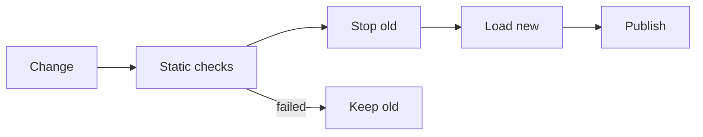

# OpenCode 扩展兼容总览

本文是 OpenBitFun 适配 OpenCode 扩展生态的总入口。它只回答三件事：OpenBitFun 与每类 OpenCode 能力差在哪里、能否适配、需要补什么。实现细节分别放在配置、服务插件、终端插件和插件运行时/Plugin Host 设计中。

本文描述目标设计与当前差距，不代表矩阵中的目标能力已经实现。只有通过固定版本样例和端到端验证的能力才能标记为已实现。
矩阵是兼容审计库存，不是默认开发路线图；`OC-R*` 只表示该能力依赖的成熟度分区。
[`OC-E0` 至 `OC-E3`](../../plans/opencode-extension-compatibility-plan.md) 是历史实施阶段，当前跨生态发现、导入和使用范围以
[当前支持声明与状态口径](external-ai-work-sources-design.md#当前支持声明与状态口径2026-09-13) 为准，
package plugin 执行子集以 [Plugin Host 当前实现](plugin-runtime-design.md#7-当前实现) 为准。
生态页“暂未支持”配合说明文案，只表示当前页面暂时无法查看该类别的内容；不表示独立 Plugin Host 未实现，也不由“可发现”推断可执行。

| 主题 | 详细设计 |
|---|---|
| 外部 AI 工作内容的发现、非阻塞提示、风险分级、导入与持续更新 | [外部 AI 工作内容体验](external-ai-work-sources-design.md) |
| 配置来源、Rules、Agents、Skills、Commands、MCP、LSP（仅 `unsupported` 来源事实）、Formatter、Theme、Keybind | [配置与声明式资产适配](opencode-config-assets-adapter-design.md) |
| JS/TS 工具、软件包插件、稳定 Hook、`client`、`serverUrl`、`$` | [服务插件运行时适配](opencode-plugin-runtime-adapter-design.md) |
| TUI 插件入口、Route、Command、Keymap、Dialog、Slot、Theme、State、KV | [终端界面插件适配](opencode-tui-plugin-adapter-design.md) |
| SDK、Server、ACP、IDE、Web、GitHub、GitLab、Slack | [外部集成适配](opencode-external-integration-adapter-design.md) |
| 进程、调用、超时、恢复、状态与 OpenBitFun 归属模块边界 | [插件运行时与 Plugin Host](plugin-runtime-design.md) |
| OpenBitFun 能力输出到外部宿主、能力组合、通用状态/事件/并发/冲突边界 | [能力装配与宿主集成](capability-runtime-integration-design.md) |
| 交付顺序和阶段退出条件 | [粗粒度计划](../../plans/opencode-extension-compatibility-plan.md) |

## 1. 基线与判断方法

本次清单刷新于 2026-07-30：

- 最新稳定版为 [`v1.18.9`](https://github.com/anomalyco/opencode/releases/tag/v1.18.9)，提交为 [`4da7bb44c84e013fa53e9c5d02ac753d1435c81a`](https://github.com/anomalyco/opencode/commit/4da7bb44c84e013fa53e9c5d02ac753d1435c81a)。
- 开发分支前瞻检查记录为提交 [`7565e03536d19e850f9996c407f9bf5e932b5f7a`](https://github.com/anomalyco/opencode/commit/7565e03536d19e850f9996c407f9bf5e932b5f7a)。该值会持续变化，只用于发现差异，不计入稳定兼容承诺。
- `v2` 前瞻分支检查记录为提交 [`247f14f9556c31ee532cb4a79a83283e753adc62`](https://github.com/anomalyco/opencode/commit/247f14f9556c31ee532cb4a79a83283e753adc62)：仓库仍以 Bun 作为 package manager、开发和默认编译路径，同时提供 Node 26 SEA 并行构建与 Node 启动器。它不是“已经完全切换 Node”的稳定承诺。
- 配置、插件、工具、Agent、Skill、Command、Rule、MCP、Formatter、Theme、Keybind、开发工具包、Server 和 ACP 以 [OpenCode 官方文档](https://opencode.ai/docs/) 为准。
- 稳定服务插件接口以 [`packages/plugin/src/index.ts`](https://github.com/anomalyco/opencode/blob/4da7bb44c84e013fa53e9c5d02ac753d1435c81a/packages/plugin/src/index.ts) 为准；
- custom tool 接口以 [`packages/plugin/src/tool.ts`](https://github.com/anomalyco/opencode/blob/4da7bb44c84e013fa53e9c5d02ac753d1435c81a/packages/plugin/src/tool.ts) 为准；
- 终端插件接口以 [`packages/plugin/src/tui.ts`](https://github.com/anomalyco/opencode/blob/4da7bb44c84e013fa53e9c5d02ac753d1435c81a/packages/plugin/src/tui.ts) 为准；
- 终端插件行为说明以 [`tui-plugins.md`](https://github.com/anomalyco/opencode/blob/4da7bb44c84e013fa53e9c5d02ac753d1435c81a/packages/opencode/specs/tui-plugins.md) 为准。

稳定兼容只固定 `v1.18.9` 的公开文档、接口源码和样例；开发及 `v2` 提交仅用于发现未来差异，不进入当前承诺。升级时必须
重新比较实际消费的文件和行为，不能沿用本次结论。

### 1.1 差异类型

矩阵用以下六种类型说明 OpenBitFun 真正要做的工作。一个扩展项可以同时包含两种类型。

| 差异类型 | 含义 |
|---|---|
| 补基础能力 | OpenBitFun 还没有可承接该行为的真实产品能力，必须先补归属模块和消费方。 |
| 补扩展接口 | OpenBitFun 有基础能力，但没有供插件调用的稳定接口或 Hook。 |
| 融合现有能力 | 两边都有相近能力，但加载顺序、状态、权限或最终归属不同，需要统一语义。 |
| 转换参数 | 基础行为一致，只需转换格式、字段、使用范围、错误或生命周期。 |
| 直接桥接 | OpenBitFun 已有窄接口，增加少量兼容接口即可。 |
| 明确降级 | 组件运行时、产品边界或接口稳定性使完整等价不合理；必须给出替代行为。 |

“OpenBitFun 有类似模块”不等于“OpenCode 已兼容”。可实现性只使用以下结论：

| 结论 | 含义 |
|---|---|
| 可完整适配 | 可以保留稳定版的可观察行为、顺序和冲突语义。 |
| 可主要适配 | 主流程可用，少量平台差异由宿主能力决定。 |
| 明确降级 | 只提供可解释的替代行为，不宣称完整兼容。 |
| 暂不承诺 | 接口不稳定，或实现会复制另一套产品运行时。 |

## 2. 总体方案

本文件只定义 OpenCode 特有来源、顺序、参数和兼容承诺。跨宿主共用的是 OpenBitFun 能力归属模块、类型明确的贡献、权限/
副作用事实、当前能力版本和对外能力接口，不是 OpenCode 原始对象。OpenBitFun 能力作为 MCP、Plugin 或 SDK 能力进入
OpenCode，和 OpenCode 配置/插件进入 OpenBitFun 是两个独立验收方向，不能用任一方向完成证明另一方向已经兼容。

- OpenBitFun 实现自己的插件兼容链路、脚本执行、OpenCode 兼容接口和 Rust 能力转发；不启动完整
  OpenCode Agent Runtime，也不把 Bun 或物理进程拓扑固化进插件内部 ABI。
- 用户和项目 OpenCode 内容默认作为持续兼容来源被后台发现。低风险声明式内容可以无感应用并给出可撤销的
  非阻塞摘要；可执行内容在首次启用或能力扩大时等待来源、插件身份和执行域确认，但不阻塞项目和无关会话。
- 设置中的统一外部来源视图负责解释全局/项目使用范围、当前支持范围、待处理项和变更结果；显式导入只是把
  非执行内容转为 OpenBitFun 原生配置的可选快照，不是 OpenCode 项目可用或插件执行的前置条件。
- Desktop、TUI、Peer Host 与只读 Server 使用同一组版本化控制 DTO。这组 DTO 只包含彼此独立的生命周期、Host 能力、恢复动作、
  `Refresh/SetSourceEnabled/SetSafeMode`，不携带 OpenCode 私有数据；审批和冲突仍归 Tool/Subagent/MCP 等能力归属模块。
- 第一条执行完整流程已覆盖官方复数目录和源码验证过的单数目录中的受支持单文件 `.js` standalone tool；`.ts`、模块依赖、
  package plugin、完整配置、Hook 和 TUI 插件入口仍只识别或延后。当前范围和完整兼容目标必须分别表达，不能用
  一个 JS fixture 宣称 OpenCode runtime 完整兼容。
- 当前 standalone Tool 使用本机 Node.js 验证受限 JS 子集，并在 Desktop 与交互式 TUI（ChatMode）显示运行时和无 OS 沙箱边界；
  脚本 worker 与 local stdio MCP 已共享跨平台进程树回收。OpenCode v2 的 Node SEA 前瞻证明 Node 是可行执行路线，但其
  Bun 编译路径仍存在；OpenBitFun 后续 TypeScript/Zod、`$` 与包依赖必须按固定样例选择脚本执行后端，不能提前把 Bun 或 Node 固化进插件内部 ABI。HarmonyOS PC 原生 CLI/TUI 必须按
  [平台专题](../platform-portability-design.md)独立取证，不包含 HarmonyOS 手机 Remote App。
- 扩展调用必须有期限、取消、有界队列、大小检查和可观察的崩溃降级；更细的权限、沙箱和组织策略沿用现有控制点并延期
  单独设计，不在首条完整流程扩大接口。
- OpenBitFun 归属模块负责最终业务状态；适配器只保留 OpenCode 的格式、顺序、参数和错误语义。

近期优先级：

| 优先级 | 可观察结果 | 暂不绑定的工作 |
|---|---|---|
| OC-E0 | 固定版本、官方 custom tool 契约、受支持单文件 fixture、当前静态预览明确显示“未执行” | 全量配置导入 |
| OC-E1 | 上述 fixture 的真实 `execute` 进入现有 Tool Runtime，支持身份/路径字段、合作式与硬取消，并在 Desktop/交互式 TUI（ChatMode）完成非阻塞审批和冲突选择 | `metadata`/`ask`、依赖型样例、package plugin、Hook、TUI 插件 API |
| OC-E2 | 一个真实 package plugin，仅实现其需要的 loader 和最小 client/context | 全部 loader fallback 和 Client API |
| OC-E3 | 按阻塞样例加入 Hook；TUI 先接 command/slash/key，toast 需先有 CLI 类型明确的状态/通知模块 | 原始 renderer、Server、Remote、连接器 |

### 2.1 当前受管 package-plugin 运行切片

当前生产路径已经包含一个受管 Bun Plugin Host，用于执行配置中显式声明的 OpenCode Server plugin。Desktop、CLI 和
app-server 复用同一条 Core 装配路径；每个本地 Session 在创建前按实际 execution root 确保对应逻辑实例，Remote
Session 不在控制机回退执行插件。一个物理 Host 可以承载多个目录实例，实例和贡献都由
`instance_id + generation_key + revision` 隔离。

Desktop、CLI 和 app-server 的标准开发/构建命令都会先构建 `extension-host.js`；Desktop 包、CLI 产品包和
app-server release 输出都把它放入 `resources/ext-host`。当前分发仍要求系统提供兼容的 `bun`（也可通过
`OPENBITFUN_BUN_COMMAND` 显式指定）；签名 Bun
sidecar 尚未交付，因此安装包还不能宣称插件运行时完全自包含。恢复 Session 和 Host 崩溃后的同 Session 下一次提交
都会重新 ensure 实际 execution root；Remote Session 继续保持不在控制机执行本地插件。

Rust 侧只暴露一个类型化 `HookFunctionRuntime` 数据面，覆盖启动及完整注册快照、`tool.execute.before/after`、插件
Tool 执行与取消、dispose，以及插件反向调用的 metadata/ask。OpenCode wire JSON 和 RPC lease 留在 adapter 内，
当前 package-plugin 的逻辑代际与诊断由 Core lifecycle 接入既有 owner/read-only surface；`PluginRuntimeClient` 只继续
服务 legacy managed-package 路径。`tool.execute.before` 先于 native `PreToolUse`，两者完成后
重新做 schema 和权限判断；Tool 只执行一次，`tool.execute.after` 再先于 native `PostToolUse`。运行型插件 Hook
失败会停止当前有序 Hook 链；after 失败只把已执行结果标成错误并反馈给模型，不进入 Tool 重试。

Config Hook 的输入复用 adapter 现有本地来源计划，按 user global、显式文件、project、配置目录和 inline 的顺序
合并完整 JSON/JSONC 对象；`$schema` 不是必填项，未知字段原样保留。OpenCode adapter 负责 Config contributor 归属及
Agent/权限/Plugin Tool/Skill 字段的类型化投影；Core 只负责现有产品 owner 对接、runtime key 绑定和 generation 原子提交。
Config Hook、插件 Agent/权限/Skill 投影、Tool 注册和模型可见 output 已接入现有归属模块。插件 Tool 的真实
`title`、`output`、`metadata` 会进入完整 after Hook 链，
原始结构化结果继续保留这些字段；after Hook 对 title/metadata 的变换尚无稳定 UI/持久化消费方，当前只把变换后的
output 作为模型展示结果，后续有真实消费方时再扩展小型展示契约。

插件 Host 初始化失败发布全局诊断；已知 workspace 的创建/激活失败发布可从对应 external-source snapshot 查询的
`plugin.activation_failed`，并继续原生 Agent Session。existing-session ensure 的诊断归属限制见第 6 节。初次激活失败时插件贡献不可用；刷新失败时已确认的
上一代贡献可能继续服务，诊断只表示本次激活/刷新失败，成功 ensure 后清除。插件 Tool 结束会同步取消其反向 ask
所创建的待审批请求，避免执行路由撤下后遗留权限状态。

当前信任边界是“配置中显式声明的插件等同受信任本地可执行扩展”。此前的 activation review/approve 接口没有进入
执行门禁，继续保留会让调用方误以为已有安全保证，现已删除。此切片保持完整功能，但不满足本文第 7 节的安全完成
判定；后续安全 PR 必须在不改变 `HookFunctionRuntime` 业务语义的前提下补齐：

- import 前不可变内容快照和 TOCTOU 校验；
- 来源签名、provenance 与安装/更新完整性；
- 首次启用和扩权确认、细粒度权限及可撤销激活状态；
- 凭据隔离、环境变量最小化和敏感数据审计；
- 每插件 worker/沙箱选型，以及 CPU、内存、网络、子进程和队列额度。

现有进程树回收、代际 fencing、期限、取消和 Host 故障重启仍是功能可靠性控制，不代表已经实现恶意插件隔离。

## 3. 能力矩阵

`当前状态`只表示 OpenCode 兼容行为是否已经进入 OpenBitFun 生产路径，不把“OpenBitFun 有相似基础模块”算成已兼容。
`成熟度依赖（非执行顺序）`表示该能力在完整兼容成熟度中的依赖位置，不代表近期执行顺序、承诺版本或必须实现。实际立项还必须有
真实样例/消费方，并满足 OC-E 阶段与产品架构总计划的退出条件。

这些表是差异审计库存，不是实施说明。快速阅读只需关注“扩展项、当前状态、目标可实现性、成熟度依赖、细节”；
“OpenBitFun 差异”和“需要完成的工作”用于解释为何不能直接桥接。实际实现范围以链接的专题设计和 OC-E 计划为准，
不能把一整张表放进同一阶段。

### 3.1 配置与声明式资产

| OpenCode 扩展项 | OpenBitFun 差异 | 当前状态 | 目标可实现性 | 成熟度依赖（非执行顺序） | OpenBitFun 需要完成的工作 | 细节 |
|---|---|---|---|---|---|---|
| 配置层级与合并 | 融合现有能力 | 已实现：runtime-free 本地来源计划 | 可完整适配 | OC-R1 | Adapter 私有来源计划统一 user global、`OPENCODE_CONFIG`、project、`.opencode`/`OPENCODE_CONFIG_DIR` 与 `OPENCODE_CONFIG_CONTENT` 的顺序和监听根；Command、Subagent、MCP、Skills、Instructions、References 仅消费各自字段并保留原有合并语义，Tool/静态 Hook 仅消费无需运行插件的目录或声明。remote、managed 与 organization 配置不在当前范围 | [来源与合并](opencode-config-assets-adapter-design.md#3-配置层级与来源) |
| JSON、JSONC、环境变量、文件引用 | 转换参数 + 明确降级 | 主要本地来源已实现 | 可主要适配 | OC-R1 | 已支持全局/项目 JSON/JSONC、`XDG_CONFIG_HOME`、`OPENCODE_CONFIG`、`OPENCODE_CONFIG_DIR`、`OPENCODE_CONFIG_CONTENT` 与项目配置禁用；inline 内容有界且使用脱敏虚拟来源标识。完整配置 schema、配置变量替换、remote/managed 来源仍未实现 | [解析与鲁棒性](opencode-config-assets-adapter-design.md#4-解析与鲁棒性) |
| 独立 `tui.json/jsonc` | 融合现有能力 + 转换参数 | 未实现 | 可完整适配 | OC-R1 | 按 global、`OPENCODE_TUI_CONFIG`、project、`.opencode` 独立顺序加载，不能复用主配置优先级 | [TUI 来源](opencode-config-assets-adapter-design.md#32-tui-独立来源顺序) |
| Rules / Instructions | 转换参数 | 部分实现：完整本地配置顺序下的文件与 glob | 可完整适配 | OC-R1 | OpenCode adapter 已读取用户全局 `AGENTS.md`/Claude fallback，并按 OpenCode 的全局文件覆盖、后续本地来源去重追加规则合并 `instructions`；相对路径从 opened directory 向 project boundary 查找，禁用项目配置时回到用户配置根。Product Assembly 在 Codex/Claude 用户来源与项目来源之前合成并去重。远程 URL 与 managed/organization policy 仍未实现 | [声明式资产](opencode-config-assets-adapter-design.md#5-声明式资产映射) |
| Agents / Modes | 融合现有能力 + 转换参数 | 部分实现：静态 Agent 安全子集、role 投影、模型/profile 绑定与 Agent-local 权限约束 | 可主要适配 | OC-R1 | 已支持当前生产 V1 与 Core V2 的已验证安全子集、全局/项目 Markdown 和 JSON/JSONC、`primary/subagent/all`、description、模型/variant 意图和工具映射；同一 workspace route/generation registry 向 Web/TUI 主选择器和 fresh Task 投影，复用审批、冲突、更新、撤下与调用租约。未声明模型继承当前/父 Session，显式模型作为新主 Session 默认值且之后可修改；不维护厂商别名、质量推断或自动 fallback。V1/V2 生命周期与有序权限规则保持原语义，主 Agent 的外部 ask/deny 约束也进入子委派 ceiling。legacy mode、root ambient permission、V1 歧义 pattern、OpenCode task target 过滤、options、采样与续接仍明确阻断或降级 | [Agents 与 Skills](opencode-config-assets-adapter-design.md#52-agentsmodes-与-skills) |
| Skills | 转换参数 | 部分实现：标准根、本地配置根与标准用户根变化失效 | 可完整适配 | OC-R2 | 现有 Registry 除标准用户/项目根外，也通过 `openbitfun-core/external_sources` 组合边界按 OpenCode 配置来源顺序累加 V1 `skills.paths` 与当前迁移后的本地字符串数组；仅接受项目根/用户目录内的本地目录并做有界递归发现。与 workspace 无关的标准用户根复用版本化快照，文件变化使其失效并在下一次发现时重建；OpenCode 配置根因作用域依赖当前 workspace 而保持按请求统一发现，标准项目根与 Remote 项目来源也仍按请求读取。同 scope 配置根覆盖标准 OpenCode 根，但不重排更早的 OpenBitFun/Claude/Codex/Cursor 来源。URL、下载/缓存、完整 allow/deny/ask 顺序及外部来源策略仍未实现 | [Agents 与 Skills](opencode-config-assets-adapter-design.md#52-agentsmodes-与-skills) |
| References | 融合现有能力 + 转换参数 | 部分实现：本地目录与既有 Workspace 消费点 | 可主要适配 | OC-R2 | 已按统一的 OpenCode 本地配置来源顺序解析 `references`/旧 `reference` 的本地 path、description/hidden，相同 alias 后者覆盖；通过独立生命周期协调器与 OpenBitFun 原生关联目录合成 native-first 有效快照，接入关联目录弹窗和既有 `@` 目录选择器。外部声明不自动进入 Prompt、不授予文件权限；Git、Remote、下载/缓存明确不支持且不做临时实现 | [References](opencode-config-assets-adapter-design.md#521-references) |
| Commands | 补扩展接口 + 转换参数 | 部分实现：prompt、本地文本文件、经审阅的 shell 上下文与显式 Subagent 委派 | 可完整适配 | OC-R2 | 已支持全局/项目 JSON、JSONC、Markdown 命令、参数展开、动态目录、刷新和显式冲突选择；模板中的静态 workspace 相对 `@file` 可在调用时有界读取，`!shell` 经精确计划审阅后仅把 stdout 加入 Prompt，静态计划可记住、参数相关计划仅可单次运行。仅 `agent` 加缺省/`true` 的 `subtask` 可委派给同 workspace、同 OpenCode 生态、已审批且仍有效的精确 Subagent，并复用现有 fresh Task 生命周期；shell 与委派的组合、`model`、`variant`、`subtask: false`、隐式默认 Agent、Remote 与附件上下文保持受限，不回退到当前 Agent 或本机执行 | [Commands](opencode-config-assets-adapter-design.md#53-commands) |
| Models / Providers 配置 | 融合现有能力 | 未实现 | 可主要适配 | OC-R1 | 静态字段进入模型归属模块；动态模型、鉴权和请求头交给插件运行时 | [声明式资产](opencode-config-assets-adapter-design.md#5-声明式资产映射) |
| MCP | 转换参数 | 部分实现：local stdio 与 HTTPS remote | 可完整适配 | OC-R2 | 已接入发现、审批、冲突、workspace 隔离、更新和启动反馈；V1/V2 MCP 声明独立解析，显式导入保留 cwd、阶段超时和动态 OAuth 开关；SSE、自定义 OAuth client 与 Agent 范围仍不支持；Remote 不回退本机实例 | [MCP、LSP 与 Formatter](opencode-config-assets-adapter-design.md#54-mcplsp-与-formatter) |
| LSP | 明确退役 | Runtime 已删除；仅可保留上游来源事实 | 明确降级：不适配 | 不安排 | command、extensions、env、initialization 只能形成 L0 `unsupported` 诊断；不得导入、应用、执行、创建 DTO、启动进程或 Remote fallback | [MCP、LSP 与 Formatter](opencode-config-assets-adapter-design.md#54-mcplsp-与-formatter) |
| Formatters | 补基础能力 + 转换参数 | 未实现 | 可主要适配 | OC-R2 | R1 解析；R2 补文件写入后的格式化执行能力，再映射 command/environment/extensions/`$FILE` | [MCP、LSP 与 Formatter](opencode-config-assets-adapter-design.md#54-mcplsp-与-formatter) |
| Themes | 转换参数 | 未实现 | 可主要适配 | OC-R1 | 保留 builtin/user/project/cwd 覆盖顺序，分别映射 GUI 和 TUI 色彩能力 | [声明式资产](opencode-config-assets-adapter-design.md#5-声明式资产映射) |
| Keybinds | 补扩展接口 + 转换参数 | 未实现 | 可主要适配 | OC-R1 | 为运行时 TUI 输入增加 `tui.json` 兼容入口，处理 leader、组合键、禁用和冲突 | [声明式资产](opencode-config-assets-adapter-design.md#5-声明式资产映射) |
| Shell / Tools / Attachments / Share / Snapshot / Compaction / Watcher | 融合现有能力 + 转换参数 | 部分实现：Command shell 偏好仅供经审阅的 Prompt 上下文 | 可主要适配 | OC-R2 | Command 的窄 shell 语义已接到 Terminal owner；通用 shell 环境、工具调用、附件、分享、快照、压缩和 watcher 仍未实现，不从 Command 路径外推通用能力 | [其他稳定配置](opencode-config-assets-adapter-design.md#55-其他稳定配置项) |
| Log / Username / Enterprise / Tool output / 旧字段迁移 | 转换参数或补基础能力 | 未实现 | 可主要适配 | OC-R1 | 覆盖 `logLevel`、`username`、`enterprise`、`tool_output` 及 `reference/autoshare/layout/mode` 迁移 | [其他稳定配置](opencode-config-assets-adapter-design.md#55-其他稳定配置项) |
| `server` | 明确降级 | 未实现 | 明确降级 | OC-R4-P | 只供显式外部协议兼容服务使用，不改变普通 OpenBitFun 启动方式 | [其他稳定配置](opencode-config-assets-adapter-design.md#55-其他稳定配置项) |
| `autoupdate` | 明确降级 | 不适用 | 明确降级 | 不安排 | 不控制 OpenBitFun 产品更新；保留来源并显示“不适用于 OpenBitFun 更新” | [其他稳定配置](opencode-config-assets-adapter-design.md#55-其他稳定配置项) |

本类整体风险是来源优先级错误、相似能力语义不一致和远程执行域错配。控制点集中在有序来源事实、字段级诊断、归属模块校验和官方配置样例，不在每个配置项内重复设计，也不为概念完整性新增公共 Graph 对象。

### 3.2 工具与服务插件

| OpenCode 扩展项 | OpenBitFun 差异 | 当前状态 | 目标可实现性 | 成熟度依赖（非执行顺序） | OpenBitFun 需要完成的工作 | 细节 |
|---|---|---|---|---|---|---|
| `.opencode/tools/*.js` | 补基础能力 | 受支持单文件子集已接入 Tool Runtime | 可完整适配 | OC-R2 | 当前 Node worker 支持基础 schema、默认值、字符串结果、取消/超时/撤下；完整 Zod、模块依赖、`metadata`/`ask` 和附件结果继续走类型化进程通信扩展 | [工具加载](opencode-plugin-runtime-adapter-design.md#5-工具与插件加载) |
| `.opencode/tools/*.ts` | 补基础能力 | 已识别，执行不支持 | 可完整适配 | OC-R2 | 当前静态显示不 import；后续由固定样例选择 Node 转译或 Bun/TypeScript worker，保留真实 schema 与 execute，不在 Rust 猜测 TS 语义 | [工具加载](opencode-plugin-runtime-adapter-design.md#5-工具与插件加载) |
| 插件 `tool` map | 补基础能力 + 补扩展接口 | 已实现：受管 Host 注册、执行、取消和 generation 隔离 | 可完整适配 | OC-R2 | 真实 title/output/metadata 已传给 after Hook；附件保留在结构化结果中，但通用文件/模型消费等待真实产品消费方 | [工具加载](opencode-plugin-runtime-adapter-design.md#5-工具与插件加载) |
| 项目与用户目录插件 | 补基础能力 | 部分实现：配置显式声明的本地文件/目录可执行，自动目录发现未实现 | 可完整适配 | OC-R2 | 补完整来源顺序下的自动发现与状态 UX；运行继续复用受管 Host | [服务插件](opencode-plugin-runtime-adapter-design.md#52-服务插件) |
| 配置中的软件包插件 | 补基础能力 | 已实现：受管缓存准备、禁用 lifecycle scripts、Bun Host 加载 | 可完整适配 | OC-R2 | 安装/更新 provenance、不可变快照和激活权限按 2.1 的安全后续项补齐 | [服务插件](opencode-plugin-runtime-adapter-design.md#52-服务插件) |
| 全局插件加载 | 补基础能力 | 未实现 | 可完整适配 | OC-R2 | 自动发现全局配置和 ConfigPaths 全局目录，并按完整来源顺序生成 `plugin_origins`；首次可执行启用按来源、插件身份和执行域确认，决定只提示一次且可按项目覆盖 | [服务插件](opencode-plugin-runtime-adapter-design.md#52-服务插件) |
| `package.json`、入口与依赖 | 补基础能力 | 主要实现：server exports/main/入口回退、`engines.opencode`、受管依赖准备，以及本地 package/source tree 内容摘要 | 可主要适配 | OC-R2 | 摘要变化会产生新逻辑 generation；物理 Host 更新边界见第 6 节。继续补 npm 配置和原生模块兼容样例 | [来源与执行版本](opencode-plugin-runtime-adapter-design.md#4-来源与执行版本) |
| 内置/MCP/外部同名工具；后续 pure/重复插件顺序 | 融合现有能力 | standalone Tool 显式选择已实现 | 可完整适配 | OC-R2 | 当前按候选身份与内容版本记忆选择且不静默覆盖；package plugin 阶段再复现 internal-first、pure、来源顺序和去重 | [注册与覆盖](opencode-plugin-runtime-adapter-design.md#53-注册与覆盖) |
| `project` / `directory` / `worktree` | 直接桥接 | 已实现：受管实例和 Tool context 使用真实本地 execution root；Remote 明确不回退 | 可完整适配 | OC-R2 | 继续补固定多工作树/多 Session 样例 | [插件兼容接口](opencode-plugin-runtime-adapter-design.md#7-opencode-插件兼容接口) |
| `client` | 补扩展接口 | 主要实现：Plugin 所需方法经实例回环 gateway 转发现有后端 owner | 可主要适配 | OC-R2 | 按真实插件补方法；未知写操作稳定失败 | [插件兼容接口](opencode-plugin-runtime-adapter-design.md#7-opencode-插件兼容接口) |
| `serverUrl` | 补扩展接口 | 已实现：每实例独立 loopback gateway，支持流式 HTTP/SSE | 可主要适配 | OC-R2 | WebSocket 明确不支持；完整外部 Server 协议不在本切片 | [插件兼容接口](opencode-plugin-runtime-adapter-design.md#7-opencode-插件兼容接口) |
| `$` 与脚本环境 | 补基础能力 | 已实现：受管 Bun Host 注入公开 `$` 能力 | 可完整适配 | OC-R2 | 受限模式仍依赖后续真实 OS/容器安全边界 | [默认策略](opencode-plugin-runtime-adapter-design.md#3-默认策略与可调权限) |
| 加载、停用、更新与崩溃恢复 | 补基础能力 | 主要实现：共享 Host、逻辑实例 dispose、代际 fencing、崩溃进程树回收、失败诊断和下一次 ensure 重启；插件失败不阻断原生 Session | 可主要适配 | OC-R2 | 正常更新/停用的物理 Host generation 替换、不可变旧版本恢复和安全更新策略按第 6 节后续项补齐 | [生命周期](opencode-plugin-runtime-adapter-design.md#9-生命周期) |
| 同一 Host 内未文档化全局共享 | 明确限制 | 已实现共享 Host，但不承诺未文档化全局协作 | 可主要适配 | OC-R2 | 保留公开 PluginInput、Hook 顺序和显式接口 | [故障域](opencode-plugin-runtime-adapter-design.md#81-故障域) |

本类整体风险是第三方代码副作用、依赖安装失败、Hook 顺序不一致和 Plugin Host 失控。默认权限可以开放，但 Rust 主应用与 Plugin Host 的进程隔离、超时、取消、队列上限、结果大小和故障恢复必须始终启用。

### 3.3 稳定服务 Hook

本节的“实现”指进入真实 OpenCode 插件运行时。静态 Hook catalog 仍只负责 runtime-free 发现；配置中显式声明的
package plugin 则由受管 Host import，并通过类型化 `HookFunctionRuntime` 执行。两条路径的状态必须分别显示，静态
发现不能冒充运行可用，运行 Host 也不能反向接管其他生态的静态目录。

| Hook | OpenBitFun 差异 | 当前状态 | 目标可实现性 | 成熟度依赖（非执行顺序） | OpenBitFun 需要完成的工作 |
|---|---|---|---|---|---|
| `dispose` | 直接桥接 | 已实现：有界清理；drain/dispose 超时使 Host 代际失效并回收进程树 | 可完整适配 | OC-R3 | 补真实阻塞插件的跨平台 Host 重启样例。 |
| `event` | 补扩展接口 | 静态目录可见，运行未实现 | 可完整适配 | OC-R3 | 提供版本化事件代理并隔离插件异常。 |
| `config` | 补扩展接口 + 融合现有能力 | 已实现：完整本地合并配置作为输入，按插件顺序执行；单个失败 Hook 回滚其修改并继续，成功结果投影 Agent、权限、Tool、workspace Skill | 可完整适配 | OC-R3 | 继续由各归属模块做最终校验；生态字段解析迁移边界见第 6 节。 |
| `tool` | 补基础能力 + 补扩展接口 | 已实现：真实定义、执行、取消和 generation-fenced 路由 | 可完整适配 | OC-R2 | 附件结果等待产品消费方。 |
| `auth` | 补扩展接口 | 静态目录可见，运行未实现 | 可主要适配 | OC-R3 | 提供 API/OAuth 方法和脱敏凭据代理。 |
| `provider` | 补扩展接口 + 融合现有能力 | 静态目录可见，运行未实现 | 可主要适配 | OC-R3 | 将动态模型列表接入 Provider 归属模块。 |
| `chat.message` | 补扩展接口 | 静态目录可见，运行未实现 | 可完整适配 | OC-R3 | 依次变换消息和 parts，变换后重做结构校验。 |
| `chat.params` | 补扩展接口 + 融合现有能力 | 静态目录可见，运行未实现 | 可完整适配 | OC-R3 | 依次变换模型参数，显式产品上限最后生效。 |
| `chat.headers` | 补扩展接口 | 静态目录可见，运行未实现 | 可完整适配 | OC-R3 | 依次变换请求头，敏感值不进入日志。 |
| `permission.ask` | 融合现有能力 | 静态目录可见，运行未实现 | 可主要适配 | OC-R3 | 默认保留 allow/deny/ask 语义；用户或组织策略可收紧。 |
| `command.execute.before` | 补扩展接口 | 静态目录可见，运行未实现 | 可完整适配 | OC-R3 | 在命令执行前依次变换消息 parts。 |
| `tool.execute.before` | 补扩展接口 | 已实现：先于 native PreToolUse，之后重做 schema 和权限判断 | 可完整适配 | OC-R3 | 补完整端到端 fixture 与交互验证。 |
| `shell.env` | 补扩展接口 | 静态目录可见，运行未实现 | 可完整适配 | OC-R3 | 在实际执行域构造环境变量。 |
| `tool.execute.after` | 补扩展接口 | 已实现：有序变换并保留原始结果；最终 model-visible output 已消费 | 可完整适配 | OC-R3 | title/metadata 等待稳定 UI/持久化消费方，见 2.1。 |
| `tool.definition` | 补扩展接口 + 融合现有能力 | 静态目录可见，运行未实现 | 可完整适配 | OC-R3 | 变换模型可见 JSON Schema；真实执行继续使用 worker 中原始 Zod 校验，保持 OpenCode 双表示语义。 |

Hook 的共同风险是把变换误做成通知、并行调用破坏顺序或插件写入非法状态。所有 Hook 都走类型化调用、顺序执行和归属模块终检；具体调用协议见[服务插件运行时设计](opencode-plugin-runtime-adapter-design.md#6-钩子适配与权威提交)。

### 3.4 终端界面插件

| OpenCode 扩展项 | OpenBitFun 差异 | 当前状态 | 目标可实现性 | 成熟度依赖（非执行顺序） | OpenBitFun 需要完成的工作 | 细节 |
|---|---|---|---|---|---|---|
| 独立 TUI 插件入口、options、meta、lifecycle | 补基础能力 | 未实现 | 可完整适配 | OC-R4-T | 独立解析 `tui.json`，加载只导出 `tui` 的模块并维护启停、取消和清理 | [发现与生命周期](opencode-tui-plugin-adapter-design.md#4-发现加载和生命周期) |
| `app`、`tuiConfig`、`keys`、`mode` | 补扩展接口 + 转换参数 | 未实现 | 可主要适配 | OC-R4-T | 提供版本、实时配置、按键格式化和模式栈兼容接口 | [能力映射](opencode-tui-plugin-adapter-design.md#5-能力映射) |
| Command 与 slash alias | 补扩展接口 | 未实现 | 可完整适配 | OC-R4-T | 声明注册到 CLI action registry，保持来源顺序，并由既有 controller 执行 | [Command](opencode-tui-plugin-adapter-design.md#54-command-与-slash-alias) |
| Route 身份与导航 | 融合现有能力 | 未实现 | 可主要适配 | OC-R4-T | 保留 route id、覆盖顺序和 navigate/current；渲染降级页由 OpenBitFun 提供退出动作 | [Route](opencode-tui-plugin-adapter-design.md#53-route-与导航) |
| Keys、Keymap、Layer、Binding、Mode | 转换参数 + 明确降级 | 未实现 | 可主要适配 | OC-R4-T | 转换公开键位和分发语义；依赖 OpenTUI Renderable 的方法明确不支持 | [Keymap](opencode-tui-plugin-adapter-design.md#55-keyskeymaplayerbinding-与-mode) |
| Alert / Confirm / Prompt / Select / Toast | 转换参数 | 未实现 | 可主要适配 | OC-R4-T | 把已知属性和返回值映射到 Ratatui 宿主交互 | [Dialog](opencode-tui-plugin-adapter-design.md#56-dialogtoast-与-prompt) |
| Theme、Attention、通知、声音 | 转换参数 | 未实现 | 可主要适配 | OC-R4-T | 接到主题与平台通知能力，无系统能力时降级到文本 | [Theme 与通知](opencode-tui-plugin-adapter-design.md#58-theme) |
| State、共享 KV、Client、Events | 补扩展接口 + 融合现有能力 | 未实现 | 可主要适配 | OC-R4-T | 提供实时只读状态、应用级共享 KV、兼容客户端和 v2 事件 | [状态与事件](opencode-tui-plugin-adapter-design.md#510-statekvclient-与-events) |
| 插件 list / activate / deactivate / add / install | 补基础能力 + 补扩展接口 | 未实现 | 可完整适配 | OC-R4-T | 分别映射查询、启停、当前会话加载和安装；`install` 不自动 `add` | [插件管理](opencode-tui-plugin-adapter-design.md#511-插件安装启用和停用) |
| Host / plugin Slots | 明确降级 | 未实现 | 明确降级 | OC-R4-T | 识别名称、属性、模式、顺序和清理；原始 Solid/OpenTUI 内容返回稳定不支持 | [Slots](opencode-tui-plugin-adapter-design.md#57-slots) |
| Route / Dialog / Prompt 的任意 JSX | 明确降级 | 未实现 | 明确降级 | OC-R4-T | 不打开空白界面；显示不支持原因并提供返回动作 | [渲染边界](opencode-tui-plugin-adapter-design.md#8-无法直接等价的边界) |
| 原始 `CliRenderer`、Solid/OpenTUI 组件树 | 明确降级 | 未实现 | 暂不承诺 | OC-R5 | 不维护第二套终端渲染树；出现高价值真实需求后单独评估 | [渲染边界](opencode-tui-plugin-adapter-design.md#8-无法直接等价的边界) |

本类整体风险是两套组件运行时不等价、输入焦点失配和异常后终端状态未恢复。宿主操作与原始组件渲染必须分开判定；任何降级页面都必须可退出，不能形成空白页或锁死 modal。

### 3.5 外部接口与实验能力

| 扩展项 | OpenBitFun 差异 | 当前状态 | 目标可实现性 | 成熟度依赖（非执行顺序） | OpenBitFun 需要完成的工作 | 细节 |
|---|---|---|---|---|---|---|
| OpenCode 开发工具包客户端 | 补扩展接口 | 未实现 | 可主要适配 | OC-R4-P | 先实现真实消费的方法；未知读接口稳定失败，未知写接口绝不伪造成功 | [外部集成设计](opencode-external-integration-adapter-design.md) |
| HTTP / OpenAPI / SSE | 融合现有能力 + 明确降级 | 未实现 | 可主要适配 | OC-R4-P | 插件回环服务复用处理器；完整外部协议独立验收 | [显式兼容服务](opencode-external-integration-adapter-design.md#41-显式兼容服务) |
| ACP | 转换参数 | 未实现 | 可主要适配 | OC-R4-P | 映射工具、命令、MCP、规则、Formatter、Agent 和权限 | [能力结论](opencode-external-integration-adapter-design.md#2-能力与产品结论) |
| IDE 扩展（VS Code/Cursor/Windsurf/VSCodium） | 补基础能力 + 融合现有能力 | 未实现 | 可主要适配 | OC-R4-P | OpenBitFun 扩展实现启动/聚焦与上下文；原扩展直连须另装 `opencode` 兼容启动器并精确覆盖环境变量、`GET /app` 和 `POST /tui/append-prompt` | [IDE](opencode-external-integration-adapter-design.md#42-ide) |
| Web 与 attach 客户端 | 补基础能力 + 明确降级 | 未实现 | 明确降级 | OC-R5 | 优先使用 OpenBitFun Web/Remote；原始客户端直连另行实现 Server 协议 | [能力结论](opencode-external-integration-adapter-design.md#2-能力与产品结论) |
| GitHub Action / App | 融合现有能力 + 明确降级 | 未实现 | 明确降级 | OC-R4-C | 提供 OpenBitFun GitHub 工作流，不冒充 `opencode` 二进制 | [代码托管与 Slack](opencode-external-integration-adapter-design.md#43-githubgitlab-与-slack) |
| GitLab CI / Duo | 融合现有能力 + 明确降级 | 未实现 | 明确降级 | OC-R4-C | 提供 OpenBitFun CI/触发器，不把 runner/CLI 计入插件兼容 | [代码托管与 Slack](opencode-external-integration-adapter-design.md#43-githubgitlab-与-slack) |
| Slack | 补基础能力 + 转换参数 | 未实现 | 可主要适配 | OC-R4-C | 实现 OpenBitFun Slack 连接器；原 `@opencode-ai/slack` 直连取决于 SDK/Server 覆盖 | [代码托管与 Slack](opencode-external-integration-adapter-design.md#43-githubgitlab-与-slack) |
| `experimental.chat.messages.transform` | 补扩展接口 | 未实现 | 暂不承诺 | OC-R5 | 保留前瞻样例，稳定后复用消息变换路径 | 本节 |
| `experimental.chat.system.transform` | 补扩展接口 + 融合现有能力 | 未实现 | 暂不承诺 | OC-R5 | 稳定后接入系统提示归属模块 | 本节 |
| `experimental.provider.small_model` | 转换参数 | 未实现 | 暂不承诺 | OC-R5 | 只做版本差异监控 | 本节 |
| `experimental.session.compacting` | 融合现有能力 | 未实现 | 暂不承诺 | OC-R5 | 只做试验样例，不改变会话持久化事实 | 本节 |
| `experimental.compaction.autocontinue` | 融合现有能力 | 未实现 | 暂不承诺 | OC-R5 | 稳定后再评估长任务控制流 | 本节 |
| `experimental.text.complete` | 补扩展接口 | 未实现 | 暂不承诺 | OC-R5 | 只做版本差异监控 | 本节 |
| `experimental_workspace.register` | 融合现有能力 | 未实现 | 暂不承诺 | OC-R5 | 不让实验接口接管 Workspace/Remote 生命周期 | 本节 |

本类整体风险是把插件所需的局部接口扩张成第二套 OpenCode Server，或把官方产品集成误算成插件兼容。稳定接口按真实消费方逐步增加；实验接口只监控和保留样例。

## 4. 版本演进与插件更新体验

### 4.1 兼容版本

每个兼容版本只维护四类事实：OpenCode 稳定版提交、配置与接口清单、加载/覆盖顺序、官方及真实插件样例。插件运行时通用合同不包含 OpenCode 字段；大多数升级只修改解析、参数转换或兼容接口。

OpenCode 发布新稳定版时按以下顺序升级：

1. 比较稳定版的配置 schema、服务 Hook、TUI API、事件和加载规则。
2. 用第 1.1 节的差异类型标记新增或变化项，先判断是参数转换还是语义变化。
3. 优先只更新版本化适配层；只有 OpenCode 增加了 OpenBitFun 完全没有的产品行为时才补基础能力。
4. 旧兼容版本继续可用，直到新版本的官方样例、顺序、失败和恢复测试通过。
5. 测试通过后再推进默认兼容版本；开发分支变化只产生前瞻告警。

未知内容统一局部降级：未知配置字段保留；服务 v1 未知事件跳过并聚合诊断；TUI v2 未知事件只转发事件类型标记，不转发未验证 payload；未知只读 API 返回稳定不支持；未知写入或变换 API 不执行且不伪造成功。任何未知项都不能造成无限重试、日志风暴或主界面等待。

### 4.2 首次加载与全局插件

- 启动时按[完整来源顺序](opencode-config-assets-adapter-design.md#31-opencode-来源顺序)生成 `plugin_origins`，并包含
  ConfigPaths 中各配置/插件目录；目录自动发现只适用于服务插件，TUI 插件必须出现在合并后的
  `tui.json/jsonc` `plugin` 列表。发现本身不授予执行资格。
- 当前能够安全消费的非执行内容按用户的“自动应用低风险内容 / 先询问”偏好处理。默认自动应用并显示一次
  可撤销摘要；当前支持范围内的 JS standalone Tool 在确认前显示“已发现，静态预览，未执行”，范围外 Tool
  显示稳定不支持原因，不能进入 worker。
- 可执行插件、Tool、Hook 和 TUI 插件的来源级加载偏好按“来源限定身份 + 插件身份 + 入口类型 + 执行域 + 更新策略”确认；
  activation/import 再按有效来源顺序、工作目录、实际 OS 用户、文件/网络/进程权限、凭据和能力摘要重新检查。workspace
  只在配置或插件实例确有独立状态时限定该状态，不拥有 runtime 或 Plugin Host。确认是非阻塞待办；同一有效
  摘要下的依赖准备、Host 启动和贡献注册不再逐层重复询问。
- 当前内置/MCP 候选内容摘要基于 Tool Catalog 已公开的身份、描述和 schema；若实现行为变化但这些摘要完全不变，当前 standalone Tool 端到端能力
  不会主动重问。后续若能力归属模块提供稳定版本号，应纳入候选内容摘要，而不是让 Core 猜测实现版本。
- 第三方模块 import 前，仍须依据来源身份、内容版本、插件身份、实际执行域/用户、产品/组织策略上限、凭据和
  环境范围重新计算当前有效策略与安全启动参数，不能复用发现期或另一执行域的决定。任何直接脚本副作用都不能
  发生在确认和 import 前重算之前。
- 不执行插件代码的依赖准备可以在后台执行；Plugin Host 加载发生在旧 Host 停止后的更新窗口。主界面可进入，一级状态显示“更新中”，详情可以显示“准备中”。初始化、
  Hook、Tool 和 Client 使用各自的可见等待预算、取消和超时结果，不阻塞无关会话。
- 全局来源只在对应执行域首次发现或来源级偏好需要处理时主动提示一次，在每个项目状态页仍可见。每次装载必须
  重新计算工作目录、文件/网络/进程权限、环境、凭据和策略，但跨项目本身不重复询问；只有新的装载扩大这些条件或能力时确认。
  项目可以覆盖全局启停；“所有项目”操作必须显式选择并列出影响范围。
- 全局更新显示来源限定身份、插件身份、新版本和所有受影响项目。原始解析、内容摘要和内容一致的完整文件缓存可以共享；
  新 Host 按兼容的进程级事实承载完整插件组，内部再按真实 OpenCode project/directory 实例装载状态。单个逻辑实例失败
  不得冒充全局结果，也不能据此按 workspace 拆分物理进程。

### 4.3 插件变化、旧进程保留与恢复

来源变化后，OpenBitFun 先检查来源更新策略和 import 前可见的运行条件，再进入安全重启：

静态检查或依赖准备失败时可以保留健康旧进程；重建旧版本必须有内容摘要匹配的完整文件副本。显式停用、删除、来源撤销、
权限收紧或安全策略失效必须先停止新调用并确认旧进程树退出，再撤下旧贡献，不能恢复到不再合规的旧状态。

上述是 package-plugin 的完整 Plugin Host 目标。更新不会把新模块直接 import 到活动共享 Host，也不会让新旧 Host
并行执行；静态检查完成后先停止并确认旧 Host，再由新 Host 装载完整插件集合并发布贡献。当前 standalone Tool 尚未保存不可变旧源码副本，
因此原位文件更新后的 load 失败会撤下旧 worker
并显示 `load_failed`，而不是从已变化文件重建并冒充上一版本。该行为只影响对应插件，不影响同来源
Command、其他 Tool 或其他生态 adapter。

当前实现对未变化且仍健康的脚本保留原 worker 和模块状态；变化、停用或删除的脚本在慢速准备前先撤下路由和
worker。授权在准备前、准备后 import 前、load 后注册前和每次 invoke 前重读，缩小 Desktop/CLI 跨进程撤销窗口；
跨进程文件偏好与已进入脚本执行之间仍不可能形成数据库式原子事务，已经发出的调用不会被回溯撤销。worker 崩溃
会立即撤下该脚本路由并标记 `load_failed`，不回退同名内置/MCP 实现，也不自动重放；下一次 Tool Catalog 暴露前
只消费一次恢复预算，仍失败则等待显式刷新或来源变化，不形成重启风暴。

当前脚本 worker 与 local stdio MCP 统一通过 `services-integrations` 的进程树边界启动：Unix 以独立 process group
完成宽限终止和强制回收，Windows 在子进程恢复前附着 kill-on-close Job Object，附着失败则不运行。这解决了受管
后代在取消、崩溃或应用退出后的常规回收，但不限制文件、网络、CPU、内存或可逃逸行为，仍不构成安全沙箱。

交互式 TUI（ChatMode）更新订阅在活动期间持有工作区服务；Desktop/Agent 每次装配模型可见 Tool Catalog 时续期并在首次或空闲
回收后同步刷新。首次后台刷新与 catalog 装配共享同一个完成门闩：catalog 等待在途结果，失败后允许下一次装配重试。
当前 standalone Tool 的目录装配租约在没有订阅或活动时于 5 分钟后撤下路由并回收 worker，避免现有每脚本一个
Node 进程永久累积；这不是 package-plugin 的 workspace-scoped runtime 设计。目标通用 Plugin Host 首期保持到最后
一个活动插件停用或应用退出，避免反复冷启动和丢失事件/模块状态。
下一次目录装配会在向模型暴露前恢复仍获批准且仍有效的 route。Remote catalog 与执行解析明确返回“不支持”，即使远端
路径文本与本机工作区相同也不会复用本机 route/worker。

| 变化 | 用户体验 |
|---|---|
| 已激活项目中的同一本地文件变化，更新策略允许且运行条件未扩大 | 后台完成静态检查，再短暂停止插件并安全重启；一级状态显示“更新中”。 |
| 软件包版本/完整性、远程内容或更新策略未覆盖的来源变化 | 不加载新代码；显示差异并等待确认。 |
| bare `latest` 软件包可能有新版本 | 固定源码的缓存命中不会主动刷新；OpenBitFun 以“检查更新/更新”增强显示候选版本和影响范围，不静默换包。 |
| import 前可判断的文件/网络/进程权限、凭据、环境变量、依赖安装行为或执行位置扩大 | 不加载新代码并显示差异；确认前健康且仍合规的旧版本可继续服务。 |
| 新 Host import 后发现新增工具、Hook 或其他受管贡献 | 停止新 Host，不注册贡献，显示真实差异并等待确认；已经产生的直接副作用不能宣称已撤销。 |
| 仅删除部分贡献且来源仍存在 | 按安全重启替换完整 Host 插件组；能力范围收窄不额外要求确认，但保留一次变更摘要。 |
| 已启用来源的代码或依赖更新失败 | 静态准备失败时健康旧进程继续服务；旧 Host 停止后失败则保持不可用，满足条件时重启完整旧版本。 |
| 来源暂时不可读或远端断线 | 标记“暂时过期”；只有无安全影响且仍可验证的上一结果可在有界宽限期内继续，恢复后重新协商。 |
| 来源撤销、权限收紧或安全策略失效 | 立即阻止新调用并停止共享 Host，再撤下旧贡献；只恢复仍合规的插件。 |
| 插件被删除或显式停用 | 停止共享 Host，再以剩余插件组启动新 Host；不能只撤贡献而让旧模块继续运行。 |
| 已删除来源重新出现 | 作为新候选重新验证；身份、内容和能力摘要未变化且策略允许时可自动恢复，否则重新确认。 |
| 当前 standalone worker 崩溃 | 正在执行的调用以已发布的 `worker-lost` 失败且不自动重放；只有内容摘要匹配的完整旧版本副本仍在时才能重建。 |
| Plugin Host 崩溃 | 同一进程承载的全部插件实例、在途调用和贡献同时失效；以一次进程级有界预算与退避恢复，不按 workspace 或插件重复启动。 |

执行版本记录不是源码备份。软件包或文件的完整旧版本副本仍在且摘要匹配时可以重建；本地原位源码已变化、
旧 worker 又丢失时不能从当前来源重建后仍称为旧版本。此时只允许准备当前来源或等待用户恢复源码。

### 4.4 能力投影与多生态边界

OpenCode 的 Config Hook、contributor 归属和 Tool registration 仍由 OpenCode adapter 解释。adapter 只把已经验证的
Agent、Tool 引用和 workspace Skill 根转换成 `product-domains` 的生态无关贡献；Core 的能力发布模块负责选择原生 Tool
基线、生成 runtime/route identity、原子替换 Agent route，并按 `(workspace, publication owner)` 保存 Skill generation。
因此一个生态更新或撤销时不会覆盖另一个生态的 Skill 贡献。

这条公共边界只覆盖当前已经存在的能力提交语义。DeepSeek Harness 当前仍是静态投影，不执行 Cordis 插件；后续增加
可执行适配时，可以为已经验证过 OpenBitFun owner 语义的能力输出同一贡献类型，但必须保留独立的 Cordis 来源解析、Host
协议、执行句柄和生命周期，也不得进入 OpenCode 的 Config Hook、Hook dispatch 或 Plugin Host 组装路径。当前配置型
Skill 根的扫描、优先级锚点和合并仍属于 OpenCode consumer；DeepSeek Harness 的 Skill 发布要等真实来源与优先级语义确定后
再扩展该 owner。本边界不定义统一 Plugin Host、统一插件协议或跨生态配置模型。

## 5. 大类风险

| 大类 | 整体风险 | 主要控制点 |
|---|---|---|
| 配置与声明式资产 | 来源优先级错误、字段语义错配、远程路径误用 | 有序来源事实、字段级诊断、版本化样例、实际执行域解析 |
| 工具与服务插件 | 任意代码副作用、依赖失败、顺序不一致、进程与系统资源失控 | import 前策略、安全启动、独立进程树、平台资源预算、固定运行时、顺序测试、期限、取消、有界队列、可验证的旧版本 |
| 稳定 Hook | 把变换误作通知、非法结果污染业务状态 | 类型化调用、顺序执行、每步结构检查、归属模块终检 |
| 终端插件 | 组件运行时不等价、焦点/模式锁死、终端恢复失败 | 宿主操作与渲染分离、安全降级页、强制清理和终端恢复测试 |
| 外部与实验接口 | 复制第二产品协议、稳定接口被实验变化拖动 | 按真实消费方扩展、稳定与实验清单分离、兼容版本固定 |
| 激活后的默认开放权限 | 插件可直接产生文件、网络和进程副作用 | 首次激活和扩权确认、可调权限、来源可见、进程隔离；不虚构细粒度拦截能力 |

## 6. 明确限制与延期决策

| 能力 | 结论 | 原因 | 替代行为 |
|---|---|---|---|
| 原始 `CliRenderer` 和 Solid/OpenTUI 组件树 | 暂不承诺完整兼容 | OpenBitFun Ratatui 与 OpenCode 组件树、布局和生命周期不共用运行时 | 适配导航、命令、公开键位、已知对话、主题和通知；原始组件显示明确不支持。 |
| `api.app.version` 无法表达 renderer 降级 | 协议限制 | 插件只能读取兼容版本，没有能力协商字段，可能在懒路径选择 OpenBitFun 不支持的组件能力 | 初始化依赖 renderer 时拒绝整个插件入口；懒路径返回 `unsupported(renderer-required)`，不能宣称仅凭版本检查即可兼容。 |
| 完整 OpenCode HTTP Server 协议 | 不作为插件兼容前置目标 | 会形成第二套产品协议、会话和错误模型 | 为插件实现所需 Client/回环路由；外部协议按独立产品需求扩展。 |
| 原始 IDE/Web/attach/GitHub/GitLab 客户端或流程直接连接 OpenBitFun | 不承诺直接替换 | 这些入口依赖 OpenCode CLI、Server、会话和产品流程，不是插件接口 | 提供 OpenBitFun 原生集成；IDE `/tui` 子集和外部协议按真实需求单独兼容。 |
| 插件间 `globalThis`、进程环境和模块单例共享 | 不作为稳定承诺 | package plugin 默认共享 Plugin Host，但必要的后端/安全拆分、安全重启和崩溃恢复都会重建进程状态 | 保留官方 PluginInput、Hook 顺序和显式接口；未文档化全局副作用可能可见，但不作为兼容契约。 |
| `server` / `autoupdate` 在普通 OpenBitFun 启动中的行为 | 明确降级 | 两者分别属于 OpenCode 服务进程和 OpenCode 自身更新 | 显式兼容服务可映射 `server`；`autoupdate` 只保留来源并说明不适用。 |
| 未文档化内部接口 | 不承诺 | 没有稳定版本和契约 | 返回稳定不支持并进入版本前瞻报告。 |
| `experimental_workspace.register` | 暂不承诺 | 接口未稳定且会改变工作区与远程连接归属 | 继续使用 OpenBitFun Workspace/Remote 归属模块，稳定后重评。 |
| 受限策略下拦截任意脚本副作用 | 只能部分控制 | 插件可以直接调用脚本运行时，绕过细粒度能力代理 | 来源激活后默认兼容策略放开；用户收紧时明确列出被禁用或无法拦截的能力。 |
| 无硬资源限制平台上的系统资源耗尽 | 不能保证完全隔离 | 已有进程树可回收受管后代，但仍不能阻止内存、CPU、网络或逃逸进程拖慢整机 | 在真实需求下增加 cgroup/rlimit/容器等平台额度；缺少硬限制时显示残余风险。 |
| Plugin Tool 通用附件消费 | 后续产品 PR | 当前已保留 OpenCode attachment 的 mime/url/filename，尚无跨模型、文件 UI 与持久化共同认可的消费合同 | 本 PR 不把已完成的副作用误报为失败；后续由真实消费方定义文件授权、下载/读取、Remote 和模型可见规则。 |
| Plugin Config Skill 在 `/skill` 目录与批量管理中的展示 | 后续体验 PR | 当前 workspace Skill 根已进入 Agent 上下文、隐式发现和 Skill Tool 精确加载；Desktop/CLI 的 mode Skill 目录仍只扫描常规来源，因此插件 Skill 暂不出现在下拉选择和批量管理中 | 有明确产品需求时复用 Skill Registry 现有候选合并步骤，让 mode/all-skills 查询共享同一来源集合，并补 Desktop/CLI 生产 consumer 测试；不新增 Skill catalog 或扫描框架。 |
| 正常更新或停用时替换物理 Host generation | 后续生命周期 PR | 当前内容/依赖变化会形成新逻辑 generation，旧 Hook、Tool、Agent、Skill 会撤下并调用 `dispose`；共享 Bun Host 仅在崩溃、不可确认取消、应用退出时回收完整进程树。未正确实现 `dispose` 的 import 期 timer、连接或子进程可能继续存活，依赖模块缓存也可能保持到物理 Host 重启 | 在共享 Host owner 增加一次进程级 drain/stop/确认/重启，撤下旧 Host 的全部 workspace generation，再按使用恢复仍启用的 workspace；不增加 per-plugin Runtime 或热迁移状态机。 |
| OS 级强制终止本身失败 | 后续可靠性 PR | 这是极端平台故障；当前代际会撤下贡献并报告故障，但缺少“确认进程死亡前永久禁止同进程重启”的持久 poisoned gate | 增加可验证的进程存活探测和 sticky poisoned 状态；只有确认旧树死亡或应用重启后才允许新 Host，覆盖 Windows/Unix 故障注入。 |
| 代际替换与长时 backend 写请求精确并发 | 后续可靠性 PR | 当前会停止新 Hook/Tool、取消 instance stream 并 dispose，但尚无 instance-scoped backend RPC admission/drain；极端并发下旧代已接收的写请求可能晚到完成 | 在 backend bridge 增加 instance-scoped 拒绝新请求和有界 drain；超时标记 OutcomeUnknown，且不得确认 replacement 完成。 |
| 多 workspace 同名 Tool 激活与退役精确并发 | 后续可靠性 PR | 当前 mux 路由与全局注册表分别受锁保护；极端的最后一条旧路由退役和新路由激活交错时，可能短暂撤下仍有新路由的 mux | 统一两层状态的锁序或保留空 mux，并增加同名 Tool 激活/退役并发测试；常规顺序切换和 workspace 隔离已由本 PR 覆盖。 |
| workspace 在扫描前已被删除或移动 | 后续清理 PR | workspace 路径无法规范化时不会猜测等价身份；已激活实例可能保留到显式停用或应用退出 | 保存已确认的 canonical identity，并在来源撤销通知中按该 identity 退役；补删除、移动和符号链接变化样例。 |
| Core 内遗留的 OpenCode Client wire 投影 | 后续边界收敛 PR | 当前 loopback adapter 已拥有认证、framing、route/method 匹配和传输错误，但受限的 `client.*` bridge 仍在 Core 解析部分 query/body 并生成 wire JSON；普通插件链路已闭环，协议演进仍可能触及 Product Assembly | 按真实插件消费到的 route 分批把 wire DTO、解析和响应投影移入 `opencode-plugin-host`，向 Core 暴露最小 typed operation/result 并增加 boundary gate；不引入通用 HTTP transport、第二套产品协议或一次性重写。 |
| existing-session 激活失败的诊断归属 | 后续诊断 PR | 当前 create-session 失败按 workspace 记录；已有 Session 的 ensure 失败缺少已解析 execution root，可能显示为全局诊断，但不会改变原生 Session/Turn 结果 | 让 ensure 返回 workspace 与错误的组合，并补 workspace A 失败不污染 workspace B 的状态测试；不改变插件激活或执行语义。 |
| existing-session 每次 ensure 的 prepare 成本 | 后续性能 PR | 当前每个恢复触发点都会重新 prepare，再按稳定摘要复用实例；结果正确，但大本地源码树会增加文件扫描和一次 Host RPC | 在来源 watcher/config revision 已有事实之上增加健康 generation 快路径；失去健康或版本事实时仍执行完整 prepare，不使用固定 TTL 猜测。 |

这些限制已经作为当前架构决策：项目状态只能表述为“兼容矩阵已审计、已实现项按证据列示”，不能表述为“稳定
扩展面已完整实现”或“所有插件完整兼容”。只有真实需求和新证据可以重新开启延期项。

## 7. 完成判定

每项只有同时满足以下条件才算完成：

1. 按 OpenCode 来源、使用范围和顺序发现输入。
2. 解析或真实执行官方格式，不以静态字符串预览代替运行结果。
3. 参数、返回值、冲突、错误和生命周期通过固定版本样例。
4. 单插件业务失败不直接传播到其他插件、主界面或无关会话；平台无法提供硬资源限制时，系统资源耗尽按第 6 节明确为残余风险。
5. 用户能看到来源、使用范围、已发现/已应用/可用差异、降级原因、更新结果和恢复动作。
6. 低风险内容的自动应用可撤销；首次启用和 import 前可见的运行条件扩大时，不会在确认前执行代码；import 后动态贡献
   扩大不会在确认前注册，并明确 import 的直接副作用不可撤销。等待确认不阻塞项目。

阶段状态必须按切片独立表达：OC-E1 完成只代表 standalone tool 完整流程，不暗示 package plugin、Hook、TUI、Server
或 Remote 已完成。矩阵中未立项项保持“未实现/暂不承诺”，不能阻塞已完整流程能力，也不能被后者冒充。

阶段交付和退出标准见[粗粒度计划](../../plans/opencode-extension-compatibility-plan.md)。
