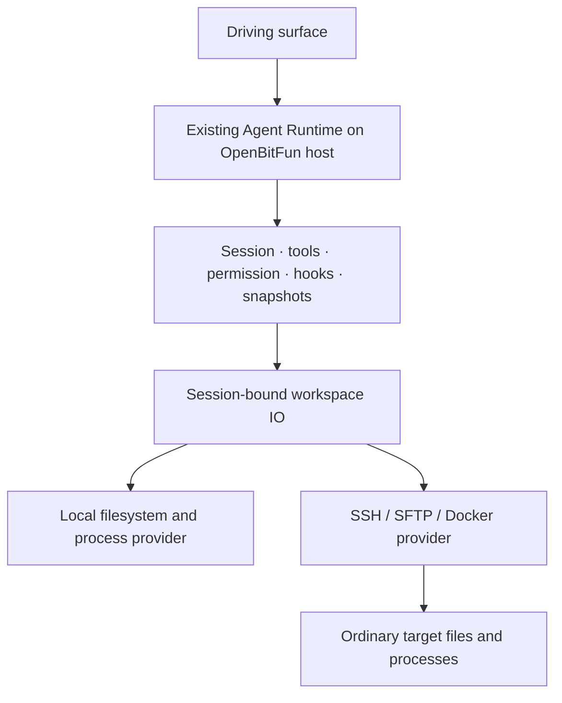

# Remote workspace transport

This document defines the transport boundary for SSH, Docker, and WSL workspaces.
The Agent Runtime stays on the OpenBitFun host. Local and remote workspaces share
file-tool algorithms through Session-bound IO providers; search retains native
acceleration with shared matching and reduction. The convergence section below
describes this boundary and the remaining capability limits.

## Controller and runtime ownership

Desktop and CLI are full OpenBitFun runtime hosts. Mobile apps and mobile-web
are controllers: they select a host and invoke its product operations through
the authenticated relay. They do not become a task runtime, filesystem owner,
SSH credential store, or terminal process host.

The selected runtime owns tasks, sessions, workspaces, saved SSH connections,
credentials, files, and PTYs. A controller may open a new directory on that
runtime, or a new POSIX directory through one of that runtime's **saved** SSH
connections. It selects the saved connection ID returned by the runtime; it
cannot create an arbitrary SSH target or send a replacement host/credential.
The runtime reconnects using its saved configuration and credential vault.
Explicit connection identities must match exactly. Missing connections and
credentials return an error and preserve saved data; they never select another
host at the same path or fall back to the controller/local filesystem.

Controller file editors pass `expectedHash` (SHA-256 of the UTF-8 bytes they
read) to `write_file_content`. The portable target service checks the revision
and writes under a per-target/path critical section, following Happy's
`registerCommonHandlers` optimistic file-write contract. An empty hash requests
creation only; omitting it preserves ordinary runtime write semantics. Conflict
errors retain the editor buffer. The lock serializes participating runtime
writes; it is not a filesystem transaction against unrelated external editors.

Terminal output is retained by the PTY owner and read by monotonic byte cursor.
Relay notifications announce that output is available; controllers catch up
through bounded pages, detect evicted cursors explicitly, and do not repeatedly
transfer a complete terminal buffer while idle. Desktop and CLI expose the same
product operations; lack of a desktop window is not a reason to disable a
portable runtime capability.

## Goals

One saved target must have the same workspace semantics across:

- direct SSH and an arbitrary `ProxyJump` chain;
- a container reached through its own sshd;
- `docker exec` on a remote Docker host; and
- `docker exec` on the local machine.

Once connected, all workspace commands, terminal sessions, Agent subprocesses,
ACP processes, search helpers, and file operations target the effective
workspace. Docker-host commands are never an implicit fallback.

The transport adapters run on macOS, Windows, and Linux clients. Remote paths
remain POSIX paths on every client, and host `std::path` semantics must never be
used to split or join them. Docker execution targets a POSIX-compatible
container shell.

## Issue capability matrix

| Issue tier | Capability | Design owner |
|---|---|---|
| P0 | Arbitrary ProxyJump chain, per-hop host/user/key, staged errors | SSH session establishment |
| P0 | Local/remote Docker, direct container sshd, `docker exec` | Effective target resolution |
| P0 | Terminal, Agent, files, ACP, and search stay inside the container | Workspace stdio and file adapters |
| P1 | SSH config import and Docker container discovery | Existing remote connection dialog |
| P1 | sshd probe with `docker-exec` fallback | `container.access: auto` |
| P1 | Jump/target/container test stages | Connection test report |
| P2 | ssh-agent, OpenSSH certificates, keyboard-interactive challenges | SSH authentication adapter |
| P2 | Bounded connect/auth timeouts, retries, and challenge rounds | `SSHConnectionOptions` |
| P2 | TTY, stdin, long-running completion, interrupt/kill | Terminal adapter and `WorkspaceStdio` |
| Optional | Arbitrary host-side diagnosis from a container workspace | Deliberately excluded; requires a future typed read-only security surface |

## Configuration and runtime resolution

`SSHConnectionConfig` is the user-authored, persisted target. An
`ActiveConnection` retains that configuration for reconnect and drift
detection, and separately stores an `effective_config`.

For `container.access: auto`, connection establishment probes the container's
published `22/tcp` endpoint:

1. local Docker opens a normal SSH session to the published loopback port;
2. remote Docker opens a second SSH session through a `direct-tcpip` channel
   owned by the Docker-host session;
3. a successful handshake and authentication resolves the effective access to
   `sshd`;
4. an unavailable or rejected endpoint falls back to `docker-exec` and probes
   the configured container shell.

Runtime code only reads `effective_config`. The original `auto` value remains
persisted so a later reconnect can discover that sshd has become available.

## Native WSL

WSL is an independent workspace target. The additive `wsl` profile field stores
an explicit distribution and optional Linux user. Missing `wsl` preserves legacy
SSH/Docker behavior. Reserved `wsl.invalid:0` legacy endpoint fields keep older
readers from treating a WSL profile as a usable SSH endpoint. Connection drift
and saved-profile deduplication include the WSL target.

The Services integration launches `wsl.exe --distribution … --cd ~ --exec
/bin/sh -lc …` on the owning Windows host through the managed command factory.
Each argument stays separate; command stdout and file streams remain binary.
Only Windows-side WSL listing and diagnostic output is decoded as UTF-16LE when
needed. Interactive terminals use the existing local PTY adapter and WSL's
configured default shell, with a POSIX cwd. Non-TTY commands share Docker's
in-target PID/process-group supervision and separate signal channel.

WSL uses shell filesystem operations, never SFTP or Windows-local path IO.
The host advertises `wsl_workspaces_v1`; controllers reject WSL discovery and
profile mutations before RPC if the peer lacks that capability. Discovery then
reports the executing host's platform support. CLI peer setup is explicitly
unsupported by the Product Operation Registry. Existing Remote Control sessions
reuse the bound workspace providers, and Detached Dispatch does not create WSL
profiles. Native WSL has no SSH transport for port forwarding.

## ProxyJump

The comma-separated jump chain is resolved left to right. Each token can be a
`~/.ssh/config` alias or `[user@]host[:port]`. Every hop has an independent
resolved host, port, user, identity file, certificate, and host-key check.
`direct-tcpip` channels carry the next SSH handshake; handles for all preceding
hops remain owned by the active connection.

Errors carry the stage name (`Jump N`, final target, or container sshd) and
separate reachability, handshake, and authentication failures. Connection and
authentication timeouts, whole-chain connection retries, and maximum
keyboard-interactive challenge rounds are bounded by `SSHConnectionOptions`.

Agent and OpenSSH certificate authentication are available on the target and
through SSH-configured jumps. Explicit password or keyboard-interactive
responses can be reused by a jump when that jump has no independent identity
configuration. Challenge responses and passphrases are runtime-only.

## Workspace stdio

`WorkspaceStdio` is the process-level port shared by SSH and local Docker:

```text
caller
  ├── stdin  ───────────────▶ workspace process
  ├── stdout ◀─────────────── workspace process
  ├── stderr ◀─────────────── workspace process
  ├── interrupt / kill ─────▶ supervisor
  └── completion / exit code ◀ supervisor
```

The SSH adapter pumps a `russh` channel. The local adapter supervises a piped
child process. Dropping all public IO streams cancels the owner, and explicit
interrupts escalate through the existing remote-exec grace period. This port is
used by:

- non-TTY remote execution, including stdin writes;
- local and remote Docker file streams;
- remote ACP subprocesses; and
- remote Flashgrep search helpers.

For non-TTY Docker processes, the command shell records the child PID inside
the container and uses `setsid` when available. Interrupt and kill requests
open a separate local or remote `docker exec` control path, signal the
in-container process group, and then close the owning Docker CLI transport.
This prevents cancelling the client-side CLI while leaving the workspace
process running. PID tracking is an enhancement, not a new execution
prerequisite: containers with a read-only temporary directory keep the legacy
Docker execution path and fall back to transport-level cancellation.

TTY execution remains a terminal-specific adapter: SSH requests a PTY, while
local Docker uses the existing local PTY service with `docker exec -it`.

## Files

SSH workspaces continue to use SFTP. Docker workspaces use binary stdio streams,
not text or base64 envelopes.

Reads stream chunks and report real byte progress. File transfers stream to a
unique temporary file in the destination directory and rename it only after the
input has completed successfully. Cancellation kills the process and the shell
trap removes the temporary file, so an interrupted upload does not replace a
valid destination with partial content. Workspace tool writes retain ordinary
filesystem semantics instead: after validating the staged bytes, they write
through the destination to preserve existing links and permissions. The final
write is not an atomic transaction against other writers; interruption during
that phase can have a partial or unknown outcome.

Directory and stat records use NUL-separated fields. File names containing
newlines or the delimiters used by older implementations remain round-trippable.
The records are decoded only after the full byte stream is assembled; invalid
UTF-8 names return an explicit unsupported-path error. Likewise, streamed text
output keeps incomplete UTF-8 suffixes between transport chunks instead of
inserting replacement characters at arbitrary chunk boundaries.

Remote names are validated before recursive download. Traversal components and
local-platform-invalid names are rejected, and case-colliding sibling names are
rejected on Windows and macOS before either entry can overwrite the other.
Recursive local uploads reject non-UTF-8 names and symbolic links explicitly;
recursive downloads reject remote symbolic links. Transfers never silently
omit an entry or follow a link outside the selected tree.

Host bind mounts are not path-translated. A host path is visible only at the
path mounted inside the container.

Workspace-facing file requests are scoped by the remote connection id together
with the POSIX workspace path whenever that id is known. A path alone is only a
legacy compatibility fallback: the same path may exist on multiple SSH hosts,
so new browse and search callers must carry the session or workspace connection
id through the platform adapter. One product surface must use the same scope for
directory browsing and filename search instead of consulting mutable global
workspace state between requests.
An explicit connection id is exact target identity, not a best-effort hint. If
that connection is unavailable or does not own the requested path, the request
fails without reading the controller filesystem or another registered host.

Recursive remote filename searches publish cancellable progress as matches are
discovered. Product surfaces render those partial results before traversal
completes and preserve a distinct error state; a transport or routing failure
must not be presented as an empty search result.
The transport adapter advertises whether command-scoped search events reach the
current surface. Peer Device controllers without a negotiated search-event
contract use the response-based command on the peer host; they never fall back
to searching the controller filesystem.

## Authentication and secrets

Supported target methods are password, private key, private key plus OpenSSH
certificate, OpenSSH agent, and keyboard-interactive responses.

- Passwords use the existing encrypted password vault.
- Private-key paths, certificate paths, and auth method metadata may be saved.
- Private-key passphrases, keyboard-interactive responses, and OTP values are
  never copied into `SavedConnection`.
- A saved interactive profile is retained but requires credential entry on the
  next manual connection.
- A legacy serialized `Agent` profile keeps its old
  `~/.ssh/id_rsa` compatibility fallback when the agent is unavailable.

## Product surface

The existing remote connection dialog owns all target types. It can import SSH
config hosts, discover local or remote Docker containers, choose `auto` or
`docker-exec`, and test the resolved jump/target/container stages before
connecting.

OpenBitFun intentionally does not expose an arbitrary “run on Docker host” action
from a container workspace. That would bypass the selected workspace and its
security boundary. Host diagnosis, if added later, must be a typed, read-only
capability with a distinct confirmation and audit surface.

## Workspace identity contract

A workspace reference is `(owning host, workspace ID)`. Resolve that ID against
that host's persisted workspace catalog before choosing execution services.
`WorkspaceInfo.workspace_kind` is the authority for Normal, Assistant, or Remote;
an SSH connection ID is a property of a Remote workspace, not a type predicate.
A missing ID or unavailable record must not fall through to another workspace
with the same path. SSH endpoints named `localhost` remain Remote.

Keep three different location roles separate:

- The workspace record's root is the project directory on the execution host.
- A session execution target may select a registered worktree within that project.
- The persistence owner computes the local session storage directory. This
  directory is never an execution root, workspace ID, or input to workspace selection.

Paths remain necessary for file operations, terminal working directories and
new-folder creation. They must not key workspace catalogs, subscriptions, routing,
selection, or cache ownership. UI events retain workspace IDs through every
adapter; session operations recover their workspace from the session's stored ID.
Across devices, IDs are interpreted only by the selected owning host.

Persisted IDs are opaque. Catalog validation checks record/map-key agreement and
reference integrity; it must not recompute IDs from paths or require a working
SSH profile. Keep unavailable records in the catalog. Activation validates the
selected record's IO requirements and reports unavailability. The pre-1.0 offline
import adapter may calculate historical destination IDs as part of its explicit
migration plan; that algorithm is not a runtime catalog API.

### Temporary upgrade adapter and sunset

`WorkspaceService::resolve_legacy_workspace_reference` in `workspace/legacy_compat.rs`
is the temporary conversion boundary for pre-ID data and protocols, including
1.0.0. It is not a workspace lookup API for new business code. Explicit IDs never
fall back to path matching. Legacy paths may select exactly one persisted record;
ambiguous or missing references retain the original data and require reselection.
Local hidden session storage paths must never be treated as project roots.
Successful conversions retain the record ID for subsequent requests and saves.

Linked worktrees persist `worktree.mainWorkspaceId` as the project relationship.
`mainRepoPath` remains readable as a filesystem projection for older builds; it is
not a join key for session storage or navigation. The upgrade adapter converts
legacy relationships using only unambiguous local workspace records. Remote
records with the same POSIX path are not eligible local project parents. Once an
ID is present, a stale path cannot redirect it. The upgrade may register an existing local main folder once when 1.0.0 never
opened it; unavailable folders and hidden runtime directories remain
recoverable errors; loading or importing an unavailable workspace must not delete
it. Remote workspaces are never inspected with the controller's local Git scanner.

Filesystem IO providers receive an explicit local or SSH target selected from the
ID-owned record's `workspaceKind`. They must not scan a remote workspace registry
to infer the provider from the requested filename. Directory browsing before a
workspace exists is an explicit device/connection operation, not workspace lookup.
Desktop file IO ingress accepts the workspace ID, including read/write, metadata,
rename/delete/create, and runtime-artifact reads. A `current` artifact URI resolves
against the request ID; a URI naming a different workspace is rejected. Legacy
file routing is isolated in the upgrade adapter and rejects a path shared by
multiple filesystem providers instead of using the active SSH connection.
Remote search binds its provider directly to the ID-owned record and validates
subsequent IO scope without looking up the workspace a second time by its root.

Snapshot command ingress resolves the ID before selecting local/remote behavior.
The local snapshot port takes IDs and rejects remote records before accessing IO.
Local writer, read-only view, initialization-lock, and bound remote snapshot caches
are keyed by workspace ID. Their on-disk layout is an IO projection and remains
unchanged for history upgrades.
Session history storage is resolved independently from the execution directory.
Remote full rollback remains unsupported; it must fail before changing files or
messages. Persisted remote operation reads retain their connection-scoped history.
The current client sends an ID; the negotiated old-host projection includes both
connection ID and SSH host. Client in-flight cache ownership includes the driving host and workspace ID.

Session list, restore and coordinator-load requests carry a workspace ID. A
current client does not supply an execution directory or hidden history directory
as the selector. History hydration and context-restore deduplication use host,
workspace ID and session ID. A session creation with an explicit unavailable ID
must fail; it cannot choose the active workspace by matching a folder or SSH host.

Session fork requests also carry workspace IDs. Fork validates both the persisted
and loaded source against that ID under the session mutation lock; worktree
execution IDs retain their explicit project-ID relationship. Stale path and SSH
projections cannot override the registered kind. Only the temporary fork ingress
adapter accepts a 1.0.0 resolved session-directory payload, and only after locating
the source by its registered workspace ID and checking the exact storage projection.

Child detail hydration first reads missing metadata through the parent's project
workspace ID, then uses the child's own execution workspace ID. A child's worktree
ID must not be replaced with the parent's ID. Metadata completion preserves live
turns and UI state.

Scheduled-job filters match workspace IDs exactly, including after upgrading
persisted 1.0.0 targets through the temporary adapter. Missing IDs are not wildcard
matches. Workspace job execution refreshes its binding from the catalog, and the
editor requires explicit reselection for an unresolved target. HTML preview also
resolves its root and SSH provider by ID; file paths remain IO operands.

The private Shared TUI protocol advertises `workspace_id_references` in version 19.
Current clients can read version 18 discovery and handshake responses; absent
capability means the adapter emits the legacy payload using the selected object's
root. `legacy_workspace_operation` is an outbound part of this temporary boundary,
not a path lookup API. Its sunset is removal of private protocol 18 support. The
Shared Runtime list and restore handlers compare workspace IDs; the predecessor payload is
accepted only at legacy ingress.

External integration settings written under the retired path-hash key are copied
once to the ID-derived key by this same upgrade boundary. Keep the old entry for
rollback, never overwrite an existing ID entry, and reject a legacy key shared by
multiple workspace records. Discovery caches, MCP routes and tool routes use the
ID thereafter; the root derived from the record is only an IO parameter. A missing
workspace ID is not the user-global scope: only an explicitly unscoped request may
read global settings.

New peer hosts advertise `workspace_id_references_v1`. An old-protocol serializer
may translate an ID-selected object into the old payload only after negotiating
legacy support; it may not resolve identity from a path or guess another host.
Legacy fields remain readable with defaults and unrelated future fields remain
ignored. Do not delete sessions, credentials or workspace records on conversion
failure. Tests must include real 1.0.0 payload shapes, unknown IDs, same-path
local/SSH and multiple-host records, storage/execution separation and restart.

Sunset the adapter when persisted references have migrated and every supported
peer can negotiate ID references. Until then, keep path conversion isolated at
upgrade/old-protocol ingress. New internal APIs and new protocol consumers must
not acquire a path-based workspace key. Removing the adapter is a coordinated
minimum-peer-version change, not an opportunistic deletion of user data.

## Upgrade compatibility

New configuration fields have Serde defaults. Profiles written before this
design remain direct SSH targets with the same IDs, credentials, paths, and
workspace restore entries. Legacy port-bearing IDs are migrated together with
password-vault and workspace references.

Local Docker profiles may legitimately retain an empty legacy password
placeholder. Connection, testing, and local container discovery do not require
a password-vault entry for those profiles.

Startup recovery never deletes a profile or workspace merely because a
credential is unavailable, a connection times out, or a remote host is
temporarily offline. Destructive removal remains an explicit user action.

Contract tests cover legacy Agent/profile deserialization, defaulted connection
options, remote-workspace retention, stdio round trips, cancellation, and
delimiter-safe Docker metadata parsing. A Docker-backed ignored integration test
is available through `OPENBITFUN_TEST_DOCKER_CONTAINER`.

## Agent Runtime convergence

Decision: keep remote workspaces lightweight. Do not require OpenBitFun CLI,
a remote Agent daemon, a shared service, or a new remote installation. The
OpenBitFun host keeps the existing Agent Runtime, model credentials, Session and
permission ownership. Only workspace filesystem and process IO crosses SSH.
Read, Write, Edit, Delete and LS use the bound filesystem provider. Grep and
Glob share matching/result algorithms while retaining native acceleration.
Snapshot file IO uses that same boundary; complete remote Session Undo remains
gated because individual recorded operations do not prove historical coverage.

### One Runtime, one IO boundary



Runtime ownership and execution location are different concerns. Sharing the
Runtime does not require deploying it beside the workspace. Session lifecycle,
read-before-write checks, edit matching, result rendering, snapshot history and
revert transitions have one implementation on the OpenBitFun host. Providers only
perform typed filesystem/process operations; they do not implement Read, Edit,
Grep or fork as separate product features.

Target installation, process supervision, a multi-user daemon, model proxying
and Session migration are not prerequisites for this SSH workspace feature.
Existing App Server, Shared TUI IPC, Peer Device and Detached Dispatch contracts
are unchanged.

### Shared owners and provider contracts

| Responsibility | Shared owner | Provider boundary |
|---|---|---|
| Agent loop, context, permissions, fork, Session persistence | Existing Runtime / Coordinator / SessionManager | None; preserve existing host ownership |
| Read windows, tail, text encoding and output budgets | `tool-execution` reading algorithm | Open a byte stream; metadata when needed |
| Edit/Write matching, freshness and result construction | Existing tool pipeline and read-state owner | Read bytes, inspect metadata, write bytes |
| LS/Glob filtering, order and presentation | Shared listing and search helpers | Enumerate typed entries with metadata |
| Grep pattern/type/ignore policy and result reduction | Shared search helpers | Native scanning, remote bytes, optional compatible search accelerator |
| Snapshot hashes, compression, history and revert phases | Existing Snapshot owners on the OpenBitFun host | Read/restore/remove actual workspace files |
| Exec lifecycle and output | Existing execution owner | Local process or existing SSH process transport |
| Hook contract, permission decisions and source trust | Existing hook owner | Explicitly selected execution domain and process provider |

`WorkspaceFileSystem` remains the typed boundary. It must distinguish missing
paths from permission/transport errors, preserve byte content and symlink
semantics, expose real metadata, and provide streaming reads and the mutation
operations actually consumed by tools and snapshots. File length or timestamp
not supplied by a backend is unknown, not zero. Remote modification times come
from the target, not the controller clock.

Local and SFTP readers can seek. A Docker stream may reject seek explicitly
while supporting the shared forward-only parser and tail ring buffer; it must
not implement seek by silently downloading an entire file to a temporary local
copy. Cancellation drops/cancels the transport, and successful EOF must include
successful command completion. Output and memory bounds do not imply a bound
on network transfer.

The path resolver and Runtime context select the provider once from the
Session's verified workspace binding. A remote request with an unavailable
provider fails; it never acquires a local provider as a fallback. Explicit
`openbitfun://` artifacts remain host-owned and use local storage even in a remote
Session. Tools must not consult whichever workspace is currently selected in
the UI. POSIX remote paths must not acquire controller OS path semantics.

### Search and large-file performance

Preserve the local native parallel scanner and its ignore behavior. Do not
route all local search through a POSIX shell just to make the call sites look
the same. Share pattern/type expansion, matching semantics, sorting, pagination
and output construction; retain provider-specific data access optimizations.

An already available compatible target search executable can reduce network
traffic. It is an optional accelerator, not a requirement to install OpenBitFun.
Its results must satisfy the same contract, including file type definitions,
ignore rules, Unicode, filenames containing newlines, context and truncation.
Do not equate different system `rg` type catalogs or approximate a Rust regex
with system grep and report an empty result as success.

The built-in `Grep` API accepts structured search arguments; it is separate from
model-authored `ExecCommand` shell text. ExecCommand preserves the submitted
command and reports the target environment's actual result. The model can then
choose another available command; the runtime does not silently rewrite it.

Current target prefilters accept nonempty case-sensitive literals or unions of
literal alternatives. They never compile the full user regex in a second engine:
even an installed `rg` can have different Unicode tables. Other expressions use
the shared scanner. A behavior-probed `rg` returns framed NUL-delimited candidate
paths. If unavailable, a behavior-probed system `grep -a -F -q` checks authorized
regular files in batches of at most 128 paths / 16 KiB of command text. These are
transport batch sizes, not search limits; oversized arguments use file streams.
Grep additionally retains UTF-16 BOM files so native BOM decoding cannot create
a match that the byte prefilter excluded. Per-file statuses and a completion
marker distinguish no match from errors, startup banners and truncated output.
Only the shared Rust matcher computes results, counts, context and pagination.
This fallback saves file transfer but still starts one grep process per file;
it is not a claim of equal performance on small-file trees or slow connections.

Without a compatible accelerator, identical matching may require reading
remote file bytes into the shared scanner. That preserves semantics but costs
bandwidth and SSH round trips. Exact total line counts and complete content
hashes also require examining complete input. Make that cost observable,
support cancellation/backpressure, and measure it with large-file and slow-link
fixtures. Do not hide it behind arbitrary file-count, depth or size cutoffs.
An existing optimized path must not be replaced until the shared path has
behavior and performance evidence; incomplete migrations remain explicit.

The current WorkspaceFS scanner applies `.gitignore`/`.ignore` inside the
requested search scope; it does not import parent, global Git or
`.git/info/exclude` rules and reports that boundary in its result. File symlinks
can be read, but directory-link roots and hard-link restrictions without a
provider identity proof fail explicitly. Content/count searches scan candidates
to compute accurate totals; multiline matching uses the native searcher's
buffering. The remote query retains its cancellable 30-second deadline.
Output retention is bounded by pagination independently of exact match counting;
one extra retained line preserves the truncation indicator. Search results expose
the selected backend, scanned-file count and stream bytes. Cancellation covers
metadata, enumeration and opening as well as reading. Ordinary SSH command tasks
retain transport ownership after caller drop to interrupt, drain and close their
channel without cancelling sibling commands. Callers return after a bounded
cleanup grace period; the transport owner retains a pending channel-open request
until confirmation or disconnect, then closes a late channel without executing
the cancelled command. A request that never receives confirmation cannot be
individually closed with the current SSH library, so its owner remains until the
transport ends rather than disconnecting the shared connection.
These are current limits, not evidence of complete backend parity.

### Snapshot storage and safe mutations

Keep snapshot blobs, metadata, operation history and revert state in the
existing local workspace runtime or remote-workspace mirror directories.
Only the current workspace file bytes and metadata use the selected filesystem
provider. Hashing, diff calculation, operation history and the staged revert
state machine remain shared. No remote database, Session service, credential
copy or model-network migration is introduced.

Snapshot manager caches, locks and persistence scope must identify the exact
workspace binding, including the SSH connection. A POSIX path alone cannot
identify a workspace when two users/hosts expose the same path. Existing data
must remain readable; new isolation must not delete or reinterpret old records.
Historical remote edits without snapshots cannot acquire a fabricated baseline
from current file contents. Enable rollback only when its real evidence exists.

New remote snapshot directories are scoped by the complete Session connection
identity inside the existing local mirror. Unattributed legacy records remain
untouched and are not treated as proven history for that connection. Only
successful snapshot completion adds `snapshot_recorded: true` to the persisted
tool result. Operation cards use that fact to query immutable summary/diff
history with the same Session scope, including while disconnected. This does
not enable current-file comparison, full-Session rollback or Session-wide
snapshot refresh for older remote history.

Prepare tracking, invoke the tool once, then complete tracking. A bookkeeping
failure after a mutation cannot cause the wrapper to invoke the tool again.
Retain the real tool result and an explicit snapshot warning. A transport loss
after submitting a mutation can have an unknown outcome; it must not be
reported as definitely unapplied or automatically replayed.

Local/remote read-before-write checks must use the same algorithm, but neither
ordinary local filesystem writes nor SFTP provide a universal compare-and-swap
against arbitrary external editors. Recheck freshness and preserve conflict
errors. Do not describe an in-process lock, preflight timestamp or rename as a
cross-user transaction guarantee.

### Multiple users and capability differences

Each OpenBitFun host retains its own Session, model credentials, permissions and
connection state. SSH authenticates an ordinary target OS user; no shared
OpenBitFun daemon or global target configuration is introduced. Connection routing
and local mirrors must not mix profiles or identities. If users intentionally
share a target OS account or directory, normal filesystem permissions and
concurrent-edit conflicts still apply; OpenBitFun cannot manufacture isolation
between identical OS credentials.

Discover capabilities at the provider/assembly boundary, not with scattered
`is_remote` gates in individual tools. Missing target programs, an unavailable
interactive desktop, network loss and platform-specific process behavior can
require explicit differences. A local hook executable or MCP command is not
silently relocated to the target. Keep its execution domain and source trust
explicit; reuse the existing engine and approval mechanism.

Remote workspaces do not acquire Detached Dispatch semantics through this
change: closing the OpenBitFun host does not promise a durable remote Agent run.
Keep existing cancellation/reconnection behavior and report unknown command
outcomes honestly.

### Completion evidence

Run the same real tool and snapshot fixtures with local and SSH-backed IO,
comparing results, file bytes, error categories, ordering, read-state, fork,
rollback and interaction behavior. Test direct SSH, ProxyJump, local Docker
and remote Docker separately. Local fake-provider tests are useful owner
coverage but are not evidence of actual SSH behavior.

Include binary/invalid UTF-8 input, CRLF, empty and very large files, tail and
pagination, Unicode/newline names, symlinks, permission errors, offline targets,
external changes, same-path different identities, snapshot start/completion
failure and cancellation during transfer. Controller sentinel files must stay
unread and unchanged for remote workspace requests. Preserve old profile and
Session payload round trips.

The structural gate removes duplicate tool algorithms and routes workspace IO
through the bound provider. Raw filesystem/process calls that remain must have
an explicit owner: local Session/artifact storage, a concrete provider, or a
measured compatible accelerator. Moving a remote shell builder into a wrapper
without sharing its semantics does not satisfy the gate. Remote Control, Peer
Device and Detached Dispatch remain separate scenarios requiring their own
regression evidence.

Workspace file uploads use `workspace_file_upload` with `begin`, `append`,
`status`, `finish`, and `cancel` actions. The runtime selects the session/current
workspace provider and binds the transfer to its account, connection identity,
and workspace root. A caller-generated 32-byte random transfer ID makes begin
idempotent; acknowledged offsets and duplicate-last-chunk hashes allow recovery
without blindly replaying a mutation. Each chunk is at most 3 MiB and uses the
existing encrypted relay bulk transport. Relay never receives plaintext file
content.

The services-core upload owner writes an exclusive temporary file beside the
destination, hashes incrementally, and publishes only after final length/digest
and optional `expectedHash` checks. Ordinary optimistic edits and upload commit
share the same target/path lock through comparison and rename. Disconnecting an
observer does not interrupt an accepted write; explicit account retirement
invalidates upload epochs and cleans staging files. Current streaming writers
support local files and SFTP workspaces; shell-only container providers answer
unsupported rather than buffering the entire upload or writing locally.
