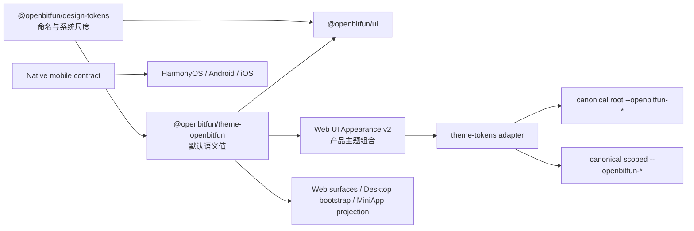

# 主题与颜色 Token 治理

本文定义 OpenBitFun 全部前端的颜色所有权、运行时投影和防回退契约。目标不是在旧变量之上再包一层，
而是让设计系统成为普通 UI 颜色的唯一公共来源：组件只消费 canonical `--openbitfun-*`，产品层只选择、
组合和投影这些 Token，不再维护第二套别名体系。

当前事实以以下可执行契约及其输出为准：

- `design-system/packages/design-tokens`
- `design-system/packages/theme-openbitfun`
- `src/web-ui/src/infrastructure/appearance/appearanceTokenContract.ts`
- `scripts/theme-color-governance-baseline*.json`
- `scripts/theme-color-near-pair-decisions.json`
- `scripts/theme-css-var-contract.mjs`
- `scripts/theme-visual-governance-contract.json`
- `scripts/frontend-color-surface-registry.json`
- `scripts/audit-frontend-colors.mjs`
- `scripts/audit-theme-colors.mjs`

文档与代码或审计结果冲突时，应修复 owner、消费方或契约；不得通过提高 baseline、扩充宽泛 allowlist
或恢复旧变量来掩盖回退。

## 一条正向依赖链

| 层级 | 唯一职责 | 不拥有的内容 |
|---|---|---|
| `@openbitfun/design-tokens` | 主题无关的命名、系统尺度和基础 Token 契约 | OpenBitFun 具体 light/dark 值、产品状态、route 或运行时选择 |
| `@openbitfun/theme-openbitfun` | OpenBitFun 的 reference/semantic 主题值、canonical CSS 变量映射和 `default.css` | Web UI Appearance 包、产品 store、组件内部状态 |
| `@openbitfun/ui` | 消费 semantic/system Token 的公共组件 anatomy、行为和无障碍契约 | 具体主题值、Appearance schema、旧 Web UI 变量 |
| Web UI Appearance | 选择和组合主题，生成 schema v2 包，并投影 canonical root/scoped Token 与显式 product domain/component Token | 公共 Token 的第二套命名、兼容双写、组件私有 palette |
| 产品前端 | 选择主题、设置设计系统 root 属性并消费 canonical Token | 复制 `theme-openbitfun` palette、随组件新增 raw color |

正向依赖固定为：



这里没有 compatibility projection。共享设计系统包不能反向依赖 Web UI Appearance；组件、生成产物、
Desktop bootstrap 和产品前端也不能反向定义公共主题值。

## Canonical Token 分层

正向代码只使用以下四类 Token：

1. **System / semantic**：`--openbitfun-color-*`、`--openbitfun-shadow-*`、`--openbitfun-effect-*`、`--openbitfun-opacity-*`
   等由设计系统发布的公共变量，是普通 UI 的默认消费层。
2. **Component**：`--openbitfun-component-*`。仅用于跨消费方稳定存在、又无法由 semantic Token 准确表达的
   组件差异；必须在 `appearanceTokenContract.ts` 中登记。
3. **Product domain**：`--openbitfun-domain-*`。用于 Git lane、语言身份、syntax、inspector、工具类别等明确的
   专用语义；不得当作普通 UI 的备用色板。
4. **Renderer payload**：Monaco、xterm、Mermaid、OpenBitFun Canvas 等第三方或专用渲染器的显式配置。
   它们有各自格式，不进入普通组件 CSS。

Primitive/reference 色值只存在于主题 authoring、明确的主题 preset 或专用 renderer owner 中。普通组件
不得直接消费 reference ramp，也不得自行定义“看起来差不多”的局部颜色。

### 状态色与增删行色

普通 UI 的状态色统一由设计系统定义。成功强调色引用 `color.codeChange.added`（`#1aa73e`），
错误/危险强调色引用 `color.codeChange.removed`（`#ec221f`）；警告固定使用 `#ff8c00`，
信息/进行中复用已有的清亮蓝 `ref.color.blue.550`（`#2e7eff`）。这组鲜明色相搭配淡着色背景，
避免在不同页面或内置皮肤中混入灰绿、粉红和另一套橙黄色。

- `color.status.*.emphasis` 用于图标和短强调，与增删行等源色对齐。
- `content` 从同一 emphasis 混入黑/白来保证长文本可读，`surface` 和 `border` 分别使用 10% 与 30% 着色。
  高对比模式可以增强文字和底色的对比，但不改动强调色锚点。
- 三个新增 emphasis Token（info/success/danger）由 Icon、Alert、ConfirmDialog、StatusPill 和工具卡状态图标
  消费；它们区分图形强调与可读文本，不能用于重新建立局部色板。
- 状态源文件保留 Token 引用和混色关系，主题构建将它们解析为 hex/RGBA，以便 CSS 与专用 renderer
  使用同一结果。内置 Appearance 和 Installer 只选取这些状态值，不再接受私有状态色覆盖；Git 增删、暂存和
  变更状态也由相同源色派生。第三方 Appearance 的现有 Token 名称与导入格式保持可读。

新增颜色按以下顺序判断：

1. 语义相同，直接复用现有 semantic Token。
2. 数值相近且相邻状态仍可区分，合并到已有 Token，并更新 near-pair 决策。
3. 存在独立、稳定、可说明的组件语义，在最窄 owner 中新增 `--openbitfun-component-*`。
4. 属于产品或渲染专用域，进入 `--openbitfun-domain-*` 或 renderer payload。
5. 只有主题本身需要新的基础色时，才修改 `@openbitfun/theme-openbitfun` 的 authoring source。

数值接近不是唯一判断标准；相邻背景/边框、文本层级、状态色、diff、syntax 和数据系列必须结合同时
出现时的区分度审查。反过来，也不能以“可能有视觉差异”为理由给每个组件建立近似私有颜色。

对话注释由 Web UI Appearance 的 `--openbitfun-component-conversation-excerpt-accent` 承载 UIKit 青色，
引用公开浅色主题的 accent（`#059cb0`），保持各内置主题的注释标识一致。全局 selection 是中性选中语义，
全局 accent 则随主题变化，均不满足这项局部设计约束。正文拖选、编辑与定位高亮使用此色的 30% 底色和
同色文字；注释编号和工具栏交互复用同一 Token。系统强制色模式下正文选区使用系统 Highlight/HighlightText。

## 普通 UI 的硬约束

更新提醒与详情弹窗共用磨砂材质。暗色通过现有 surface、content、info 与 highlight Token 提亮底面，
并用 `--openbitfun-component-update-material-cyan` 保留青色衬光；该组件 Token 复用公开浅色主题的
accent，由 Web UI Appearance 提供默认值并接受皮肤覆盖。暗色全局 accent 为蓝色，无法同时表达
青蓝两种材质色；其他组件的青色 Token 也不属于更新材质。该差异因此由更新组件的最小契约承载，
不新增基础色。旧皮肤通过现有组合逻辑补齐默认值。

普通应用组件和页面必须满足：

- 颜色、阴影和 blur 只从 canonical Token 取得；允许用 `color-mix()`、gradient 等 CSS 运算组合 Token。
- 不写 hex、rgb、hsl、命名色等 raw color；静态资产元数据和明确主题/renderer owner 除外。
- 不使用 `var(--token, fallback)` 隐藏缺失 Token。
- 不引用未定义、未登记或跨 root 偷借的变量。
- 不定义 `--color-*`、`--lab-*` 或 `--openbitfun-appearance-token-*` 等局部/历史公共前缀。
- SVG 图标优先使用 `currentColor`，由外层 semantic Token 控制状态。
- Component-private 非颜色变量可使用包约定的 `--_` 前缀，但不能借此建立私有颜色系统。

静态 favicon、manifest、SVG metadata 等不参与组件主题切换的值只能计入 `assetMetadata`。它们不能迁回
`appUi` allowlist，也不能被组件引用。

## Web UI Appearance schema v2

Web UI Appearance 的当前 schema 固定为 v2。颜色入口是 `theme-tokens` renderer：

```ts
{
  "theme-tokens": {
    version: 1,
    settings: {
      tokens: { "--openbitfun-color-*": "...", "--openbitfun-component-*": "...", "--openbitfun-domain-*": "..." },
      scopes: {
        chrome: { "--openbitfun-color-*": "..." }
      }
    }
  }
}
```

其边界如下：

- `tokens` 只能包含 `appearanceTokenContract.ts` 登记的 root Token。
- `scopes.chrome` 只能重绑定设计系统已有的 canonical theme Token，并应用到
  `[data-openbitfun-theme-scope="chrome"]`；scope 内不发明另一套 chrome 名称。
- `ThemeTokenAppearanceAdapter` 在切换时移除上一包写入的 root/scoped Token，再写入新包；不双写任何
  历史名称。
- Token 名和 Token 值都经过 allowlist 与安全校验；未登记名称、嵌套 `var()`、URL 或可注入片段直接失败。
- builtin Appearance 从 `@openbitfun/theme-openbitfun` 的完整主题值开始，只覆盖产品 theme/preset 真正不同的
  canonical 值，再补充受治理的 component/domain Token。
- Widget、Desktop 首屏 bootstrap 和生成式 UI 提示只消费同一 canonical 源生成的 allowlist 产物，
  不能反向成为主题 owner。

### 内置主题的工作区层级

侧栏与导航由 `color.surface.chrome` 承载，主内容由 `color.surface.scene` 承载。两者相邻且常驻，
不能只依靠阴影或拖拽时出现的边线区分。参照 Light 的中性灰外壳与白色内容关系，命名主题在自身色调内
拉开明度：墨韵使用暖灰宣纸外壳、浅宣纸内容与白色浮层；墨夜和午夜使用深墨外壳、炭灰内容与更亮的面板；
Tokyo Night 使用夜靛外壳、storm 靛蓝内容与蓝紫浮层。Cyber 保留黑底与霓虹强调，其浮层比内容更亮。

`color.surface.tertiary` 与 `color.surface.workbench` 用于内嵌分组及工作台；hover、selection、focus
继续使用已有交互 Token。Monaco 当前行与输入面板保留独立色阶。辅助文字和边框按新的相邻底色调整，
而不通过局部组件色值修补。上述配色由 builtin palette 声明，并同步生成启动页和生成式 UI 配色清单；
不为每款主题新增 Token 名称或主题专属布局分支。

旧 CSS-token adapter、Token 投影层、`css-tokens` renderer 和 `--openbitfun-appearance-token-*`
运行时变量均已退休并从源码删除。不得为第三方包、旧组件或测试重新引入这些接口。

### v1 读取不是兼容运行时

升级兼容只存在于包读取入口：

1. Parser 识别持久化的 schema v1 包。
2. `migrateAppearancePackage` 将已知 `css-tokens` 字段和旧名称单向映射为 v2 `theme-tokens` root/scoped
   canonical Token。
3. 旧 `css-tokens` renderer 被删除，后续校验、运行时和导出只接收 v2。
4. 已安装的旧包在加载后重新保存为 v2，之后不再依赖旧名称。

因此，旧名称只允许出现在迁移映射、upgrade fixture 和“不得出现”的负向断言中。它们不是可供新代码
消费的 alias，也不会在 DOM 中生成。未知旧字段不得被猜测或静默投影；应保留原数据并给出明确的不支持状态。

## 全前端 Surface 注册表

`scripts/frontend-color-surface-registry.json` 是前端颜色治理范围的唯一清单。每个可交付或可运行的前端必须
登记稳定 `id`、源码 root、颜色 owner 和审计引擎；新增目录不能依赖维护者再给 `package.json` 手写一段命令。
当前注册表覆盖：

- Web UI、`@openbitfun/ui`、Design Lab、Website、Mini App Market、Skin Market、Mobile Web 和 Installer。
- Desktop JavaScript 启动前页面、Native Mobile 比较预览、CLI/TUI。
- HarmonyOS、Android、iOS 三端原生源码。
- 全部 builtin/Demo MiniApp 及其内置 Skill reference mirror。
- `@openbitfun/design-tokens` 与 `@openbitfun/theme-openbitfun` 的 authoring owner。

`scripts/audit-frontend-colors.mjs` 只从该注册表编排检查：普通 Web surface 复用 CSS/Token 审计，CLI 复用终端
主题审计，Native Mobile 与 MiniApp 使用各自的源码契约检查。MiniApp discovery 会从三个登记的父目录查找
所有带 `meta.json` 的应用；发现未登记应用、登记路径消失或 reference mirror 不再 byte-equal 都直接失败。

注册表不是兼容表。surface 被下线时删除条目，owner 被迁移时原子更新唯一条目；不得同时登记新旧 root、双写
变量或用另一个命令继续扫描退休实现。

## 各前端 surface 的 owner

### Design Lab、Website、Market

Design Lab、Website、Mini App Market 与 Skin Market 直接加载 `@openbitfun/theme-openbitfun/default.css`，通过
`data-openbitfun-design-system-root`、`data-color-scheme`、`data-contrast` 和 `data-density` 选择已发布主题。
它们可以拥有布局和产品交互，但不得再维护本地 light/dark palette。

### Mobile Web / Remote Control

Mobile Web 直接消费 `@openbitfun/theme-openbitfun`。`ThemeProvider` 与首屏 bootstrap 只负责选择 light/dark、
写设计系统 root 属性和同步浏览器 `theme-color`；已退休的本地 preset/ramp 不得恢复。Relay 中的 Mobile
静态包必须由这一源码重新构建，不能保留旧 Vite 产物作为隐式第二套主题实现。

### Desktop bootstrap 与 Native Mobile 预览

Data Migrator 的独立静态界面直接消费设计系统公开的字体、间距、控件和语义颜色 Token。
`generate-data-migrator-theme.mjs` 构建设计系统的 Token/主题包，并将公开 CSS 入口及其依赖打包为
`src/apps/data-migrator/ui/generated/design-system.css`，随迁移程序离线交付。原生控件只使用 canonical
Token；`theme.js` 在首屏绘制前选择系统浅色/深色和高对比模式，并监听系统设置变化。
仅独立迁移器打包刷新该资源，开发者也可显式运行生成命令；Desktop 开发和打包不依赖迁移器。
统一颜色审计同时检查源码和生成物漂移。

Desktop 的更新确认页和启动页只消费 `src/apps/desktop/src/generated/bootstrap_theme.css` 发布的 canonical
`--openbitfun-*`，不得内联另一套启动色。该 CSS 和两个 Appearance manifest 一起由
`generate-startup-appearance-bootstrap.mjs` 从正式主题/Appearance 源生成；统一颜色审计执行 `--check`，
生成物漂移直接失败。

Native Mobile 预览的工具 chrome 消费 canonical `--openbitfun-*`；设备画布消费 `--mobile-*` 这一受登记的 scoped
动态变量族，其值只来自生成的 mobile contract data。二者不互相 alias。预览不得直接解释 ARGB 字符串为 Web
颜色，必须在投影边界显式转换；generated data 不作为普通 UI 源码重复计数，但必须通过生成物漂移检查。

### HarmonyOS / Android / iOS

原生移动端不加载 Web CSS，也不复制 `@openbitfun/theme-openbitfun`。它们的唯一跨平台视觉事实 owner 是
`src/apps/mobile/design-system/tokens/mobile-tokens.json`：

- 颜色名称按语义登记，例如 content、surface、status、scrim、media control 和 shadow；不得使用 `green`、
  `red`、`white` 之类数值或外观名称充当公共 API。
- `mobile-ui-design-system.mjs` 从同一 contract 生成 ArkTS/Kotlin/Swift 常量与预览数据；组件契约引用不存在的
  token 或任一生成物漂移都会失败。
- 三端非 generated 源码不得出现 `Color.White` / `.black` / `.clear`、颜色构造器、hex 字符串或同类平台
  raw color。system bar 等平台桥接读取生成的 light/dark pair，不在 entrypoint 重建 palette。
- Android vector、iOS asset catalog 与 HarmonyOS template media 是可 tint 的平台资产 owner，不是普通 UI
  颜色来源；渲染时仍必须由 semantic token 控制。

### Installer

Installer 首屏和普通流程组件加载设计系统默认主题并只消费 canonical Token。主题选择器保留六个明确的
自定义安装器 preset；这些 preset 的身份色是唯一允许的 installer raw-color owner，并由 Installer 专属
baseline 约束。运行时只把选中 preset 投影到 canonical `--openbitfun-color-*` 子集。

Installer 不再拥有 `src/styles/variables.css`，也不得让页面直接读取 preset 对象或建立页面级变量。新增
preset 必须同时说明用户可见差异、相邻状态对比、所需 canonical 投影和 baseline 变化，不能借新增 preset
扩大普通 UI 的 raw-color 预算。

### MiniApp 公共投影

MiniApp 不能读取 Web UI 内部变量全集。公开边界只有 `src/shared/miniapp-appearance/contract.json` 中登记的
`--openbitfun-*`，每一项都投影自 `@openbitfun/design-tokens` 或 `@openbitfun/theme-openbitfun` 的真实 canonical 变量。
Web UI payload、Rust 首帧 style 和 MiniApp 源码共同遵守以下约束：

- 使用未登记的 `--openbitfun-*`、在应用内重新定义宿主变量、或写 `var(--openbitfun-*, fallback)` 均直接失败。
- `default_appearance_style.html` 由公共 contract 生成，不是第三个 palette owner。
- Demo/builtin 与内置 Skill 中的 reference mirror 必须 byte-equal；修改正式样例时同时更新 mirror，不保留旧版。
- 普通 MiniApp chrome 的 raw color 为零。专用色不进入通用 baseline，只能登记到下表的最窄 owner；owner
  条目没有真实 occurrence 时也会因 stale 而失败。

| MiniApp | 允许的专用 owner | 边界 |
|---|---|---|
| Coding Selfie | `data-viz` | `LANG_COLORS` 语言数据系列块 |
| Git Graph | `data-viz` | branch lane 5–7 的三个分类色；其余 lane 使用宿主语义 |
| Gomoku | `game-renderer` | 黑白棋子填充与对比描边变量 |
| Daily Divination | `bespoke-theme` | 塔罗场景本身的完整插画 light/dark 主题 |
| PPT Live | `slide-renderer` | 幻灯片内容、导出器和 renderer fixture；编辑器 chrome 仍为零 raw color |
| Regex Playground / Icon Design System | 无 | 全部视觉消费宿主投影 |

### 专用 renderer 和资产

Monaco、xterm/ANSI、Mermaid、syntax、diff、语言标识、调试 overlay、Canvas 和数据系列有独立的格式或
稳定语义。它们必须留在对应 renderer/domain owner 中，并通过明确 payload 或 `--openbitfun-domain-*` 消费；不得
泄漏成普通组件可随手调用的 palette。

Renderer adapter 同时拥有第三方格式边界。设计系统和 Appearance payload 可以使用其已声明支持的 CSS
颜色格式，但 adapter 必须在调用第三方 API 前投影为对方的原生格式；不得把通用语义 Token 原样透传并
假设第三方具有相同的颜色语法或 alpha 语义。例如 Monaco workbench colors 使用 hex alpha，而 token
colors 必须先相对编辑器背景合成为不透明 hex。
需要 alpha token color 的 Monaco payload 必须显式提供不透明的 `editor.background`，不得在 adapter 中复制
或猜测第三方 base theme 的默认背景值。

### 显式排除不是 allowlist

Monaco 拷贝产物、Relay static、E2E fixture、诊断报表 HTML、PPT 内容 renderer、native template icons 和
generated outputs 不属于普通应用 UI 扫描。每个边界都必须在 surface registry 中用现存路径、唯一 owner、
artifact kind 和具体理由登记；路径消失或只写模糊理由会使 registry contract test 失败。

这些条目不会允许同名颜色进入其他目录，也不能用 glob 把普通组件一起隐藏。PPT、native asset 等专用 owner
仍由各自的 renderer、生成器或平台 tint 契约验证；“不计入普通 UI raw color”不等于“不受治理”。

## 防回退契约

主题 baseline 是 no-growth ratchet，不是可随实现调整的快照。以下指标对普通 UI 均应保持为零：

- raw color occurrences / unique colors
- fallback occurrences / unique tokens
- unresolved required variables
- compatibility alias usage
- unregistered dynamic families
- indistinguishable near pairs
- non-canonical Widget payload fields

审计失败时，默认修复方式是复用 Token、删除游离 key、收敛近似色、修复 owner 或补最小 component/domain
契约。以下做法均视为治理回退：

- 为通过 CI 上调 baseline 或 fixture 期望。
- 把普通组件路径加入 renderer/asset exception allowlist。
- 新增与现有 Token 等价的字面量、fallback 或 alias。
- 在 Mobile、Installer、Website、Market、Rust 或生成产物中复制公共 palette。
- 同时写 canonical 与旧变量，或保留两个 adapter 让调用方任选。
- 用生成文件、产品定制或静态 Vite 产物绕过当前主题 owner。

baseline 只允许两类变更：实际债务下降时同步下调；或确有新的稳定语义时，在独立治理变更中给出 owner、
真实消费方、相邻状态、无障碍影响和复审结论。

## 变更与验证

颜色变更应按 owner 完成，而不是逐页面补丁：

1. 确认 surface、用户语义、相邻状态和唯一 owner。
2. 优先复用现有 semantic Token；确需新增时选择最窄 component/domain/renderer 边界。
3. 更新 authoring source、运行时 contract 和真实消费方；删除被替代的旧 API、文件和变量。
4. 若影响首屏、Widget 或静态包，从 canonical 源重新生成/构建产物。
5. 运行最窄 owner 测试，再运行跨 surface 颜色审计。

核心自动门禁为：

```bash
pnpm run theme:color-audit:test
pnpm run theme:color-audit:all
pnpm run theme:color-audit:miniapps
pnpm run theme:color-audit:native-mobile
pnpm run theme:visual-contract
pnpm run appearance:contract-audit
pnpm run design-system:check
pnpm run check:web
```

另外还应执行被改动 surface 的 type-check/test/build。自动审计、source 检查和 build 只能证明契约与产物
一致，不能替代真实渲染的视觉与对比度审查；设计验收应在 Design Lab 或真实产品中人工完成，不能把浏览器
自动化截图或 Mock 当作最终视觉证据。

## 完成判据

颜色体系只有在以下条件同时满足时才算完成：

- 普通 UI 的每个颜色都能追溯到一个 canonical semantic/component Token。
- 每个专用色值都能追溯到一个 theme preset、domain、renderer 或 asset metadata owner。
- Web UI 运行时只投影 schema v2 `theme-tokens`，DOM 中没有历史变量。
- Mobile、Website、Market、Installer 和 Design Lab 不复制公共 palette。
- v1 只在读取时迁移，正向源码、样式、产物与导出中不存在旧名称。
- baseline 默认只下降，新增语义必须有真实消费方和明确审查证据。

完成目标不是“色值数量最少”，而是每个颜色只有一个权威 owner、每个消费方只依赖稳定语义、每次回退都能
被自动门禁准确阻断。
